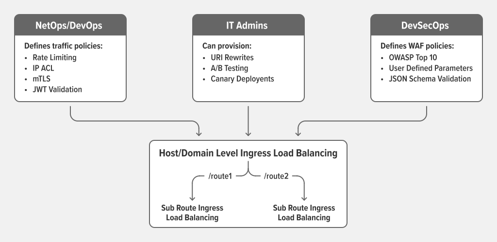
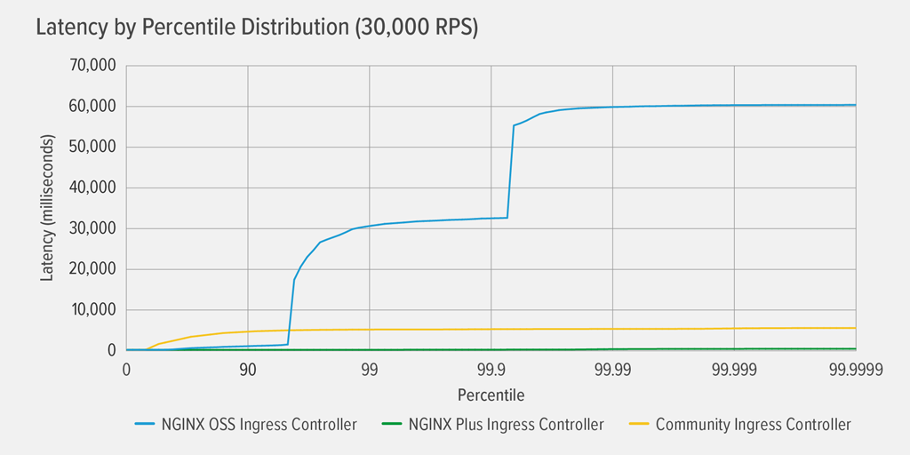
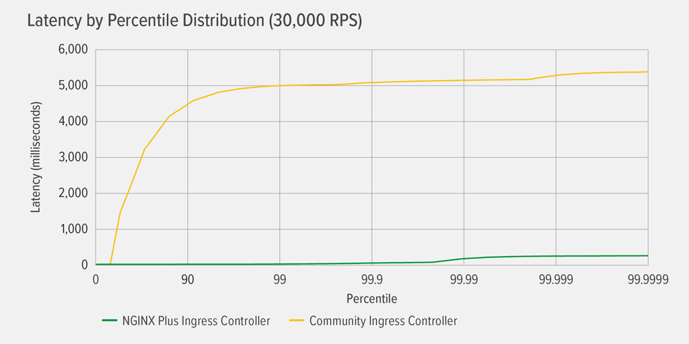
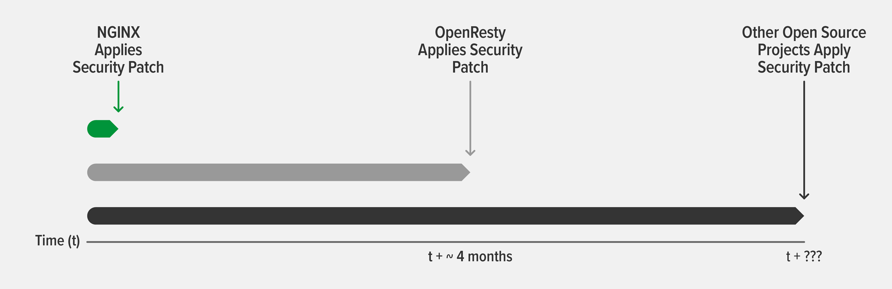

NGINX Ingress Controller, which one?
##################################################

.. image:: ./images/nginx_kic.png
   :align: center
   :width: 600
   :alt: All layers

Implementations
=========================================
NGINX Ingress Controller (NIC) comes in three different implementations:

    #. `NGINX Plus Ingress Controller <https://www.nginx.com/products/nginx-ingress-controller>`_ maintained by NGINX
    #. `Open Source (OSS) Ingress controller <https://github.com/nginxinc/docker-nginx>`_ maintained by NGINX
    #. `Community Ingress controller <https://kubernetes.github.io/ingress-nginx/>`_ maintained by the Kubernetes community and based on **NGINX Open Source**

Check out this `article <https://github.com/nginxinc/kubernetes-ingress/blob/master/docs/nginx-ingress-controllers.md>`_ for a comparison of the three options.

Why NGINX Plus?
=========================================
This workshop enables NGINX Plus Ingress Controller because it provides a robust feature set to secure, strengthen, and scale your containerized apps, including:

Additional features
*********************

* **Visibility and performance monitoring**: A number of metrics about how NGINX Plus and applications are performing are available through the API or a built-in dashboard. Optionally, the metrics can be exported to Prometheus.
* **Additional load balancing methods**: additional methods are available for HTTP, TCP, and UDP load balancing: least_time and random two with least_time.
* **Session persistence**: In addition to the hash‑based session persistence supported by NGINX Open Source (the Hash and IP Hash load‑balancing methods), NGINX Plus supports cookie‑based session persistence
* **Active health checks**: By default NGINX performs basic checks on responses from upstream servers, retrying failed requests where possible. NGINX Plus adds out-of-band application health checks (also known as synthetic transactions) and a slow‑start feature to gracefully add new and recovered servers into the load‑balanced group. for HTTP and Health checks can also be enabled for non-HTTP protocols, such as FastCGI, memcached, SCGI, uwsgi, and also for TCP and UDP..
* **JWT-Based and OpenID Connect Authentication**: fetch JWK file, JWT validation, OpenID Connect with authorization code flow
* **WAF**: enable add-on Web Application Firewall module based on F5 WAF engine, named NGINX App Protect (NAP)

Dynamic Deployment
*****************************************************
For each rolling upgrade or scaling on an existing Deployment, IP of PODs are modified.
The Ingress controller need to updates associated configuration : ``upstream`` configuration must reflect up to date ``endpoint``.

**NGINX OSS and Community**
NGINX configuration is updated and reloaded in response to the changing endpoints for the back‑end application.

As discussed in `Timeout and Error Results for the Dynamic Deployment <https://www.nginx.com/blog/performance-testing-nginx-ingress-controllers-dynamic-kubernetes-cloud-environment/#timeout-error-results/>`_ ,
the latency experienced with the community and NGINX Open Source Ingress Controllers is caused by errors and timeouts that occur after NGINX configuration reload.

**NGINX Plus**
NGINX Plus Ingress Controller uses the `NGINX Plus API <https://docs.nginx.com/nginx/admin-guide/load-balancer/dynamic-configuration-api/>`_  to dynamically update the NGINX configuration when endpoints change.
This prevents increase of memory usage:
* during reloads, especially with a high volume of client requests,
* when load balancing applications with long-lived connections (WebSocket, applications with file uploading/downloading or streaming).

As described `here <https://www.nginx.com/blog/performance-testing-nginx-ingress-controllers-dynamic-kubernetes-cloud-environment/>`_ ,
the performance results show that to completely eliminate timeouts and errors in a dynamic Kubernetes cloud environment,
the Ingress controller must dynamically adjust to changes in back‑end endpoints without event handlers or configuration reloads.

Here’s a finer‑grained view of the results for the community and NGINX Plus Ingress Controllers in the same test condition as the previous graph.
The NGINX Plus Ingress Controller introduces virtually no latency until the 99.9999th percentile, where it hits 254ms.

Based on the results, NGINX Plus API is the optimal solution for dynamically reconfiguring NGINX in a dynamic environment.
NGINX Plus Ingress Controller achieved the flawless performance in highly dynamic Kubernetes environments that you need to keep your users satisfied.

Quick and Easy Mitigation of Security Vulnerabilities
*******************************************************
In today’s ever‑more competitive business landscape,
software teams are under pressure to deliver new and updated code as fast as possible to deliver the most innovative services.
At the same time, the rise of sophisticated attacks on infrastructure and applications make it vital to track vulnerabilities and mitigate them as soon as possible,
a tedious and time‑consuming practice.

As discussed in this `blog <https://www.nginx.com/blog/mitigating-security-vulnerabilities-quickly-easily-nginx-plus/>`_, an NGINX Plus subscription offloads that burden,
enabling application teams to concentrate on their main mission – delivering code faster – while the organization remains protected from security vulnerabilities.

NGINX Plus makes it so much faster and easier to mitigate CVEs and other security threats beceause:

* **F5 SIRT Provides Real-Time Help to NGINX Plus Subscribers Under Attack** to provide real‑time assistance
* **NGINX Proactively Informs NGINX Plus Subscribers About Patches**, proactively our customers are informed about it by email.
* **NGINX Plus Subscribers Get Patches Immediately**, generally a patch is released on the day of the CVE disclosure (or within a few days in some cases).

**A significant lag between NGINX OSS vs Plus release of a patch**

As discussed `here <https://www.nginx.com/blog/mitigating-security-vulnerabilities-quickly-easily-nginx-plus/#immediate-patches>`_,
there is sometimes quite a significant lag between our release of a patch for NGINX Open Source and the release of a corresponding patch for third‑party technologies:

Users of NGINX Open Source benefit from the fact that NGINX Plus is based on it,
because we are committed to enterprise‑level support and process standards for NGINX Plus customers.
These standards include service level agreements (SLAs) with our customers that dictate bug‑fix and testing procedures with which patches must comply,
for the core software, dependencies, and supported modules alike.
The SLAs help customers achieve compliance with regulations, minimizing the risk of exposure to vulnerability exploits.

**What about OSS third‑party modules?**
An added wrinkle for NGINX Open Source is that many third‑party technologies leverage and embed it in their products.
The providers of those technologies have their own processes for disclosing and patching software vulnerabilities when they are discovered.

