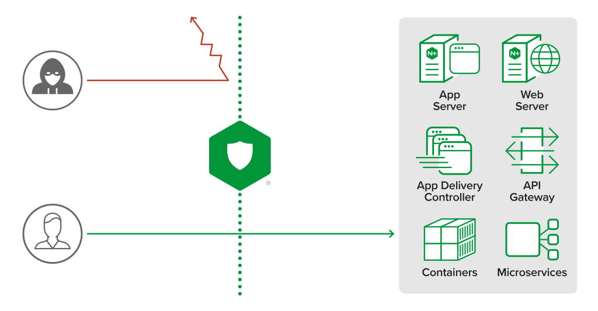
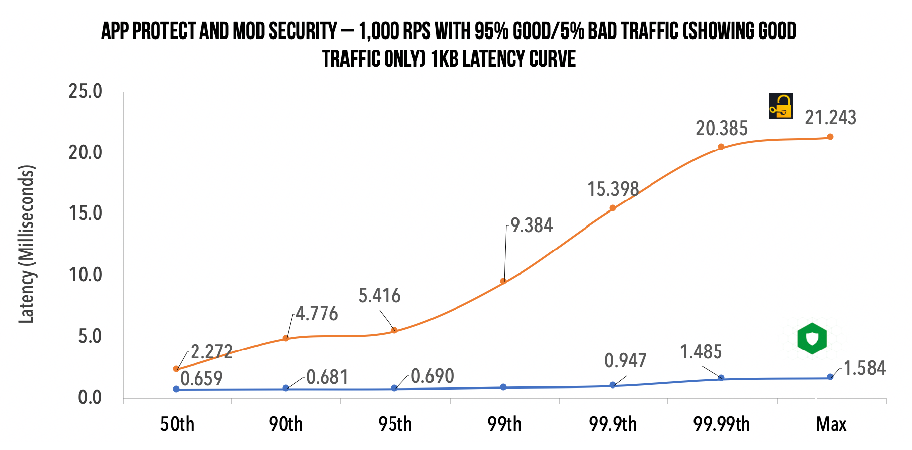
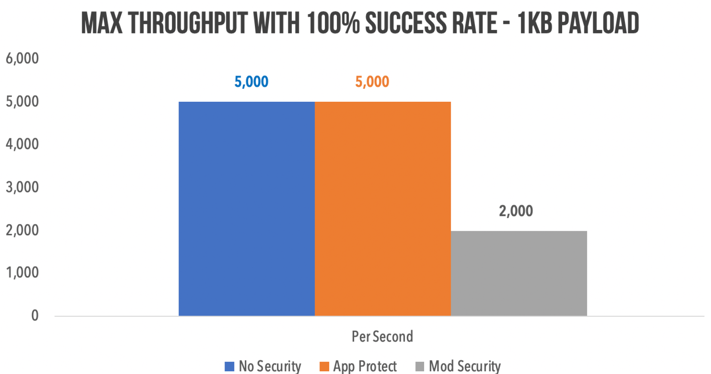
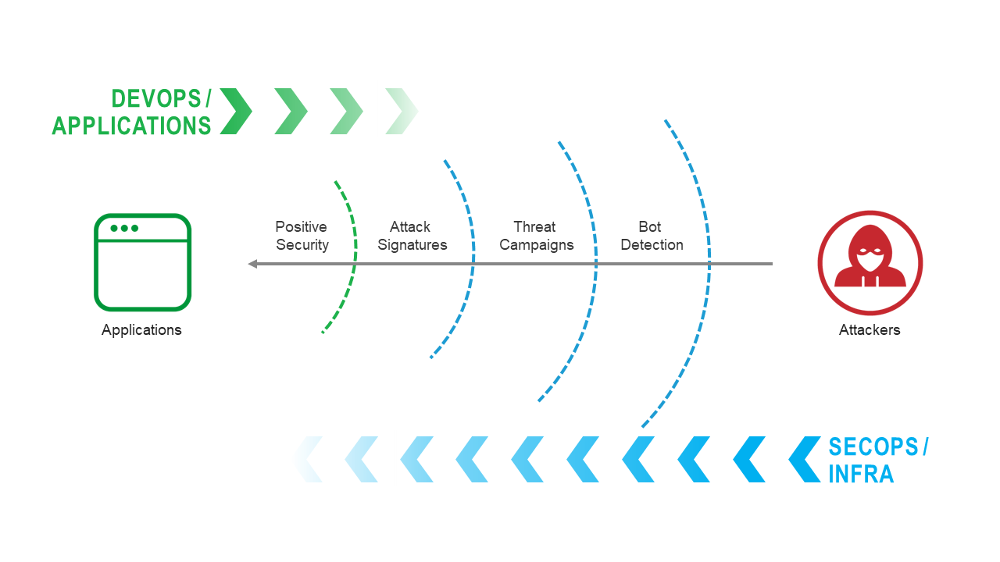

Web Application Firewall
#####################################

Objectives
=========================================
Today’s application landscape has changed dramatically.
Modern apps are microservices that run in containers, communicate via APIs, and deploy via automated CI/CD pipelines.

DevOps teams need to integrate security controls authorized by the security team across distributed environments without slowing release velocity or performance.

Why NGINX App Protect?
=========================================
NGINX App Protect is a WAF that’s lightweight but high‑performance and designed for modern apps:

- **Defense and Analytics**

    - Utilizes F5 app‑security technology for efficacy superior to ModSecurity and other WAFs
    - Offers high‑confidence signatures for extremely low false positives
    - Increases visibility, integrating with third‑party analytics solutions

- **DevOps integration**

    - Deploys as a lightweight software package that is agnostic of underlying infrastructure
    - Facilitates declarative policies for “security as code” and integration with DevOps tools
    - Accelerates time to market and reduces costs with DevSecOps‑automated security

High Performance
**************************
Comparing performance of WAF solutions is important, it will determine impact on:

- **user experience**: hiccups matter. If the median response time or latency is less than 30 milliseconds, but there are
“hiccups” with latencies above 1 second, the cumulative effect will impact subsequent user
experiences. For example, if you visit a fast food drive-through where the median wait time for food is 1
minute, you probably think that was a good customer experience. However, what if the customer in
front of you has a problem with their order, and it takes 10 minutes to resolve? Your wait time would
actually be 11 minutes. Because your request came in line after the “hiccup,” the 99.99th percentile’s
delay becomes your delay too.

- **compute**: How many *Ingress Controller + WAF* PODs to run? Size depends on throughput, throughput depends on WAF solution.

`GigaOm report <https://www.nginx.com/resources/library/high-performance-app-security-testing/>`_ presents the results of its performance testing on three WAFs:

- NGINX App Protect
- ModSecurity on NGINX
- AWS WAF

Few interesting results:

- **user experience**: NGINX App Protect produced 82% lower latency than AWS WAF at 1,000 tps on the 5% bad request test.
Latency differences were minimal until the 90th percentile, with a significant difference witnessed at the 99th percentile and above.

- **compute**: The maximum transaction throughput achieved with 100% success (no 5xx or 429 errors)
and with less than 30ms maximum latency with our tiny AWS c5n.large (2 CPU and 5.25 GB RAM) instance was
approximately 5,000 requests per second for NGINX App Protect.
By comparison, ModSecurity began to produce errors at the 2,000 requests per second threshold.

Lower rate of False Positive for more protection
*************************************************
A WAF enforce a security policy and violations occur when some aspect of a request or response does not comply with the security policy.

Why F5 WAF engine generates violations with a a low chance of being false positives?

#. **High accuracy attack signatures**
Accuracy of a `F5 signature <https://clouddocs.f5.com/cloud-services/latest/f5-cloud-services-Essential.App.Protect-Details.html#attack-signatures>`_
indicates the ability of the attack signature to identify the attack including susceptibility to false-positive alarms:

    - *Low*: Indicates a high likelihood of false positives.
    - *Medium*: Indicates some likelihood of false positives.
    - *High*: Indicates a low likelihood of false positives.

#. **High violation rating**
Low accuracy signatures have a lot of chance to generate False Positive alone but,
if a transaction match multiple low signatures, there is a lot of chance to encounter a real threat!
That's why F5 WAF engine assigns the violation rating by assessing the combination of violations occurring in a transaction.
The violation rating is assigned to the transaction as a whole rather than the individual violations in the request.
This is because real attacks often include multiple violations within one transaction.
The violation rating takes into consideration the impact of the violations on the business.
Requests with high violation ratings (4-5) are likely to be real attacks:
    - 0: No violation
    - 1-2: False positive
    - 3: Needs examination
    - 4-5: Threat

#. **Threat Campaigns**
Because attackers understood this mechanism of *Accuracy* and *Violation Rating*,
their goal is to generate an attack under the radar,
i.e. that match only the low accurate signature.
`F5 labs <https://www.f5.com/labs>`_ deployed a honey pot infrastructure over the globe,
analyse ongoing attacks and develop very accurate signatures to block the ongoing attacks.
This set of signatures, updated up to several times a day, is named *Threat campaigns*.

DevOps integration
**************************

ToDo

Best Practices
A WAF policy includes 2 parts, I share with you some Best Practice to onboard them easier:

1.	Positive security policy
›	Objective
ê	reduce the surface attack to publish only expected request by the Application (URI, method, parameter, JSON schema (key and vaue types), file types, header, cookies)
›	Owner
ê	Application knowledge is owned by App Developpers.
›	How to configure
ê	For API based application, App Dev consolidate their knowledge in a specification file in a standard format (OpenAPI 3.x, swagger 2.x). This file is imported in F5 WAF and F5 WAF auto-reconfigure its positive security policy. Because this spec evolves each App release (2-4 weeks), my customer allow DevOps to upload this file directly to F5 WAF.
ê	For non-API based application, the effort to get the knowledge of the App from/with App Dev could be simple or huge, it depends on your organization.

2.	Negative security policy
›	Objective
Enable protection from:
ê	software vulnerabilities & common web exploits: non-legitimate request
ê	fraud & abuse: legitimate request but the intent is bad (DoS, Credential Stuffing, Brute Force, Web Scraping…)
›	Owner
ê	Security knowledge is owned by SecOps.
›	How to configure
›	Start with base F5 WAF template here that includes already OWASP top 10 recommendation
›	Enable WAF policy in transparent mode for an application (FQDN)
›	For False Positive, disable signature per entity (URI path, page, header) here
›	Enable WAF policy in blocking mode for an application (FQDN). Keep WAF policy in transparent mode for URI paths where False Positive are still encountered.
›	Define Server Technologies here to improve performance by enabling only signatures linked to Application frameworks (Apache, IIS, MySQL…)
›	Enable advanced protections, step by step, and monitor False Positive:
ê	Bot Defense here
ê	Data Guard here
ê	Custom signature here
ê	Clickjacking here
ê	…
5.	In parallel, repeat step 3 and 4 until False Positive disappeared on an URI path
6.	In parallel, review modification created by False Positive:
ê	Change your base line policy: for example, integrate a signature disabled because the CVE is already patched on server side and this signature generates False Positive
ê	Modify Application to be compliant with your base line policy

Design overview
=========================================

.. image:: ./_pictures/global_design.png
   :align: center
   :width: 800
   :alt: Design overview

