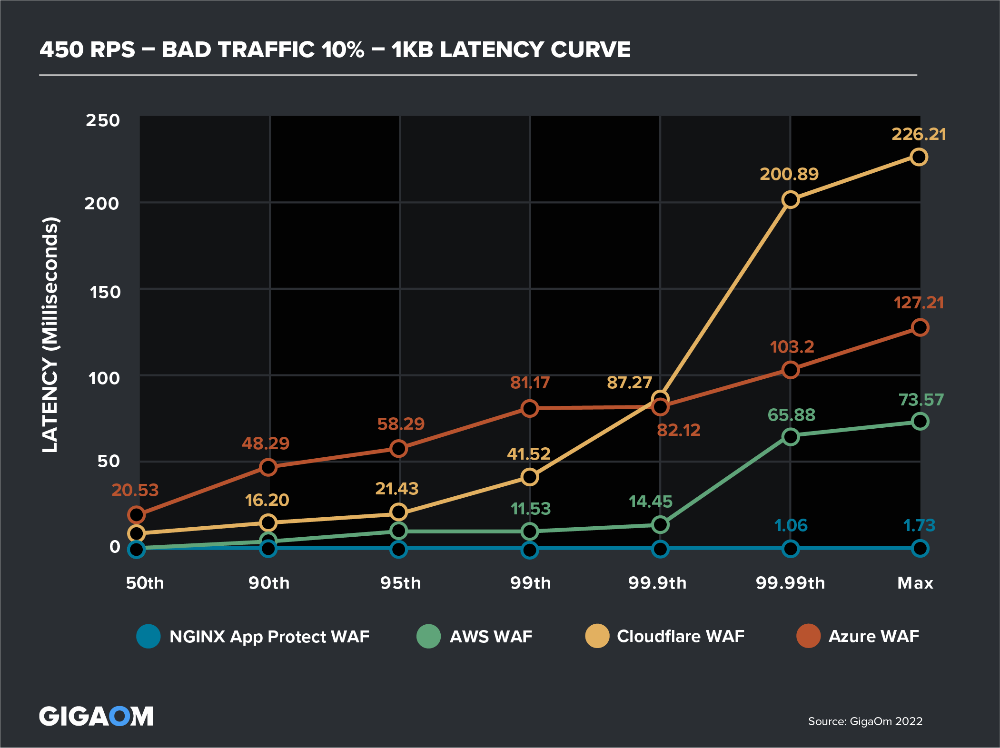
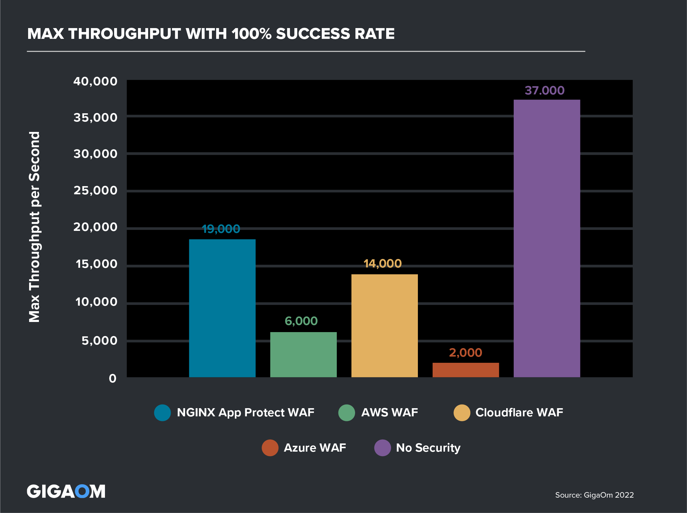
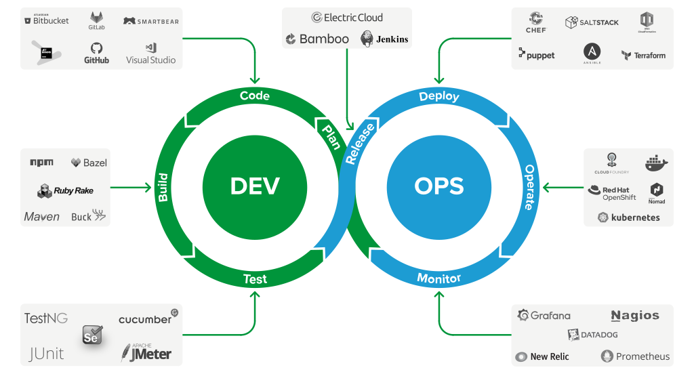
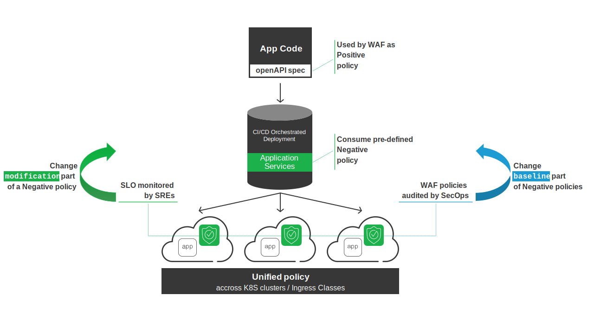

Web Application Firewall
#####################################

.. image:: ./_pictures/dia-RW-2020-05-19-App-Protect-Secure-Apps-diagram-1024x533-1.svg
   :align: center
   :width: 600
   :alt: WAF

.. contents:: Contents
    :local:

Objectives
**********************
Today’s application landscape has changed dramatically.
Modern apps are microservices that run in containers, communicate via APIs, and deploy via automated CI/CD pipelines.

DevOps teams need to integrate security controls authorized by the security team across distributed environments without slowing release velocity or performance.

Why NGINX App Protect?
**********************
NGINX App Protect is a WAF that’s lightweight but high‑performance and designed for modern apps:

- **Defense and Analytics**

    - Utilizes F5 app‑security technology for efficacy superior to ModSecurity and other WAFs
    - Offers high‑confidence signatures for extremely low false positives
    - Increases visibility, integrating with third‑party analytics solutions

- **DevOps integration**

    - Deploys as a lightweight software package that is agnostic of underlying infrastructure
    - Facilitates declarative policies for “security as code” and integration with DevOps tools
    - Accelerates time to market and reduces costs with DevSecOps‑automated security

High Performance
====================

**OBJECTIVES**

Comparing performance of WAF solutions is important, it will determine impact on:

- **user experience**: hiccups matter. If the median response time or latency is less than 30 milliseconds, but there are “hiccups” with latencies above 1 second, the cumulative effect will impact subsequent user experiences. For example, if you visit a fast food drive-through where the median wait time for food is 1 minute, you probably think that was a good customer experience. However, what if the customer in front of you has a problem with their order, and it takes 10 minutes to resolve? Your wait time would actually be 11 minutes. Because your request came in line after the “hiccup,” the 99.99th percentile’s delay becomes your delay too.

- **compute**: How many *Ingress Controller + WAF* PODs to run? Size depends on throughput, throughput depends on WAF solution.

**WAF COMPARISON**

`GigaOm report <https://research.gigaom.com/report/high-performance-web-application-firewall-testing/>`_ presents the results of its performance testing on WAF products:
NGINX App Protect, AWS WAF, Azure WAF, Cloudflare WAF and NGINX Plus without WAF as a referential.

- **user experience**: With 10% bad traffic, Cloudflare WAF consistently produced greater latency than NGINX App Protect WAF. At 500 rps of combined good and bad traffic, the latency gap was 150 times at the 99th percentile.

- **compute**: The chart below highlights the maximum throughput achieved with 100% success and no 5xx or 429 errors and with less than 30ms maximum latency. Here NGINX App Protect WAF supported 19,000 tps, about one-third greater than the throughput of runner up Cloudflare WAF (14,000 transactions).

Lower rate of False Positive and more protection
==================================================
A WAF enforce a security policy and violations occur when some aspect of a request or response does not comply with the security policy.

Why F5 WAF engine generates violations with a a low chance of being false positives?

**High accuracy attack signatures**

Accuracy of a `F5 signature <https://clouddocs.f5.com/cloud-services/latest/f5-cloud-services-Essential.App.Protect-Details.html#attack-signatures>`_
indicates the ability of the attack signature to identify the attack including susceptibility to false-positive alarms:

    - *Low*: Indicates a high likelihood of false positives.
    - *Medium*: Indicates some likelihood of false positives.
    - *High*: Indicates a low likelihood of false positives.

**High violation rating**

Low accuracy signatures have a lot of chance to generate False Positive alone but,
if a transaction match multiple low signatures, there is a lot of chance to encounter a real threat!
That's why F5 WAF engine assigns the violation rating by assessing the combination of violations occurring in a transaction.
The violation rating is assigned to the transaction as a whole rather than the individual violations in the request.
This is because real attacks often include multiple violations within one transaction.
The violation rating takes into consideration the impact of the violations on the business.
Requests with high violation ratings (4-5) are likely to be real attacks:
    - 0: No violation
    - 1-2: False positive
    - 3: Needs examination
    - 4-5: Threat

**Threat Campaigns**

Because attackers understood this mechanism of *Accuracy* and *Violation Rating*,
their goal is to generate an attack under the radar,
i.e. that match only the low accurate signature.
`F5 labs <https://www.f5.com/labs>`_ deployed a honey pot infrastructure over the globe,
analyse ongoing attacks and develop very accurate signatures to block ongoing attacks.
This set of signatures, updated up to several times a day, is named *Threat campaigns*.

DevOps integration
====================================

DevOps need to automate security controls with Infrastructure-as-Code built into your CI/CD pipeline.

**MODELS**

NGINX App Protect uses declarative policies for “security as code” that can be integrated with DevOps tools.
Because NGINX App Protect presents a multi layered defense, a `declarative WAF policy <https://docs.nginx.com/nginx-app-protect/configuration/#policy-authoring-and-tuning>`_ reflects it and includes 2 parts:

.. image:: ./_pictures/multi-layer-approach.png
   :align: center
   :width: 700
   :alt: multi layer approach

#. **Positive model**

    - **Objective**: Reduce the surface attack to publish only expected request by the Application (URI, method, parameter, JSON schema (key and vaue types), file types, header, cookies)
    - **Owner**: Application knowledge is owned by App Developpers.
    - **How to configure**:
        - For API based application, App Dev consolidate their knowledge in a specification file in a standard format (OpenAPI 3, swagger). As described `here <https://docs.nginx.com/nginx-app-protect/configuration/#openapi-specification-file-reference>`_ , this file is imported in F5 WAF and F5 WAF auto-reconfigures its positive security policy. Because this spec evolves each App release (2-4 weeks), my customer allow DevOps to upload this file directly to F5 WAF.
        - For non-API based application, the effort to get the knowledge of the App from/with App Dev could be simple or huge, it depends on your organization. Translation of Application specification in a declarative format should be a teamwork AppDev/SecOps

#. **Negative model**

    - **Objective**:
        - software vulnerabilities & common web exploits protection: non-legitimate request
        - fraud & abuse protection: legitimate request but the intent is bad (DoS, Credential Stuffing, Brute Force, Web Scraping…)
    - **Owner**: SecOps
    - **How to configure**:
        - Start with `base template <https://docs.nginx.com/nginx-app-protect/configuration/#best-practices>`_ that already includes OWASP top 10 recommendation
        - Define `Server Technologies <https://docs.nginx.com/nginx-app-protect/configuration/#server-technologies>`_ to improve performance by enabling only signatures linked to Application frameworks (Apache, IIS, MySQL…)
        - Enable advanced protections:
            - `Bot Defense <https://docs.nginx.com/nginx-app-protect/configuration/#anti-automation>`_
            - `Data Guard <https://docs.nginx.com/nginx-app-protect/configuration/#data-guard-blocking>`_
            - `Custom signature <https://docs.nginx.com/nginx-app-protect/configuration/#user-defined-signature-sets>`_
            - `Clickjacking <https://docs.nginx.com/nginx-app-protect/configuration/#clickjacking-protection>`_

**FALSE POSITIVES**

It's unavoidable, you will encounter False Positives.
In a blameless culture, the question is: How does NGINX App Protect allow to manage False Positive effectively?

A *pre-defined Negative policy* is a policy JSON file that describes the security baseline.
It includes the ``policy`` structure property (see below).
JSON files are stored in a repository owned by SecOps and consumed by CI/CD pipelines.
Ideally, which Negative policy to use is defined during *Risk Impact Analysis* phase done by Product Owner.
SecOps use policy to express the security policy as intended to be: enabled features, the signature sets, server technologies...
This part of the policy is usually determined when the application is deployed and changes at a relatively slow pace, after an Audit at least.

.. code-block:: yaml
    :emphasize-lines: 1

    policy:
      name: baseline-corp-low
      signatures:
      - signatureId: 200001834
        enabled: true

The ``modifications`` structure property (see below) contains a list of changes expressed by DevOps / SRE team.
Modifications are used to express exceptions to the baseline policy.
These exceptions are usually the result of fixing false positive incidents and failures in tests applied to those policies.
Because adapting baseline to handle False Positive is too long to be included in a Dev Sprint,
DevOps are usually allowed to insert granular modifications, typically disabling checks of individual signatures, metacharacters and sub-violations.
These changes are more frequent.

.. code-block:: yaml
    :emphasize-lines: 6

    policy:
      name: baseline-corp-low
      signatures:
      - signatureId: 200001834
        enabled: true
    modifications:
    - entityChanges:
        enabled: false
      entity:
        signatureId: 200001834
      entityType: signature
      action: add-or-update

