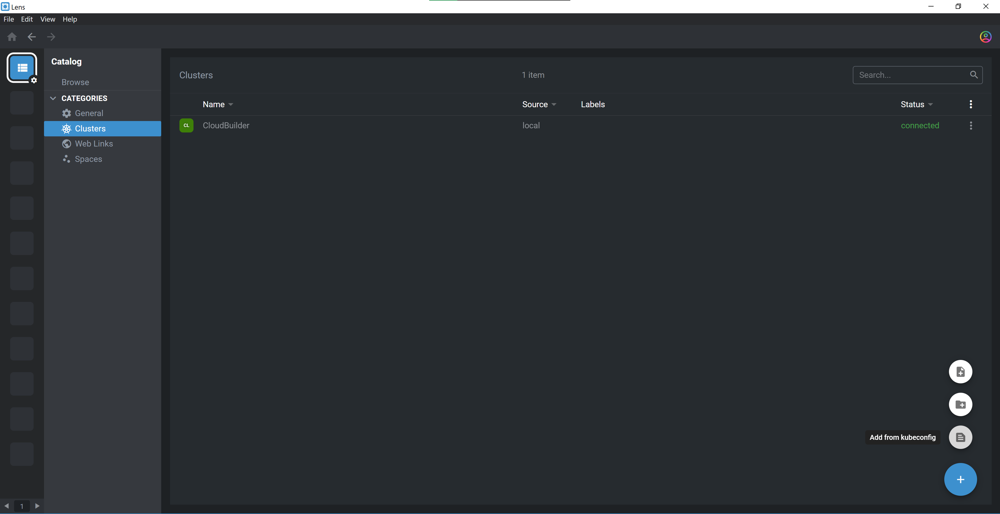
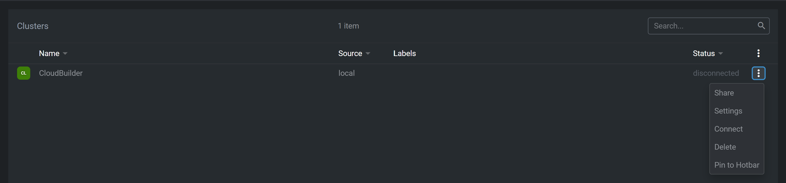
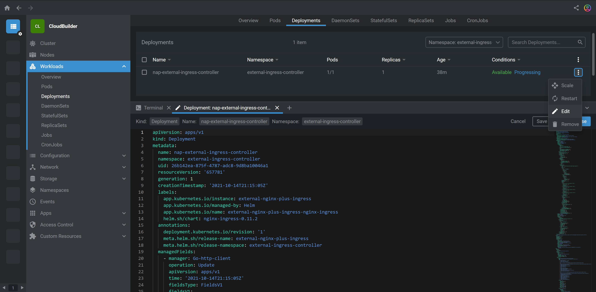
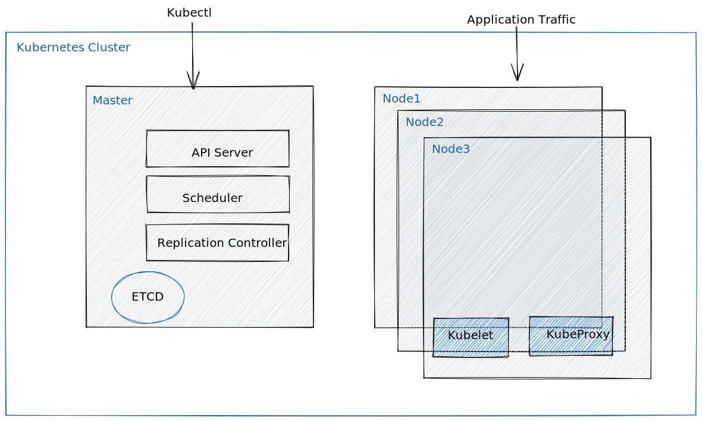
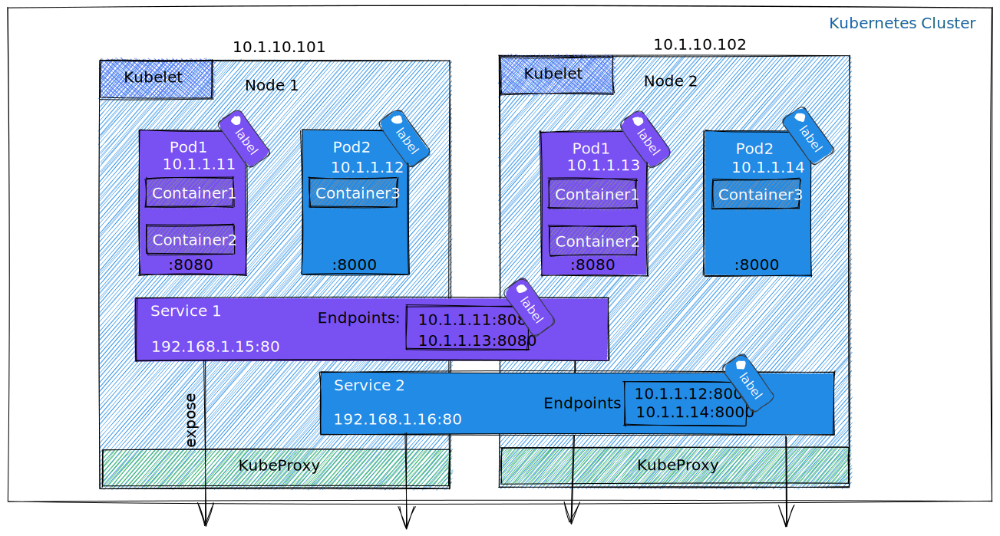
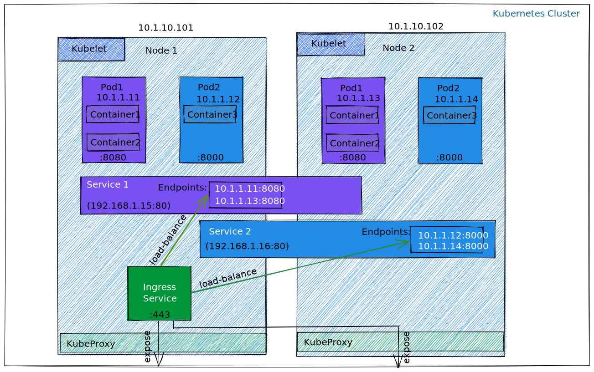

Pre-requisites
#####################################

.. contents:: Contents
    :local:

1. Major League Cyber
*********************
- Create an account on `Major League Cyber <https://www.majorleaguecyber.org>`_

2. Capture The Flag
*********************
- Connect to `Capture The Flag server <https://ctfd1.f5app.dev/oauth>`_ using your Major League Cyber's credentials
- Authorize this workshop to access your profile
- You are redirected to ``Challenges`` that are questions asked during ``Exercises`` in each ``Lab``.

3. Site ID and region
*********************
- A dedicated environment is created for each user
- Ask F5 for your ``{{site_ID}}`` and your ``{{region}}``
- During Labs, reuse those variables in command lines. For example replace ``{{site_ID}}`` by `1`

4. Jumphost
*********************

Logging into your lab System:

- Copy-paste private SSH key `here <https://raw.githubusercontent.com/nergalex/f5-aks-kic-lab/master/source/class1/module4/_files/jumphost.key>`_ to a local file ``jumphost.key``
- On Mac/Linux, modify the rights of your local file ``jumphost.key`` with the command: below:

.. code-block:: bash

    chmod 600 jumphost.key

- On Windows use `SecureCRT <https://www.vandyke.com/cgi-bin/releases.php?product=securecrt>`_ or `Putty <https://www.putty.org/>`_: download `jumphost.ppk <https://raw.githubusercontent.com/nergalex/f5-aks-kic-lab/master/source/class1/module4/_files/jumphost.ppk>`_ for Putty.
- Open an SSH session to ``jumphost-aksdistrict{{site_ID}}.{{region}}.cloudapp.azure.com``. Log in as user ``cyber`` authenticated with private key ``jumphost.key``.

.. code-block:: bash

    ssh -i jumphost.key cyber@jumphost-aksdistrict{{site_ID}}.{{region}}.cloudapp.azure.com

- Elevate your privilege:

.. code-block:: bash

    sudo su -

- Get your kubeconfig:

.. code-block:: bash

    cat .kube/config

5. Lens
*********************
- Donwload Lens `here <https://k8slens.dev/>`_
- Install and run Lens
- Add your AKS cluster in Catalog

- Connect to cluster

- Browse into your cluster

6. Knowledge
*********************
The architecture of labs shows `microservices <https://docs.microsoft.com/en-us/azure/architecture/microservices/>`_ application deployed to Azure Kubernetes Service (AKS).
It uses a basic AKS configuration that can be the starting point for most deployments.
Participating to this lab assumes basic knowledge of Kubernetes.

Please read `this article <https://docs.microsoft.com/en-us/azure/architecture/reference-architectures/containers/aks-microservices/aks-microservices>`_ that introduce you to infrastructure and DevOps considerations of running a microservices architecture on AKS.

Kubernetes components
=====================

Container, POD, Service
=======================

Ingress Service
=====================

