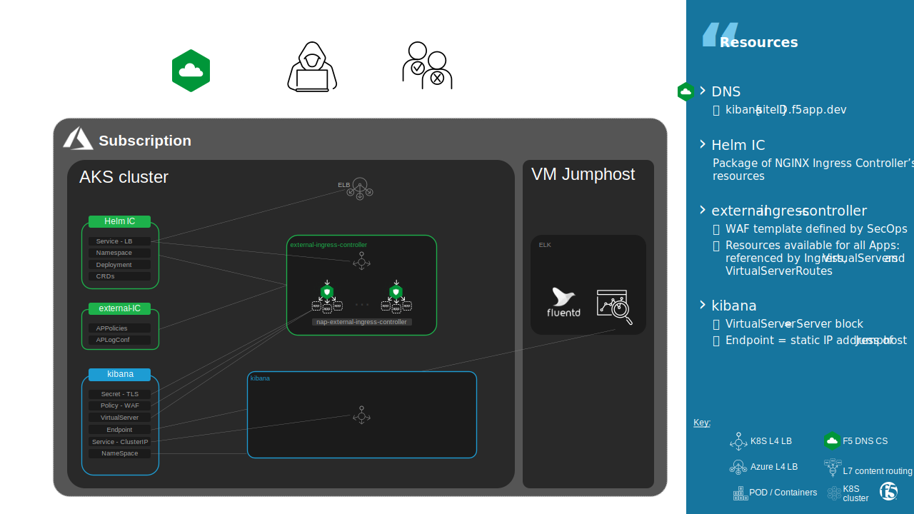
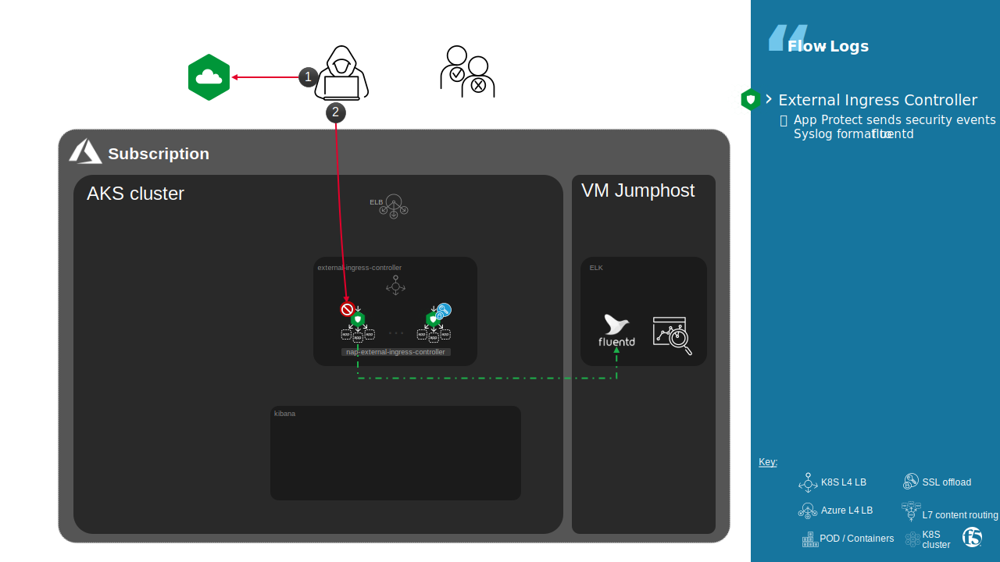

Infrastructure
##############################################################

.. contents:: Contents
    :local:

Jumphost
*********************

- Download SSH key `jumphost.key <https://f5-my.sharepoint.com/:f:/r/personal/al_dacosta_f5_com/Documents/Lab/f5-aks-kic-lab?csf=1&web=1&e=PYcBdc>`_
- Ask for your ``{{site_ID}}`` and your Azure ``{{region}}``
- Open an SSH session to ``jumphost-aksdistrict{{site_ID}}.{{region}}.cloudapp.azure.com``. Log in as user ``cyber`` authenticated with private key ``jumphost.key``.

.. code-block:: bash

    ssh -i jumphost.key cyber@jumphost-aksdistrict{{site_ID}}.{{region}}.cloudapp.azure.com

AKS cluster
*********************

On Jumphost, communicate with K8S API using kubectl

.. code-block:: bash

    $ kubectl get namespaces

K8S resources
*********************

A NGINX Ingress Controller + App Protect module is already deployed.

ELK UI https://kibana{{site_ID}}.f5app.dev is published by Ingress Controller.

ELK UI is protected by NGINX App Protect embedded in Ingress Controller.

.. image:: ./_pictures/infra_resources_elk.svg
   :align: center
   :width: 900
   :alt: ELK

Security events logs are sent to ELK.

