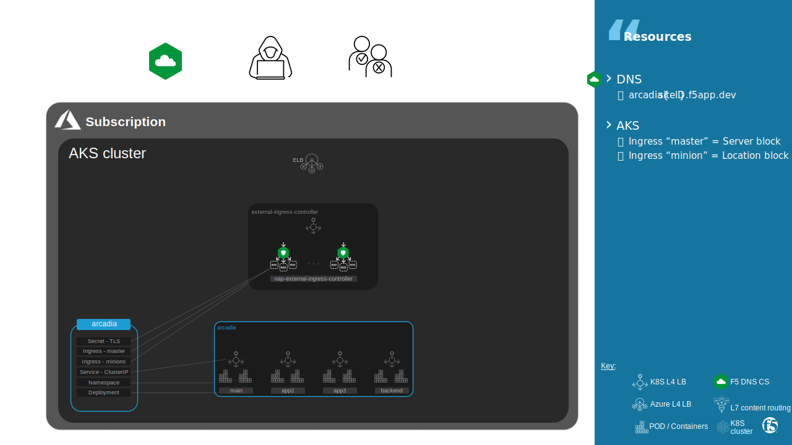
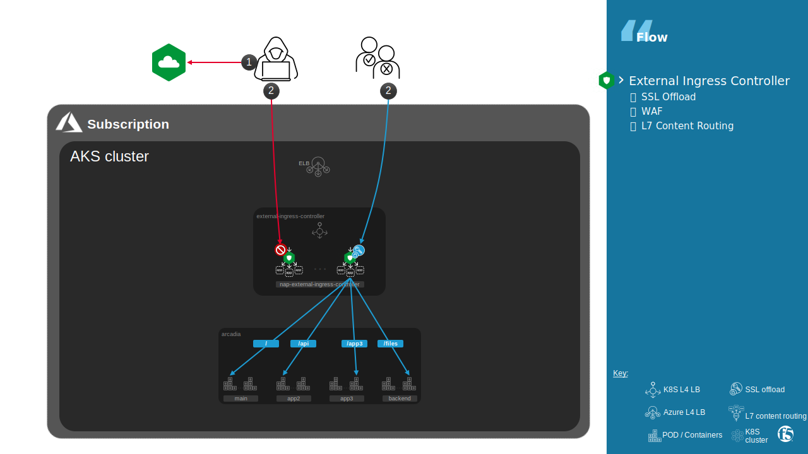

Arcadia
##############################################################

.. contents:: Contents
    :local:

App Design
*********************

Arcadia app is split between 4 micro-services.
More details `here <https://rtd-nginx-app-protect-udf.readthedocs.io/en/latest/class1/module1/module1.html>`_

.. image:: ./_pictures/arcadia-api.png
   :align: center
   :width: 800
   :alt: App design

K8S resources
*********************

Arcadia is published through ingress class External.

Page rendering generates requests to each micro-service routed by Ingress Controller.

- Connect to ``https://arcadia{{site_ID}}.f5app.dev/``
- Login with user ``matt`` and password ``ilovef5``

Mater / Minions
===================

Arcadia is published using `mergeable Ingress <https://github.com/nginxinc/kubernetes-ingress/tree/v1.11.1/examples/mergeable-ingress-types>`_.

.. code-block:: bash

    annotations:
        nginx.org/mergeable-ingress-type: "master"

.. code-block:: bash

    annotations:
        nginx.org/mergeable-ingress-type: "master"

Ingress configuration a spread for host ``arcadia{{site_ID}}.f5app.dev`` across multiple Ingress resources using Mergeable Ingress resources.
Here all resources belong to a same namespace ``lab1-arcadia`` but it could be different namespaces.
This enables easier management when using a large number of paths.

.. code-block:: bash

    server {
            # configuration for lab1-arcadia/arcadia-ingress-external-master

            location /api {
                    # location for minion lab1-arcadia/arcadia-ingress-external-minion-app2
            }

            location /app3 {
                    # location for minion lab1-arcadia/arcadia-ingress-external-minion-app3
            }

            location /files {
                    # location for minion lab1-arcadia/arcadia-ingress-external-minion-backend
            }

            location / {
                    # location for minion lab1-arcadia/arcadia-ingress-external-minion-main
            }
    }

Advanced Configuration
======================
** Annotation **

The Ingress resource only allows you to use basic NGINX features – host and path-based routing and TLS termination.
For more advanced features like rewriting the request URI or inserting additional response headers,
annotations `here <https://docs.nginx.com/nginx-ingress-controller/configuration/ingress-resources/advanced-configuration-with-annotations/#summary-of-annotations>`_
can be applied to an Ingress resource that allow to use advanced NGINX features and customize/fine tune NGINX behavior for that Ingress resource.

** Snippets **

One annotation available is Snippets.
Snippets allow you to insert raw NGINX config into different contexts of the NGINX configurations that the Ingress Controller generates.
These should be used as a last-resort solution in cases where annotations entries cannot help.

Disadvantages
=============
Annotation and Snippets have the following disadvantages:

- **Complexity**
    - Annotation is not an object (dict or/and list), so all your configurations is flat and become quickly difficult to read
    - To use snippets, you will need to:
        - Understand NGINX configuration primitives and implement a correct NGINX configuration.
        - Understand how the IC generates NGINX configuration so that a snippet doesn’t interfere with the other features in the configuration.
- **Decreased robustness**
    - An incorrect snippet makes the NGINX config invalid, which causes reload failures. This will prevent any new configuration updates, including updates for the other Ingress resources, until the snippet is fixed.
- **Security implications**
    - Snippets give access to NGINX configuration primitives and those primitives are not validated by the Ingress Controller. For example, a snippet can configure NGINX to serve the TLS certificates and keys used for TLS termination for Ingress resources.

|   **Note**: If the NGINX config includes an invalid snippet, NGINX will continue to operate with the latest valid configuration

