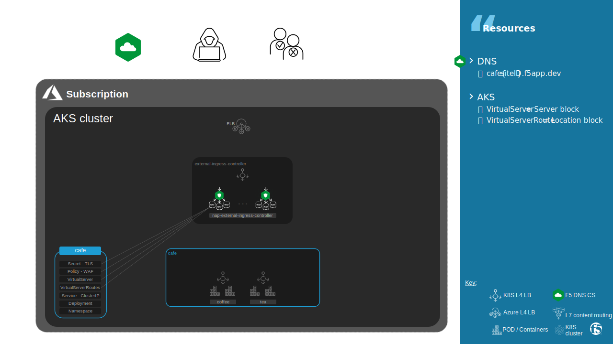
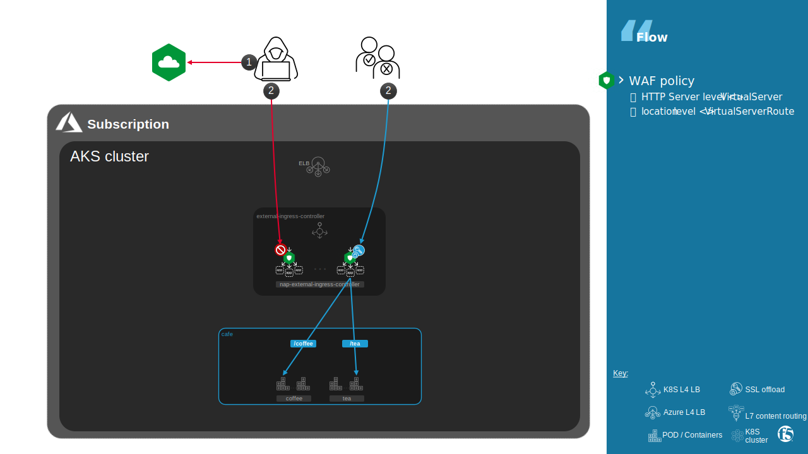

Cafe
##############################################################

.. contents:: Contents
    :local:

Introduction
*******************************
Cafe application, configured by your own in lab 2, have been already deployed in its final configuration in namespace ``lab3-cafe``.

Like an ``Ingress`` resource, a ``VirtualServer`` resource allows you to set a default policy at the http context in configuration file.
More, a ``VirtualServerRoute`` allows you to set a location policy in the configuration file.

In lab3, a WAF policy have been already applied to ``VirtualServer`` and each ``VirtualServerRoute`` resources.

- Try to access to ``https://cafe{{site_ID}}.f5app.dev/tea`` and ``https://cafe{{site_ID}}.f5app.dev/coffee``

Exercise 1: K8S resources
*******************************

The Policy resource allows you to configure a WAF policy,
which you can add to your VirtualServer and VirtualServerRoute resources.
More details `here <https://docs.nginx.com/nginx-ingress-controller/configuration/policy-resource/#waf>`_.

VirtualServer
===============================

- View Cafe ``VirtualServer`` and associated WAF policy

.. code-block:: bash

    kubectl describe virtualserver -n lab3-cafe cafe | grep -A 20 Spec

*output:*

.. code-block:: yaml
    :emphasize-lines: 4

      Host:                cafe1.f5app.dev
      Ingress Class Name:  nginx-external
      Policies:
        Name:       generic-security-level-low
        Namespace:  lab3-cafe

VirtualServerRoute
===============================

- View a Coffee ``VirtualServerRoute`` and associated WAF policy

.. code-block:: bash

    kubectl describe virtualserverroute -n lab3-cafe coffee | grep -A 38 Spec

*output:*

.. code-block:: yaml
    :emphasize-lines: 10

      Host:                cafe1.f5app.dev
      Ingress Class Name:  nginx-external
      Subroutes:
        ...
        Path:          /coffee/proxy
        Action:
          Pass:  coffee
        Path:    /coffee
        Policies:
          Name:       waf-cafe-coffee
          Namespace:  lab3-cafe
      Upstreams:
        Name:     coffee
        Port:     80
        Service:  coffee

**Capture The Flag**

    **1.1 What is the waf policy name that protects /tea?**
    | waf-cafe-tea

WAF Policy
===============================

- View a Coffee WAF ``Policy`` and associated App Protect policy

.. code-block:: bash

    kubectl describe policy -n lab3-cafe waf-cafe-coffee | grep -A 7 Spec

*output:*

.. code-block:: yaml
    :emphasize-lines: 2

      Waf:
        Ap Policy:  external-ingress-controller/cafe-coffee
        Enable:     true
        Security Log:
          Ap Log Conf:  external-ingress-controller/naplogformat
          Enable:       true
          Log Dest:     syslog:server=10.1.0.10:5144

App Protect Policy
===============================

- View a Coffee ``appolicy``

.. code-block:: bash

    kubectl describe appolicy -n external-ingress-controller cafe-coffee | grep -A 100 Spec

*output:*

.. code-block:: yaml
    :emphasize-lines: 9

      Policy:
        Application Language:  utf-8
        Blocking - Settings:
          Violations:
            Alarm:         true
            Block:         true
            Name:          VIOL_HTTP_RESPONSE_STATUS
        Enforcement Mode:  blocking
        Name:              cafe-coffee-security-level-low
        Signatures:
          Enabled:       false
          Signature Id:  200000128
        Template:
          Name:  POLICY_TEMPLATE_NGINX_BASE

**Capture The Flag**

    **1.2 In which namespace are located all APPolicies?**
    | external-ingress-controller

Exercise 2: Ingress Controller configuration
********************************************

- Log into IC

.. code-block:: bash
    :emphasize-lines: 3

    kubectl get pods -n external-ingress-controller

*output:*

.. code-block:: bash
    :emphasize-lines: 2

    NAME                                              READY   STATUS    RESTARTS   AGE
    nap-external-ingress-controller-7576b65b4-ps4ck   1/1     Running   0          8d

.. code-block:: bash

    kubectl exec --namespace external-ingress-controller -it nap-external-ingress-controller-7576b65b4-ps4ck bash

NGINX
===============================

- See configured WAF policies

.. code-block:: bash

    grep -E 'server_name |location |protect' /etc/nginx/conf.d/vs_lab3-cafe_cafe.conf

*output:*

.. code-block:: nginx
    :emphasize-lines: 3,12,18

    server_name cafe1.f5app.dev;
    app_protect_enable on;
    app_protect_policy_file /etc/nginx/waf/nac-policies/external-ingress-controller_generic-security-level-low;
    app_protect_security_log_enable on;
    app_protect_security_log /etc/nginx/waf/nac-logconfs/external-ingress-controller_naplogformat syslog:server=10.1.0.10:5144;
    location @return_0 {
    location /redirect {
    location /return_page {
    location /coffee/proxy {
    location /coffee {
        app_protect_enable on;
        app_protect_policy_file /etc/nginx/waf/nac-policies/external-ingress-controller_cafe-coffee;
        app_protect_security_log_enable on;
        app_protect_security_log /etc/nginx/waf/nac-logconfs/external-ingress-controller_naplogformat syslog:server=10.1.0.10:5144;
    location /tea/proxy {
    location /tea {
        app_protect_enable on;
        app_protect_policy_file /etc/nginx/waf/nac-policies/external-ingress-controller_cafe-tea;
        app_protect_security_log_enable on;
        app_protect_security_log /etc/nginx/waf/nac-logconfs/external-ingress-controller_naplogformat syslog:server=10.1.0.10:5144;

**Capture The Flag**

    **2.1 Which App Protect policy name protects /return_page?**
    | external-ingress-controller_generic-security-level-low

App Protect
===============================

- See configured WAF policies

.. code-block:: bash

    cat /opt/app_protect/config/config_set.json

*output:*

.. code-block:: json
    :emphasize-lines: 22

    {
      "policies": {
        "/etc/nginx/waf/nac-policies/external-ingress-controller_generic-security-level-low": {
          "import_filename": "/etc/nginx/waf/nac-policies/external-ingress-controller_generic-security-level-low",
          "src_config_line": 109,
          "vs_info": {
            "50-cafe1.f5app.dev:19-/tea/proxy": {
            },
            "50-cafe1.f5app.dev:17-/coffee/proxy": {
            },
            "50-cafe1.f5app.dev:16-/return_page": {
            },
            "50-cafe1.f5app.dev:15-/redirect": {
            },
            "50-cafe1.f5app.dev:14-@return_0": {
            },
            "50-cafe1.f5app.dev:0-": {
            }
          }
        },
        "/etc/nginx/waf/nac-policies/external-ingress-controller_cafe-coffee": {
          "import_filename": "/etc/nginx/waf/nac-policies/external-ingress-controller_cafe-coffee",
          "src_config_line": 373,
          "vs_info": {
            "50-cafe1.f5app.dev:18-/coffee": {
            }
          }
        },
        "/etc/nginx/waf/nac-policies/external-ingress-controller_cafe-tea": {
        }
      }
    }

**Capture The Flag**

    **2.2 Two VirtualServerRoutes in a same namespace can reference same WAF policy. Is it true?**
    | yes

    **2.3 Two VirtualServerRoutes in 2 namespaces can reference one same WAF policy. Is it true?**
    | yes

