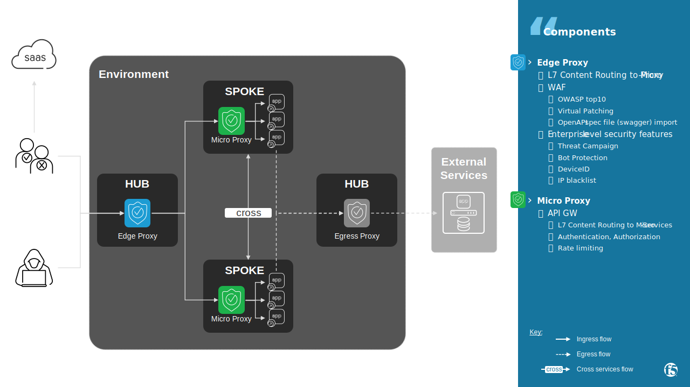
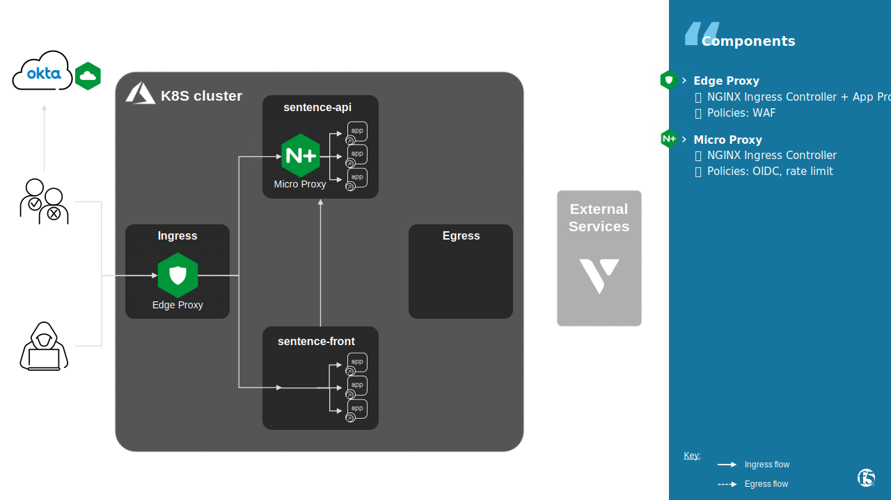
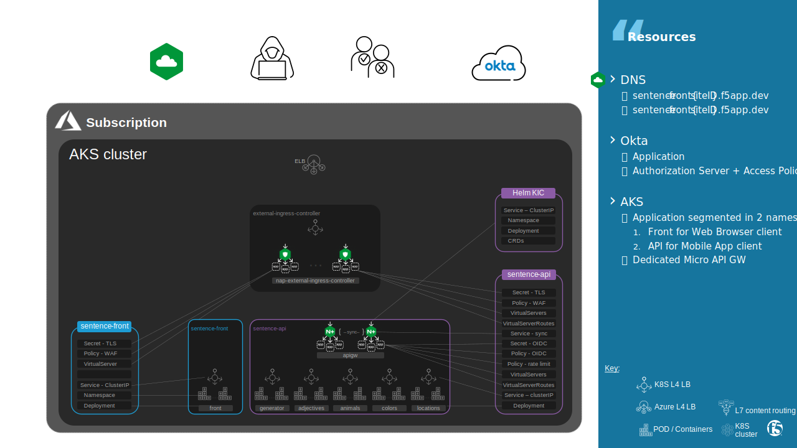

Architecture
#################################################################

.. contents:: Contents
    :local:
    :depth: 1

Edge Proxy - Web Application & API Protection
*********************************************

In previous labs, we worked on an Ingress Controller hosted in an infra namespace ``external-ingress-controller`` with Ingress Class Name ``nginx-external``.
This Ingress Controller is an **Edge Proxy** that:
    - is managed by Infrastructure Provider team
    - shares his service configuration with multiple Applications
    - manages North/South traffic
    - protects published Application with a core WAF policy defined at Enterprise level

In this lab, **Edge Proxy** protects an Web Browser based and API based Application when it is consumed from outside K8S cluster.

Micro Proxy - API GW
********************************

One of the defining characteristics of an API is that it should be reusable,
i.e. an API endpoint can be consumed by another internal micro-service, partner application or anybody on Internet.
`To reduce attack surface of APIs <https://www.f5.com/labs/articles/education/securing-apis--10-best-practices-for-keeping-your-data-and-infra>`_,
a threat model and according protection are defined per `API consumer profile <https://www.osaango.com/blog/why-should-you-categorize-your-apis>`_:

    - **Private API**: consumed within an organization and not intended to be exposed to consumers outside of the organization
    - **Partner API**: consumed by specific partners of your organization, meaning that there is an established relationship and some framework.
    - **Public API**: intended to be consumed by anybody interested in the API, and does not depend on or establish a close relationship; the goal is to make consumption easy, and to attract as many consumers as possible.

In this lab, **Micro Proxy** publishes API endpoints of an Application in 2 ways:

    - **Private API** consumed by another namespace and inside the same namespace. This communication generates cross namespace, or East/West, traffic inside K8S cluster.
    - **Partner API** consumed by a user using an IDaaS

.. note::
    **Private API** could also generates **North/South traffic** regarding our K8S cluster point of view: for example a consumer hosted on another K8S cluster in another Cloud Service Provider

Sentence
********************************

App components
================================
As described `here <https://clouddocs.f5.com/training/community/nginx/html/class6/module1/lab1/lab1.html>`_,
Sentence app is split into:

- a **web frontend service**, published publicly
- a **middle-end API service** named ``generator``, published:
    - internally to frontend server
    - directly to authenticated partner. Partner are authenticated by an IDaaS: **Okta**
- **backend API micro-services**, published internally to ``generator``

A dedicated Ingress Controller acts as an API GW to handle **internal API** and **partner API** publication.

K8S resources
================================
Sentence app is split into 2 namespaces:

- **Front** that hosts web frontend service
- **API** that hosts API GW, middle-end and backend API micro-services

