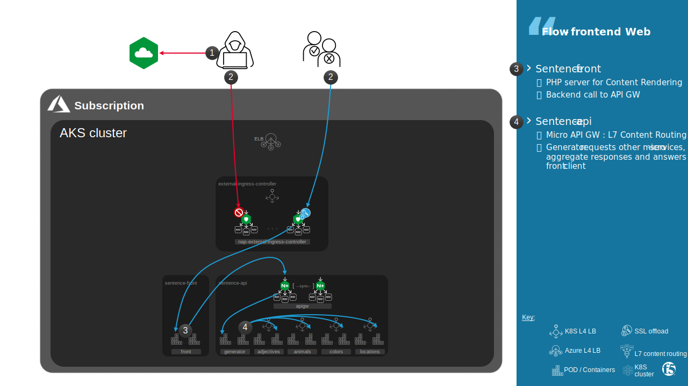
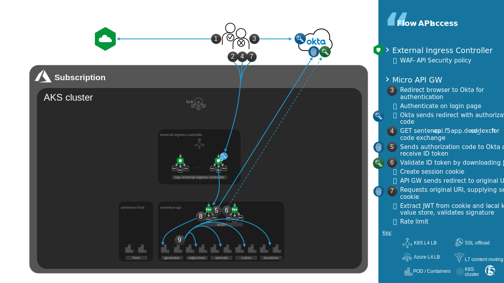
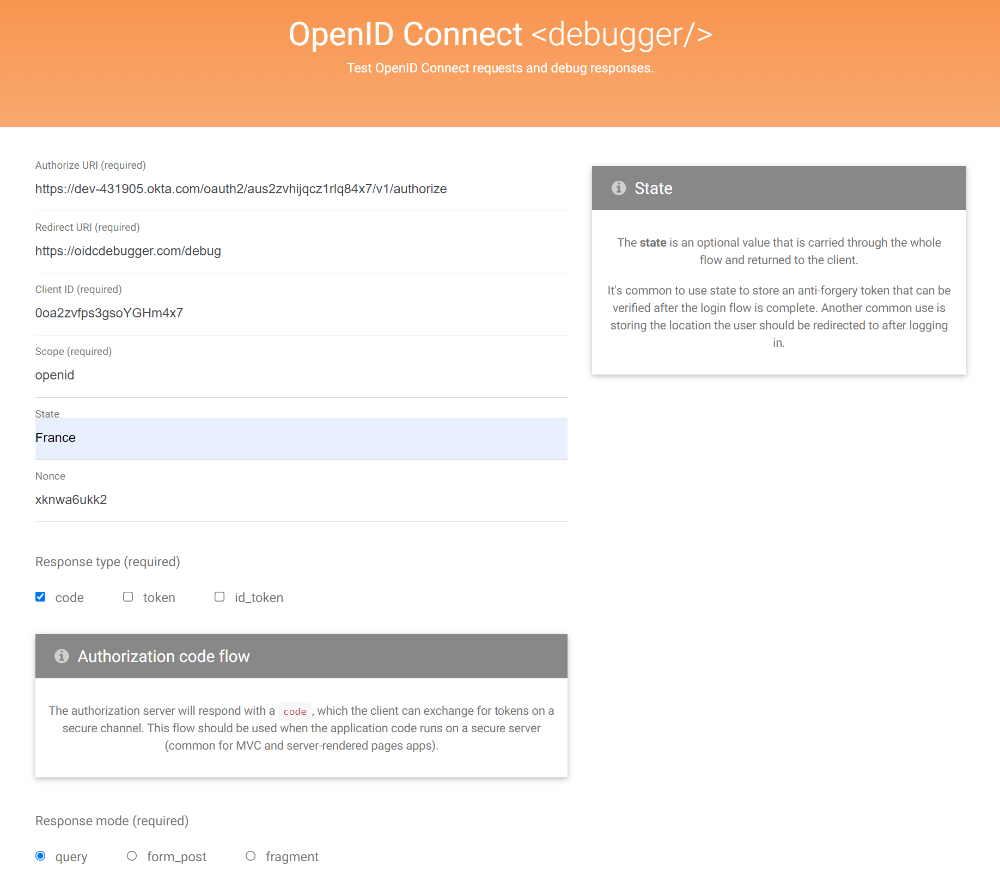
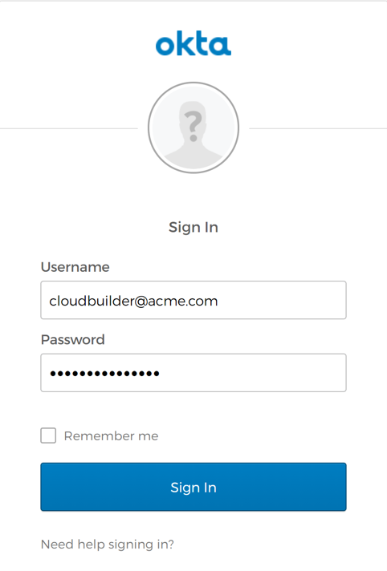
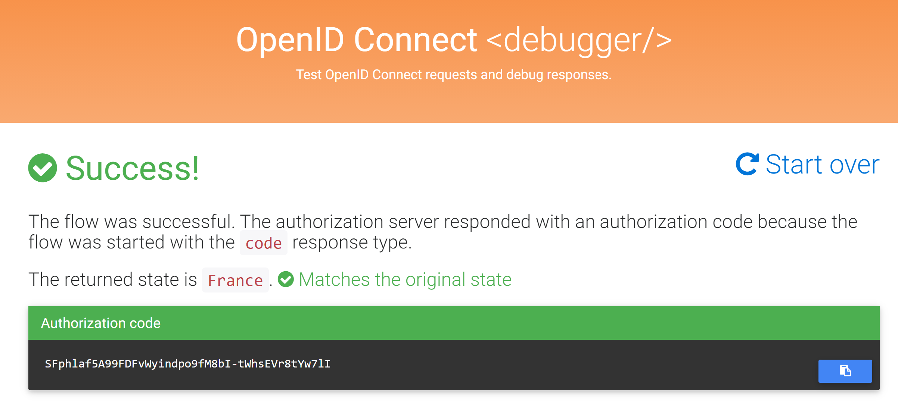
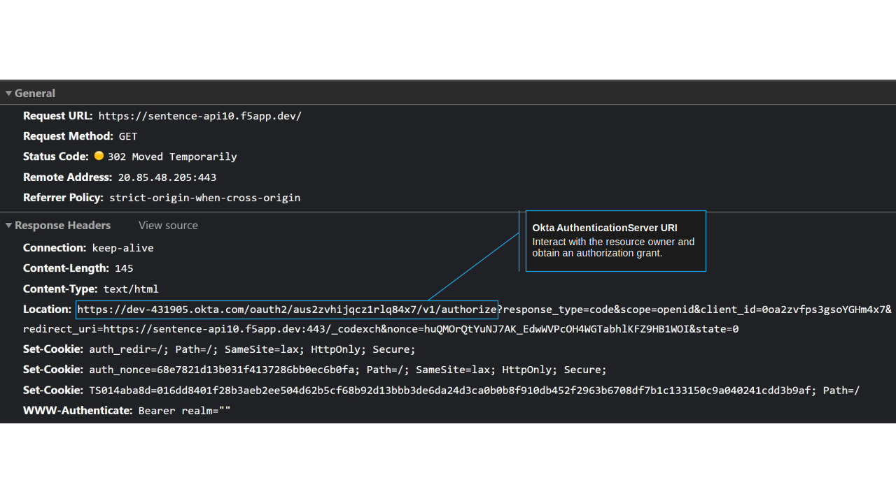
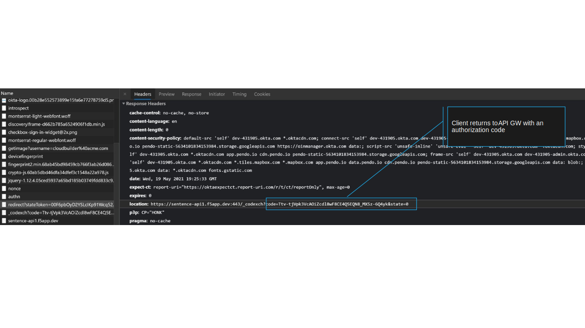
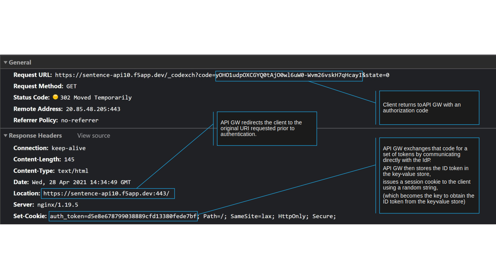
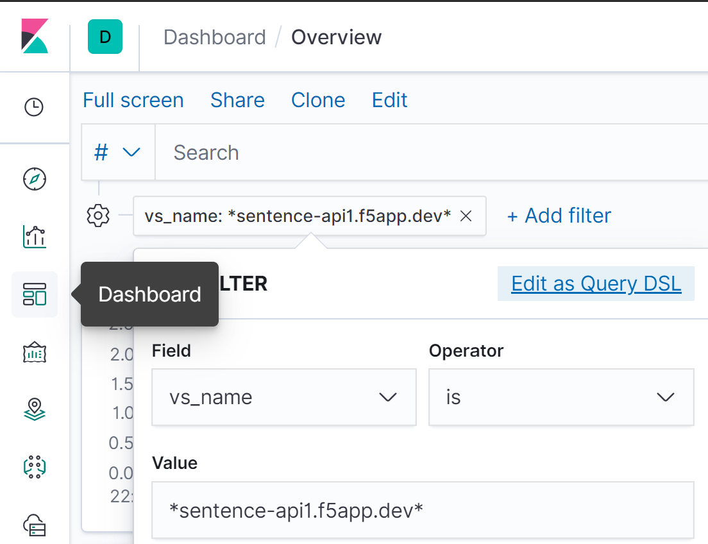

Sentence app
#################################################################

.. contents:: Contents
    :local:
    :depth: 2

Web UI access
*********************************************

Exercise 1: Flow 2 | Client >> Frontend
============================================

- Using your web browser, try to access to ``https://sentence{{site_ID}}.f5app.dev``

*output:*

- Check that web frontend access is well protected by NGINX App Protect: ``https://sentence{{site_ID}}.f5app.dev?<script>``

*output:*

.. code-block:: html

    <html><head><title>Request Rejected</title></head><body>The requested URL was rejected.
    Please consult with your administrator.  
    Your support ID is: 4096465330496922252
      <a href='javascript:history.back();'>[Go Back]</a></body></html>

Exercise 2: Flow 3 | Frontend >> Internal API
=============================================

- Install ``curl``

.. code-block:: bash

    kubectl create ns debug
    kubectl run multitool --image=praqma/network-multitool -n debug
    kubectl exec -it multitool -n debug -- sh

- Connect to `Internal API endpoint /name <https://github.com/fchmainy/nginx-aks-demo/blob/main/Docker/frontend-namespace-via-apigw/index.php#L25>`_

.. code-block:: bash

    curl http://apigw-microapigw.lab4-sentence-api/name

*output:*

.. code-block:: json

    {
      "adjectives": "calm",
      "animals": "whale",
      "colors": "green",
      "locations": "valley"
    }

Exercise 3: Flow 4 | Generator >> Internal API
=============================================

- Connect to `Internal API endpoint /adjectives <https://github.com/fchmainy/nginx-aks-demo/blob/main/Docker/generator-via-api-gw/generator.py#L57>`_

.. code-block:: bash

    curl http://apigw-microapigw.lab4-sentence-api/adjectives

*output:*

.. code-block:: json

    [
      {
        "id": 1,
        "name": "kind"
      },
      {
        "id": 2,
        "name": "proud"
      },
      {
        "id": 3,
        "name": "calm"
      }
    ]

Partner API access
*********************************************

Flows 2-7: Functional view
=============================================

Partner API access enable OpenID Connect integration for NGINX Plus as described `here <https://github.com/fchmainy/nginx-aks-demo/blob/main/Docker/generator-via-api-gw/generator.py#L57>`_.

.. image:: ./_pictures/OIDC_overview.svg
   :align: center
   :width: 500
   :alt: OIDC

Implementation done for this lab:

    - Okta as an identity provider (IdP)
    - authorization code flow
    - NGINX Ingress Controller is configured as a relying party
    - Okta knows our internal Ingress Controller as a confidential client or a public client using PKCE

In this lab, both the client and NGINX Ingress Controller communicate directly with the IdP at different stages during the initial authentication event.

.. image:: ./_pictures/OIDC_details.svg
   :align: center
   :width: 700
   :alt: OIDC

Exercise 1: Flow 3 | Client >> Okta
=============================================

- Using a Web Browser, connect to `oidcdebugger <https://oidcdebugger.com/>`_
- Fill the form:
    - Authorize URI: ``https://dev-431905.okta.com/oauth2/aus2zvhijqcz1rlq84x7/v1/authorize``
    - Redirect URI: ``https://oidcdebugger.com/debug``
    - Client ID: ``0oa2zvfps3gsoYGHm4x7``
    - Scope: ``openid``
    - State: ``France``
    - Nonce: ``39pog581mp9``
    - Response type: ``code``
    - Response mode: ``query``

- Authenticate user with username ``cloudbuilder@acme.com`` and password ``F5-AKS-KIC-lab!``

- You should receive a response code

Exercise 2: API GW - K8S configuration
=================================================

- View OIDC configuration in VirtualServerRoute resource

.. code-block:: bash

    kubectl describe virtualserverroute -n lab4-sentence-api generator | grep -A 13 Spec

*output:*

.. code-block:: yaml
    :emphasize-lines: 8

      Host:                sentence-api1.f5app.dev
      Ingress Class Name:  sentence-api-nginx-internal
      Subroutes:
        Action:
          Pass:  generator
        Path:    /
        Policies:
          Name:       oidc-policy
          Namespace:  lab4-sentence-api
      Upstreams:
        Name:     generator
        Port:     80
        Service:  generator

- View OIDC policy resource

.. code-block:: bash

    kubectl describe policy -n lab4-sentence-api oidc-policy | grep -A 7 Spec

*output:*

.. code-block:: yaml

      Oidc:
        Auth Endpoint:   https://dev-431905.okta.com/oauth2/aus2zvhijqcz1rlq84x7/v1/authorize
        Client ID:       0oa2zvfps3gsoYGHm4x7
        Client Secret:   oidc-secret
        Jwks URI:        https://dev-431905.okta.com/oauth2/aus2zvhijqcz1rlq84x7/v1/keys
        Scope:           openid
        Token Endpoint:  https://dev-431905.okta.com/oauth2/aus2zvhijqcz1rlq84x7/v1/token

_______________________________________________________________________

**Capture The Flag**

    **2.1 What is the URI that publish Public Key used by IC to check signature of JWT?**

    **2.2 What is the secret length in bytes?**

Exercise 3: API GW - NGINX configuration
=================================================

NGINX Ingress Controller is configured to perform OpenID Connect authentication.

- Connect to internal IC (apigw)

.. code-block:: bash

    kubectl get pods --namespace lab4-sentence-api
    kubectl exec --namespace lab4-sentence-api -it apigw-7795fd75c9-492rl bash

- View configuration in Location block

.. code-block:: bash

    grep oidc /etc/nginx/conf.d/vs_lab4-sentence-api_sentence-api-internal.conf

*output:*

.. code-block:: nginx
    :emphasize-lines: 1

    include oidc/oidc.conf;
    set $oidc_pkce_enable 0;
    set $oidc_logout_redirect "/_logout";
    set $oidc_hmac_key "sentence-api-internal";
    set $oidc_authz_endpoint "https://dev-431905.okta.com/oauth2/aus2zvhijqcz1rlq84x7/v1/authorize";
    set $oidc_token_endpoint "https://dev-431905.okta.com/oauth2/aus2zvhijqcz1rlq84x7/v1/token";
    set $oidc_jwt_keyfile "https://dev-431905.okta.com/oauth2/aus2zvhijqcz1rlq84x7/v1/keys";
    set $oidc_scopes "openid";
    set $oidc_client "0oa2zvfps3gsoYGHm4x7";
    set $oidc_client_secret "-lzR61blfzTcU05FEohmXZ0HwPhjZJPGAPmJpSk-";

- View configuration of OIDC code exchange request received by client

.. code-block:: bash

    grep -A 5 _codexch /etc/nginx/oidc/oidc.conf

*output:*

.. code-block:: nginx
    :emphasize-lines: 1

    #set $redir_location "/_codexch";
    location = /_codexch {
        # This location is called by the IdP after successful authentication
        status_zone "OIDC code exchange";
        js_content oidc.codeExchange;
        error_page 500 502 504 @oidc_error;
    }

- View configuration of OIDC token request sent by NGINX Ingress Controller to Okta

.. code-block:: bash

    grep -A 10 /_token /etc/nginx/oidc/oidc.conf

*output:*

.. code-block:: nginx
    :emphasize-lines: 8

    location = /_token {
        # This location is called by oidcCodeExchange(). We use the proxy_ directives
        # to construct the OpenID Connect token request, as per:
        #  http://openid.net/specs/openid-connect-core-1_0.html#TokenRequest
        internal;
        proxy_ssl_server_name on; # For SNI to the IdP
        proxy_set_header      Content-Type "application/x-www-form-urlencoded";
        proxy_set_body        "grant_type=authorization_code&client_id=$oidc_client&$args&redirect_uri=$redirect_base$redir_location";
        proxy_method          POST;
        proxy_pass            $oidc_token_endpoint;
   }

Exercise 4: API GW - OIDC flows
=================================================
Upon a first visit to a protected resource,
API GW initiates the OpenID Connect authorization code flow and redirects the client to the OpenID Connect provider (Okta).

- Using your Web brower, open Developper tools (F12 or Ctrl + Shift + i)
- Browse to ``https://sentence-api{{site_ID}}.f5app.dev/``
- Click on request ``https://sentence-api{{site_ID}}.f5app.dev/``

_______________________________________________________________________

**Capture The Flag**

    **4.1 In parameters of the request, what is the PATH of the redirect uri?**

- Authenticate user with username ``cloudbuilder@acme.com`` and password ``F5-AKS-KIC-lab!``

The client returns to API GW with an authorization code.

API GW exchanges that code for a set of tokens by communicating directly with the IdP.
The ID Token received from the IdP is validated.

.. code-block:: bash

    grep -A 8 /_id_token_validation /etc/nginx/oidc/oidc.conf

*output:*

.. code-block:: nginx
    :emphasize-lines: 1

    location = /_id_token_validation {
        # This location is called by oidcCodeExchange() and oidcRefreshRequest(). We use
        # the auth_jwt_module to validate the OpenID Connect token response, as per:
        #  https://openid.net/specs/openid-connect-core-1_0.html#IDTokenValidation
        internal;
        auth_jwt "" token=$arg_token;
        js_content oidc.validateIdToken;
        error_page 500 502 504 @oidc_error;
    }

API GW then stores the ID token in the key-value store,
issues a session cookie to the client using a random string,
(which becomes the key to obtain the ID token from the key-value store)
and redirects the client to the original URI requested prior to authentication.

- Click on request ``https://sentence-api{{site_ID}}.f5app.dev/_codexch``

Subsequent requests to protected resources are authenticated by exchanging the session cookie for the ID Token in the key-value store.

.. image:: ./_pictures/OIDC_flow_4.svg
   :align: center
   :width: 900
   :alt: OIDC - flow 4

JWT validation is performed on each request, as normal, so that the ID Token validity period is enforced.
For more information on OpenID Connect and JWT validation with NGINX Plus,
see Authenticating Users to `Existing Applications with OpenID Connect and NGINX Plus <https://www.nginx.com/blog/authenticating-users-existing-applications-openid-connect-nginx-plus/>`_.

- Browse on ``https://sentence-api{{site_ID}}.f5app.dev/adjectives``

_______________________________________________________________________

**Capture The Flag**

    **4.2 What is the cookie name for which the value will be exchanged for the ID Token in the key-value store?**

Exercise 5: Web Application and API Protection (WAAP)
=====================================================
The OpenAPI Specification defines the spec file format needed to describe RESTful APIs.
The spec file can be written either in JSON or YAML.

- View the difference for ``/name`` endpoint between Sentence's openAPI spec files:
    - `Internal API <https://github.com/fchmainy/nginx-aks-demo/blob/main/k8s/apigw/oas_generator_v0.1.yaml>`_
    - `Partner API <https://github.com/nergalex/f5-nap-policies/blob/master/policy/open-api-files/sentence-api.f5app.dev.yaml>`_

`API protection <https://docs.nginx.com/nginx-app-protect/configuration/#openapi-specification-file-reference>`_ policy is using an OpenAPI Specification file to import the details of the APIs.
NGINX App Protect will automatically create a policy for the following properties (depending on what’s included in the spec file):
    - Methods
    - URLs
    - Parameters
    - JSON profiles

- Using a Web browser, access to ``https://sentence-api{{site_ID}}.f5app.dev/colors/1``

*output:*

.. code-block:: json

    {
      "id": 1,
      "name": "red"
    }

- Using a Web browser, access to ``https://sentence-api{{site_ID}}.f5app.dev/colors/tata`` and the error message in JSON format

*output:*

.. code-block:: json

    {"supportID": "17736894413136180189"}

_______________________________________________________________________

**Capture The Flag**

    **5.1 For /colors/{id} endpoint, what is the defined type for parameter name 'id'?**

- Connect to Kibana ``https://kibana{{site_ID}}.f5app.dev/``
- Dashboard >> Overview >> add a filter ``vs_name is sentence-api{{site_ID}}f5app.dev``

_______________________________________________________________________

**Capture The Flag**

    **5.2 What is the violation raised for request ``/colors/tata``?**

Exercise 6: WAAP configuration
=================================================

- View VirtualServer specifications

.. code-block:: bash

    kubectl describe virtualservers -n lab4-sentence-api sentence-api | grep -A 100 Spec

*output:*

.. code-block:: yaml
    :emphasize-lines: 4

      Host:                sentence-api1.f5app.dev
      Ingress Class Name:  nginx-external
      Policies:
        Name:       waf-sentence-api
        Namespace:  lab4-sentence-api
      Routes:
        Path:   /_codexch
        Route:  lab4-sentence-api/codexch
        Action:
          Pass:  apigw
        Path:    /
      Tls:
        Redirect:
          Based On:  scheme
          Code:      301
          Enable:    true
        Secret:      sentence-api-secret-tls
      Upstreams:
        Name:     apigw
        Port:     80
        Service:  apigw-microapigw

- View WAF policy specifications

.. code-block:: bash

    kubectl describe policy -n lab4-sentence-api waf-sentence-api | grep -A 100 Spec

*output:*

.. code-block:: yaml
    :emphasize-lines: 2

      Waf:
        Ap Policy:  external-ingress-controller/sentence-api
        Enable:     true
        Security Log:
          Ap Log Conf:  external-ingress-controller/naplogformat
          Enable:       true
          Log Dest:     syslog:server=10.1.0.10:5144

- View App Protect policy and the reference to OpenAPI spec file **partner API**

.. code-block:: bash

    kubectl describe appolicy -n external-ingress-controller sentence-api | grep -A 100 Spec

*output:*

.. code-block:: yaml
    :emphasize-lines: 9

  Policy:
    Blocking - Settings:
      Violations:
        ...: ...
    Description:      Based on NGINX App Protect API Security template Policy
    Name:             sentence-api-security-level-api
    Open - API - Files:
      Link:  https://raw.githubusercontent.com/nergalex/f5-nap-policies/master/policy/open-api-files/sentence-api.f5app.dev.yaml
    Template:
      Name:  POLICY_TEMPLATE_NGINX_BASE

Exercise 7: WAAP configuration and API infra endpoint
=====================================================

``/_codexch`` is not present in openAPI spec file because it is an infrastructure API endpoint required for OIDC.

- View VirtualServerRoute resource for ``/_codexch`` endpoint

.. code-block:: bash

    kubectl describe virtualserverroute -n lab4-sentence-api codexch | grep -A 100 Spec

*output:*

.. code-block:: yaml
    :emphasize-lines: 8

  Host:                sentence-api1.f5app.dev
  Ingress Class Name:  nginx-external
  Subroutes:
    Action:
      Pass:  apigw
    Path:    /_codexch
    Policies:
      Name:       waf-disable
      Namespace:  lab4-sentence-api
  Upstreams:
    Name:     apigw
    Port:     80
    Service:  apigw-microapigw

- View that WAF is disabled for ``/_codexch``

.. code-block:: bash

    kubectl describe policy -n lab4-sentence-api waf-disable | grep -A 2 Spec

*output:*

.. code-block:: yaml

      Waf:
        Enable:  false

.. note:: Ingress resource type does not allow to disable a WAF policy on a Location, only VirtualServerRoute does

Exercise 8: Rate Limit
=====================================================

The `rate limit policy <https://docs.nginx.com/nginx-ingress-controller/configuration/policy-resource/#ratelimit>`_ configures NGINX to limit the processing rate of requests.

- View VirtualServer specification

.. code-block:: bash

     kubectl describe virtualservers -n lab4-sentence-api sentence-api-internal | grep -A 5 Spec

*output:*

.. code-block:: yaml
    :emphasize-lines: 4

      Host:                sentence-api1.f5app.dev
      Ingress Class Name:  sentence-api-nginx-internal
      Policies:
        Name:       rate-limit-sentence-api
        Namespace:  lab4-sentence-api

- View Rate Limit Policy

.. code-block:: bash

     kubectl describe policy -n lab4-sentence-api rate-limit-sentence-api | grep -A 5 Spec

*output:*

.. code-block:: yaml
    :emphasize-lines: 3

      Rate Limit:
        Key:        ${request_uri}
        Rate:       5r/m
        Zone Size:  10M

- Using a Web browser, refresh page ``https://sentence-api{{site_ID}}.f5app.dev/`` quickly until a ``503`` response code
- View Access logs of API GW

.. code-block:: bash

     kubectl logs --namespace lab4-sentence-api apigw-7795fd75c9-492rl

*output:*

.. code-block:: log
    :emphasize-lines: 2,3

    10.1.1.55 - - [19/May/2021:20:57:11 +0000] "GET /colors/1 HTTP/1.1" 302 145 "-" "Mozilla/5.0 (Windows NT 10.0; Win64; x64) AppleWebKit/537.36 (KHTML, like Gecko) Chrome/90.0.4430.212 Safari/537.36 Edg/90.0.818.62" "91.165.208.158"
    2021/05/19 20:57:13 [error] 175#175: *326 limiting requests, excess: 0.848 by zone "pol_rl_lab4-sentence-api_rate-limit-sentence-api_lab4-sentence-api_sentence-api-internal", client: 10.1.1.55, server: sentence-api1.f5app.dev, request: "GET /colors/1 HTTP/1.1", host: "sentence-api1.f5app.dev"
    10.1.1.55 - - [19/May/2021:20:57:13 +0000] "GET /colors/1 HTTP/1.1" 503 599 "-" "Mozilla/5.0 (Windows NT 10.0; Win64; x64) AppleWebKit/537.36 (KHTML, like Gecko) Chrome/90.0.4430.212 Safari/537.36 Edg/90.0.818.62" "91.165.208.158"

_______________________________________________________________________

**Capture The Flag**

    **8.1 What is the rate limit threshold per second allowed in this configuration? (3 decimal places)**

