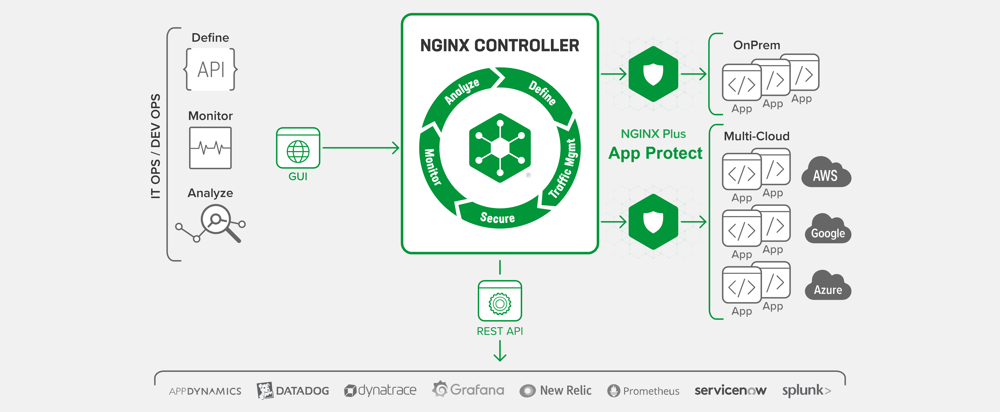

lab 5 - Controller
##############################################################

This lab describes how to manage centrally a Security distributed across Applicatives Spokes or/and hybrid-multi-cloud environments.

- **High Resiliency**: WAAP containerized instances are managed across all of your K8S clusters... as well as VM instances
- **Consistency of Security**: Applications reference WAF policies published in a central catalog
    - The Controller App Security add‑on eliminates friction by enforcing security throughout the application lifecycle without slowing developers down.
    - How? Our “WAF-as-a-Service” is an app‑centric approach to enabling WAF in automated pipelines, along with traffic services managed with the Controller Application Delivery Module, for app protection and visibility.
- **True Forecast Cost**: A simple economic model - based on Application - allows you to project on your budget with certainty
    - Application Insights offer a clear visibility into the number, performance, and ownership costs of your apps
    - With per‑app analytics, you gain new insights into app performance and reliability so you can pinpoint performance issues before they impact production.
- **Granular RBAC**: Aspire to improve collaboration across your modern app teams to unleash their productivity and efficiency.
    - All your teams – DevOps, NetOps, SecOps, and AppDev – can enjoy self‑service management and monitoring of their own apps through role‑based access control (RBAC).

.. toctree::
   :maxdepth: 1
   :glob:

   module*/module*

