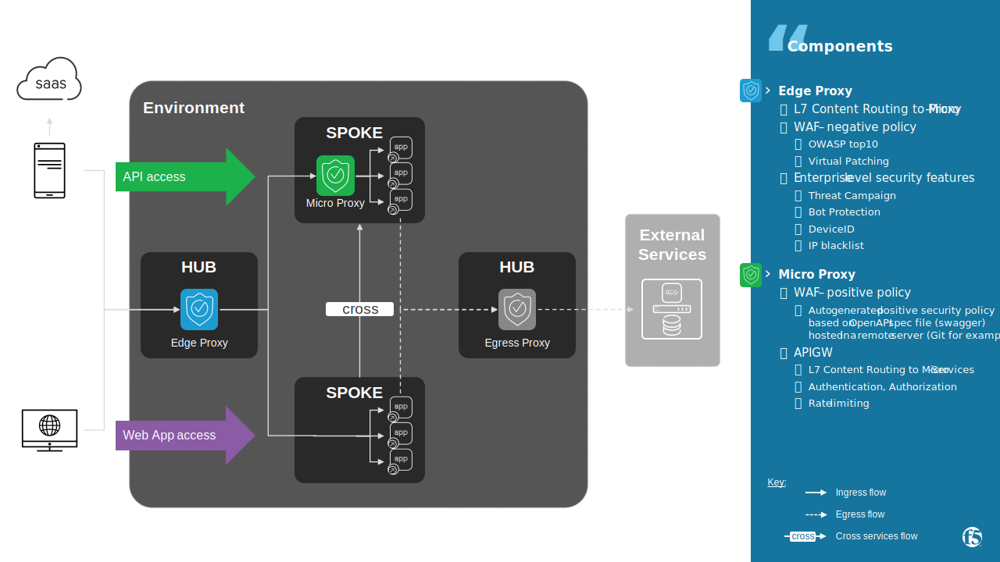
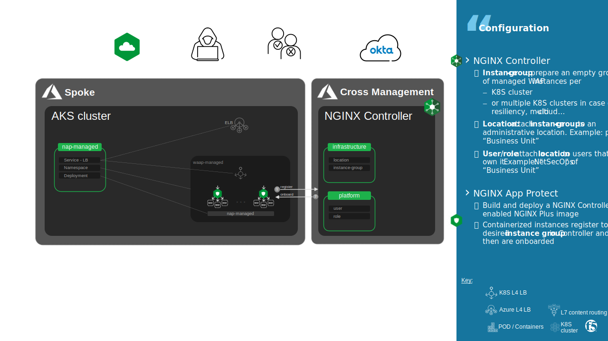
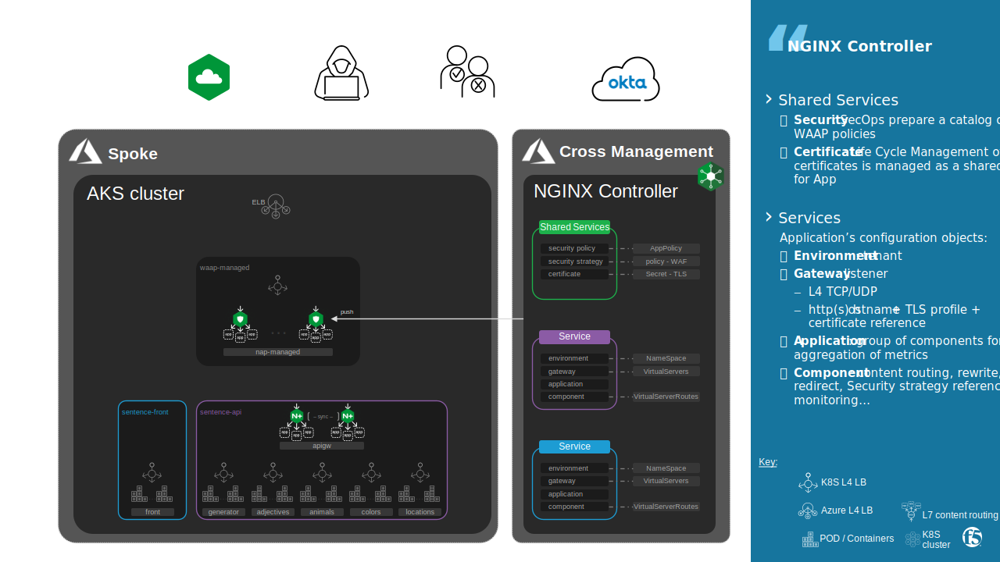
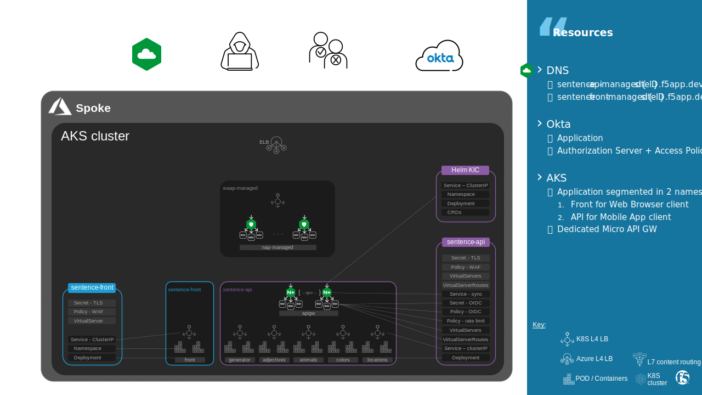
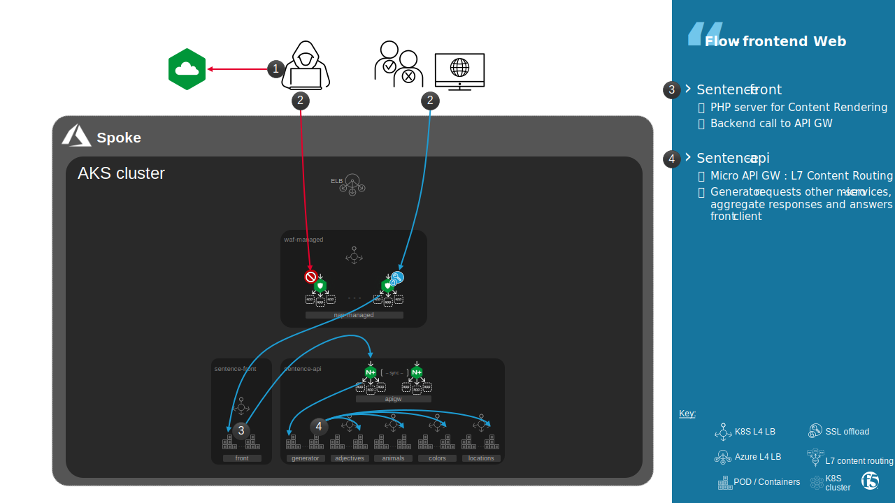
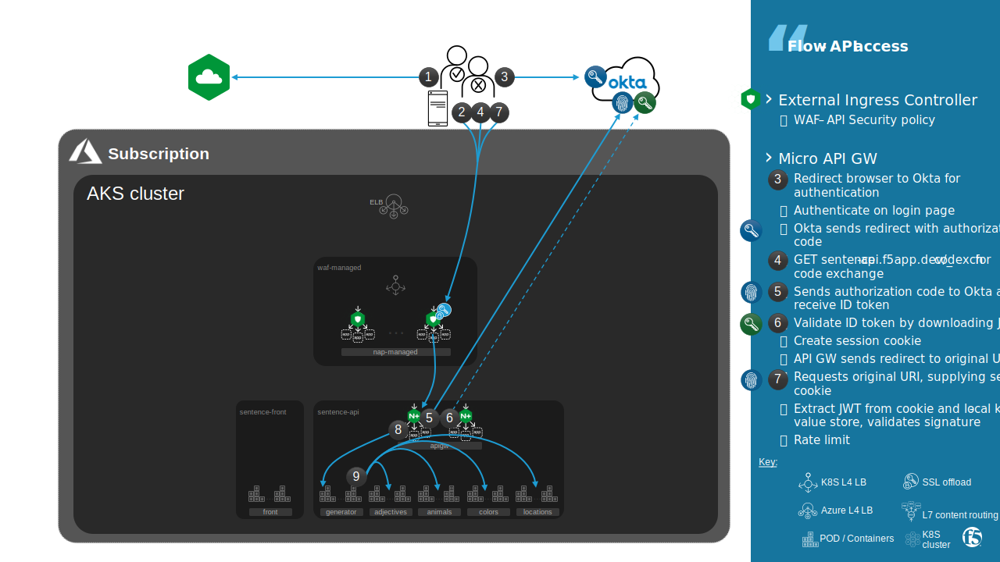

Architecture
#################################################################

.. contents:: Contents
    :local:
    :depth: 1

Distributed points of control managed by One Controller
***************************************************************
Security architect decided to distribute security across all subscriptions owned by each business unit,
whatever the Security appliance (NGINX App Protect) is hosted on VM or Container.
Regarding Modern Application hosted on Kubernetes cluster, security is embedded inside the Kubernetes cluster.
This design allows to published application on Internet directly secured by a Ingress Security layer hosted into Kubernetes clusters.

Those *strategic point of control* are controlled centrally by a Controller (NGINX Controller), as a Out of Band Control-Plane.

This design allows Operational Security team (SecOps) to have across subscription:

    - **Consistency**: standard security policies
    - **Simplicity**: standard security policies available in a catalog consumed by Operational Developer team (DevOps) responsible to publish applications
    - **Visibility** of Security events in order to understand the threat that targets widely the company or a specific application
    - **Reactivity**: when SecOps `Decides <https://en.wikipedia.org/wiki/OODA_loop>`_ to mitigate an `Observed <https://en.wikipedia.org/wiki/OODA_loop>`_ threat, stop a lateral movement that exploit a CVE for example, SecOps have to act quickly and widely by updating a standard security policy that will apply to all protected applications

This design was approved by DevOps and `SRE team <https://sre.google/>`_ because they also find value added propositions:

    - **Multi-Tenancy**: each Business Unit have its own tenant with only their published application on different environments (sandbox, QA, Prod)
    - **Self-Service**: DevOps are autonomous to manage Traffic Management and attach a security policy available in a catalog, using UI or API of Controller in CI/CD pipelines
    - **Observability - SLI**: SRE can consume metrics from *strategic points of control* as `SLIs <https://sre.google/sre-book/service-level-objectives/>`_ on their own tool by forwarding data centrally from Controller
    - **Observability - SLO**: for small Business Unit, SREs do not have their own tool and so they are free to use Analytics engine available to define SLOs + Alerts directly on Controller

Edge Proxy & Micro Proxy design
*********************************************

Edge Proxy - Ingress managed by Controller
=============================================
A Kubernetes `Ingress <https://kubernetes.io/docs/concepts/services-networking/ingress/#ingress-controllers>`_ manages external access to the services in a cluster, typically HTTP.
Ingress provides Traffic Management (load balancing, name-based virtual hosting...) and Security features (SSL offload, WAF, rate limit, oAuth OIDC...)

In previous lab, Ingress was an `Ingress Controller <https://kubernetes.io/docs/concepts/services-networking/ingress/#ingress-controllers>`_.
An Ingress watch for specific resource type in one or all NamesSpaces (Ingress, VirtualServer, VirtualServerRoute, Policy...)
and then dynamically reconfigure itself.

In this lab, containerized Ingress instances are managed and configured by remote Controller.

Why? NGINX Controller eliminates friction by enforcing security throughout the application lifecycle without slowing developers down.

How? The “WAAP-as-a-Service” is an app‑centric approach to enabling WAAP (WAF, anti-bot) in automated pipelines,
along with traffic services managed with the Controller Application Delivery Module, for app Protection and Visibility.

Micro Proxy - API GW managed by K8S API
=============================================
DevOps are free to use Ingress provided by Infrastructure - Ingress Controller or managed by Controller - in order to configure an API GW.
Traffic Management, Authentication and Authorization (oAuth OIDC, Rate Limit per API endpoint) can be handled by Controller with "API Management" module,
it will be the intent of Lab 6.

In this lab, DevOps decided to use a dedicated API GW deployed as an Ingress Controller inside the application's NameSpace ``sentence-api``.
The picture below shows configuration Kubernetes objects.

In `lab4 <https://f5-k8s-ctfd.docs.emea.f5se.com/en/latest/class5/module1/module1.html#micro-proxy-api-gw>`_,
related configuration objects in order to publish Application on Edge Proxy *Ingress Controller* were hosted in NameSpaces ``sentence-api`` and ``sentence-api``.
Because those configuration objects are now upsert on Controller, they are set in grey in the 2 pictures above.

Application design
*********************************************
*Sentence* application is a monolithic application that has been elected to be `Refactored <https://www.clouddirect.net/five-rs-of-application-modernisation/>`_.

*Sentence* will serve differently two kinds of edge computing, as shown in the picture above:

- **traditional Web Browser** that access frontend web servers

Frontend web servers make an API call to a micro-service named "generator" that then make API call to API micro-services (colors, adjectives...)

- **Mobile App and modern Web Browser** that are computing the page rendering on end-user device and make lightweight API calls directly to API micro-services (colors, adjectives...)

Application centric pricing
*********************************************

Pricing model of NGINX Controller allows you to have **Simple and Predictable Consumption** with a per Application pricing :

.. image:: ./_pictures/Controller_pricing_model.png
   :align: left
   :width: 800
   :alt: NGINX Controller pricing model

*Workloads*: offer predictable pricing aligned to the applications deployed
*Data*: offers predictable pricing to NetOps teams accustomed to it

