Exercises
#################################################################

.. contents:: Contents
    :local:
    :depth: 2

----------------------------------------------------------------

This lab demonstrates the value added feature of NGINX App Protect managed by Controller:

- **Life Cycle Management**

    - **Scaling policy**: Scale In / Scale Out using native Kubernetes feature
    - **Upgrade**: Do Rolling Upgrade of NGINX App Protect instances using native Kubernetes feature
    - **Security Update**: Update the signatures and threats using Kubernetes Rolling Upgrade

- **Multi-Tenancy**

    - **Segregation**: Isolate user roles (DevOps, NetOps, SecOps)
    - **DevOps Self-Service**: Deploy an application consuming a Security policy available in a catalog
    - **Visibility**: Define Service Level Indicators (SLI) and Define Service Objectives (SLO)

- **False Positive Management**

    - **Simple starting point**: Start with a basic WAF policy and be reactive to handle False Positive
    - **Standard Policy**: Create your standard policy and publish it in catalog
    - **Specific Policy**: Update your standard policy for a specific application

Life Cycle Management
*********************************************

Exercise 1: Scale Out
============================================
- In Lens, edit Deployment of NGINX App Protect instances:  ``Workloads`` **>** ``Deployments`` **>** ``NameSpace: waap-managed`` **>** ``nginx-appprotect``

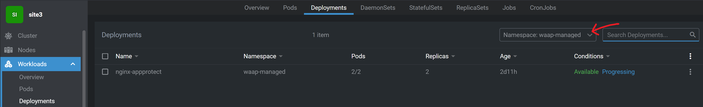

- Scroll to see the environment variable when a POD starts

.. code-block:: yaml
    :emphasize-lines: 3

          env:
            - name: ENV_CONTROLLER_INSTANCE_GROUP
              value: lab_k8s_{{site_ID}}
            - name: ENV_CONTROLLER_LOCATION
              value: site{{site_ID}}_waap_managed
            - name: ENV_CONTROLLER_API_URL
              value: '10.0.0.12:443'

- Note the value of Controller's Instance-Group to be registered
- In NGINX Controller, login as SuperNetOps

    - email:  supernetops@f5cloudbuilder.dev
    - password: NGINXC0ntroller!

- User Role of a SuperNetOps allow a user to view, create and delete any instance-groups (FULL authorization)
- Check if you see POD names of your Kubernetes cluster {{site_ID}}

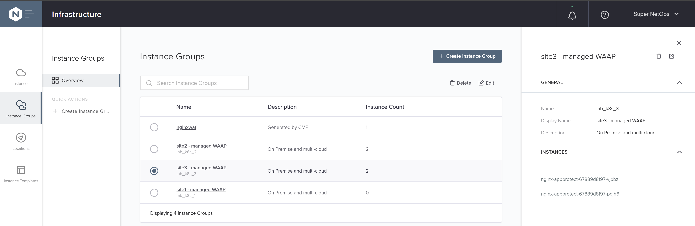

- Click on an instance name

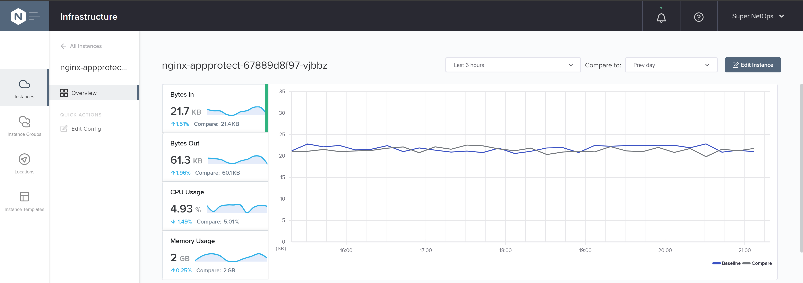

- Scroll down to see Services running in this Instance

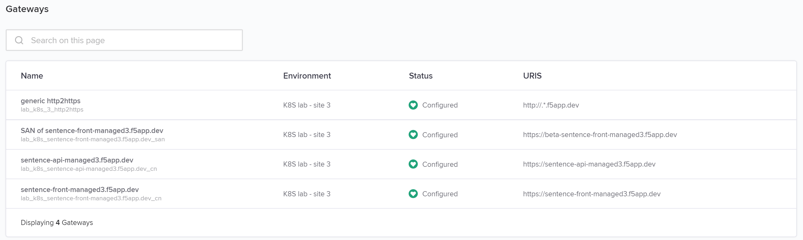

- In Lens, scale out Deployment of NGINX App Protect to 3 replicas (instances)

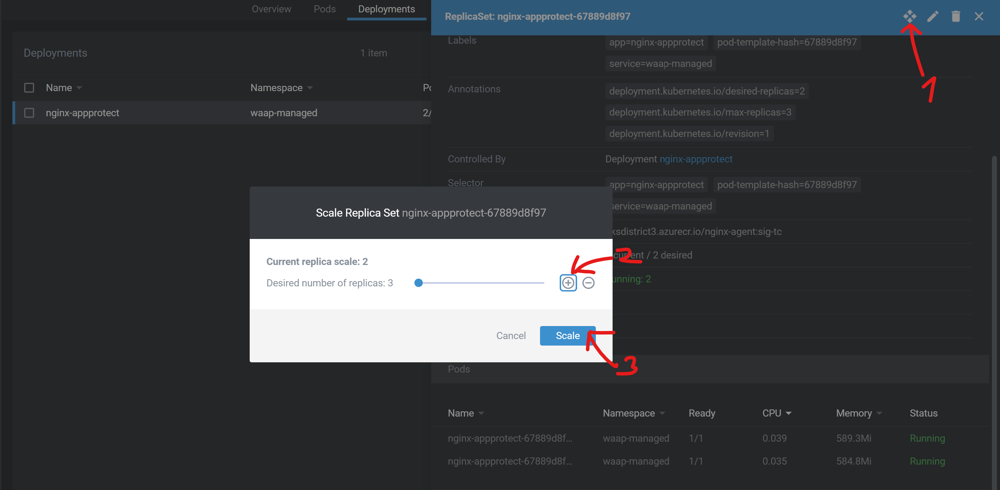

- In Controller, see the instance registered in instance-group ``lab_k8s_{{site_ID}}``

Exercise 2: Upgrade Signatures
============================================

Oh my god, deployed image of NGINX App Protect contains a very old signature package.
Upgrade with a fresh image that have been already built and uploaded to Azure Container Registry linked to your AKS cluster.

- In Lens, go to ``Workloads`` **>** ``PODs`` **>** ``NameSpace: waap-managed`` **>** ``nginx-appprotect``
- Open a shell

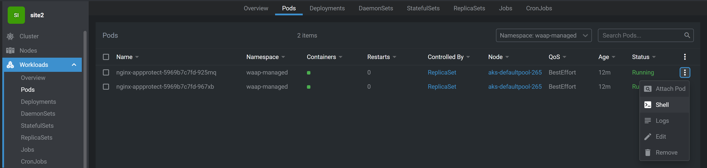

- Show signature packages

.. code-block:: bash

    cat /var/log/app_protect/compile_error_msg.json

*output*

.. code-block:: json
    :emphasize-lines: 2,3,4

    {
        "user_signatures_packages": [],
        "threat_campaigns_package": {},
        "attack_signatures_package":
        {
            "revision_datetime": "2019-07-16T12:21:31Z"
        },
        "completed_successfully": true
    }

_______________________________________________________________________

**Capture The Flag**

    **2.1 What is the last update of signature package?**

    **2.2 What is the last update of Threat Campaign?**

_______________________________________________________________________

- Show the last update of signature package

.. code-block:: bash

    sudo yum --showduplicates list app-protect-attack-signatures

- Show the last update of Threat Campaign

.. code-block:: bash

    sudo yum --showduplicates list app-protect-threat-campaigns

- Go to ``Workloads`` **>** ``Deployments`` **>** ``NameSpace: waap-managed`` **>** ``nginx-appprotect``
- Update specification using latest image of NGINX App Protect

.. code-block:: json
    :emphasize-lines: 8

    spec:
      ...
      template:
        ...
        spec:
          containers:
            - name: nginx-agent
              image: 'aksdistrict2.azurecr.io/nginx-agent:latest'

- View `rolling upgrade <https://kubernetes.io/docs/concepts/workloads/controllers/deployment/>`_ of PODs by clicking on ``nginx-appprotect`` deployment
- Open a shell on a fresh POD
- Show signature packages and see that packages are now up-to-date

.. code-block:: bash

    cat /var/log/app_protect/compile_error_msg.json

*output*

.. code-block:: json
    :emphasize-lines: 7,13

    {
        "user_signatures_packages":
        [],
        "attack_signatures_package":
        {
            "revision_datetime": "2021-11-04T19:18:42Z",
            "version": "2021.11.04"
        },
        "completed_successfully": true,
        "threat_campaigns_package":
        {
            "revision_datetime": "2021-11-03T07:51:14Z",
            "version": "2021.11.03"
        }
    }

Multi-Tenancy
*********************************************

Exercise 3: SuperNetOps
=============================================

User Role "SuperNetOps" allow user:

    - to manage NGINX App Protect instances (FULL authorization)
    - to view all Services (READ authorization)

- In NGINX Controller, login as SuperNetOps

    - email:  supernetops@f5cloudbuilder.dev
    - password: NGINXC0ntroller!

- Go to ``Platform`` **>** ``User Role`` then see configuration PATHs and attached authorization levels

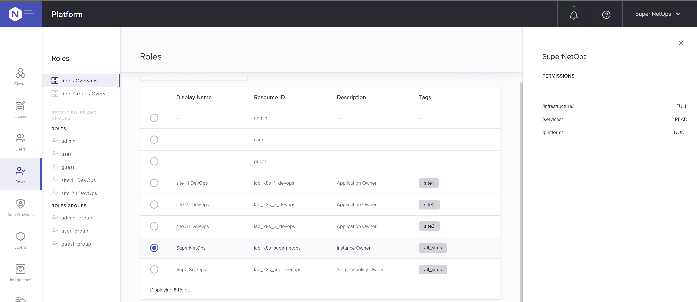

- Go to ``Services`` **>** ``Gateway``. You can see all gateways but edit none.

Exercise 4: Super SecOps
============================================

User Role "SuperSecOps" allow user:

    - to manage all WAF policies (FULL authorization)
    - to view all Services (READ authorization)

- In NGINX Controller, login as SuperSecOps

    - email:  supersecops@f5cloudbuilder.dev
    - password: NGINXC0ntroller!

- Go to ``Platform`` **>** ``User Role`` then see configuration PATHs and attached authorization levels

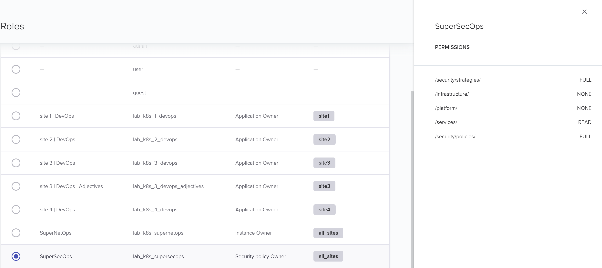

- Go to ``Services`` **>** ``Security Strategies``
- See all Security Strategies available for consumption by DevOps

Exercise 5: DevOps
============================================

User Role "DevOps" allow user:

    - to manage (FULL authorization) his applications inside his own environment {{ site_ID }} only
    - to view all WAF policies (READ authorization)

- In NGINX Controller, login as DevOps owner of your site

    - email:  devops{{ site_ID }}@f5cloudbuilder.dev
    - password: NGINXC0ntroller!

- Go to ``Platform`` **>** ``User Role`` then see configuration PATHs and attached authorization levels

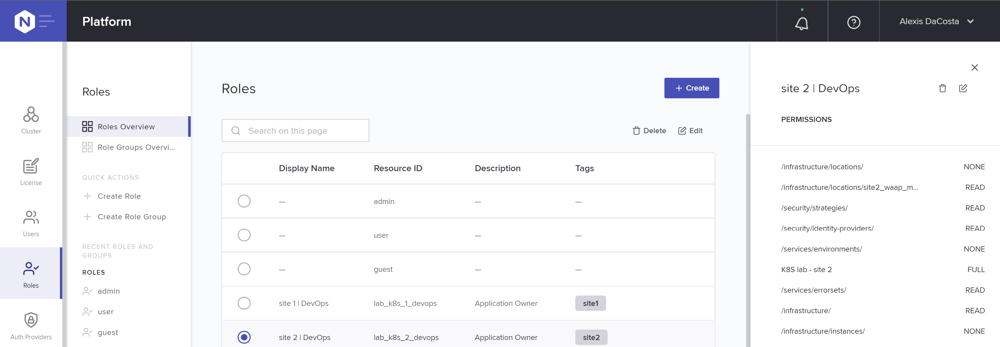

--------------------------------------------

- DevOps configure an Application using logical objects:

    - **Environment**: a Tenant.
        A DevOps user is assigned into one or multiple Tenants aka *Environment*

    - **Gateway**: a listener on TCP/UDP service or on HTTP(s) host(s).
        A *Gateway* is a configuration object within an *Environment*,
        often used as the top level for defining how applications are delivered to customers – settings such as hostname, protocol, and TLS/SSL behavior –
        though such settings can also be made at a lower level.
        Gateways also employ the concept of *Placement* which is how you link Controller and the NGINX App Protect instances that receive the configurations and do the actual work (data-plane).

    - **App**: a logical group of *Components*
        App configuration object is where you begin to model applications and group traffic‑shaping behaviors.
        You can use as many or as few Apps as needed to meet the needs of your organization.
        The only requirement is that an App must be unique within an Environment.

    - **Component**: a Traffic Management policy with a Security strategy attached.
        Within an App, Components describe the desired traffic‑shaping behavior for the App.
        In the simplest case, all the traffic for a given pathname is sent to the same group of servers.
        But Components also control more advanced shaping like header manipulation, URL rewriting, backend load‑balancing behaviors, cookie handling, and other settings.

    - **Analytics**: auto-generated or custom dashboard offer observability (metrics, security event) at each object level
        Application Insights offer a clear visibility into the number, performance, and ownership costs of your apps
        With per‑app analytics, you gain new insights into app performance and reliability so you can pinpoint performance issues before they impact production.

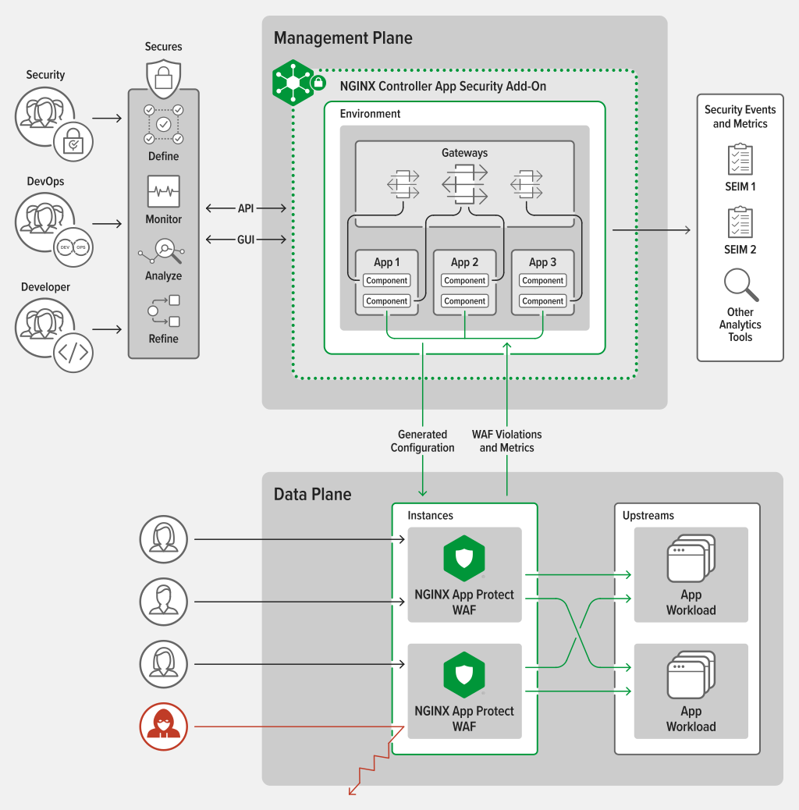

- In case of an Application based on micro-services, teams works on different Components. For example, Sentence API is have different micro-services:

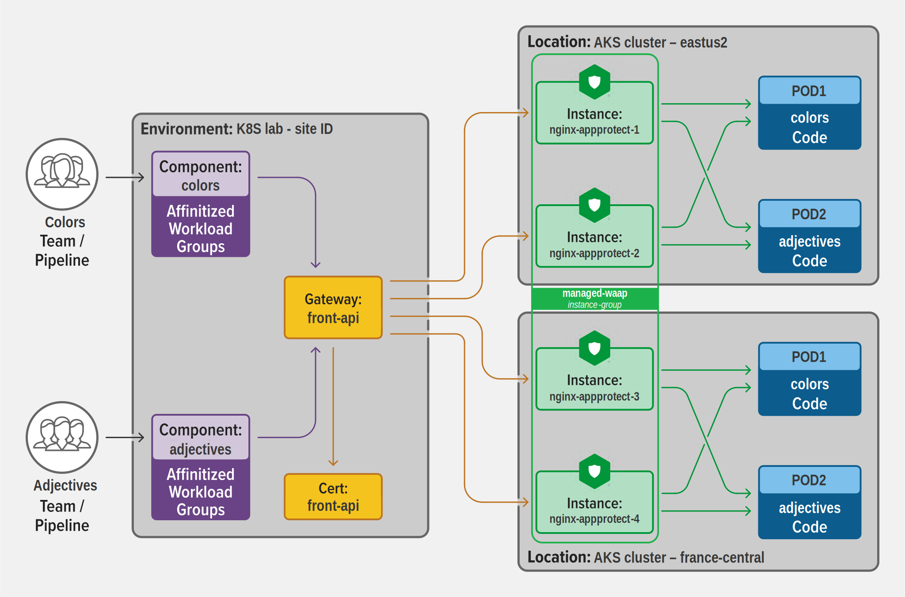

- Go to ``Services`` **>** ``Gateways`` **>** ``sentence-front-managed{{ site_ID }}.f5app.dev``
- ``Edit Gateway`` **>** ``Placements``: show attached ``instance-group``

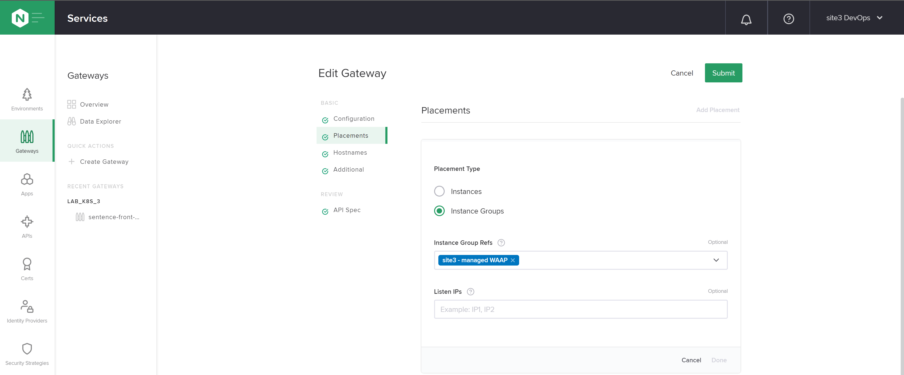

**Note:** NGINX Controller v4: specific ``instance-groups`` could be assign to a User Role

- In your web browser, go to ``https://sentence-front-managed{{ site_ID }}.f5app.dev`` and generate some traffic by refreshing 10 times the page
- Go to ``Services`` **>** ``Apps`` **>** ``sentence-front-managed{{ site_ID }}.f5app.dev``
- Update filter to ``Last 5 minutes``
- Switch tab to ``Latency metrics``, click on compare to ``Prev week`` and see graphs

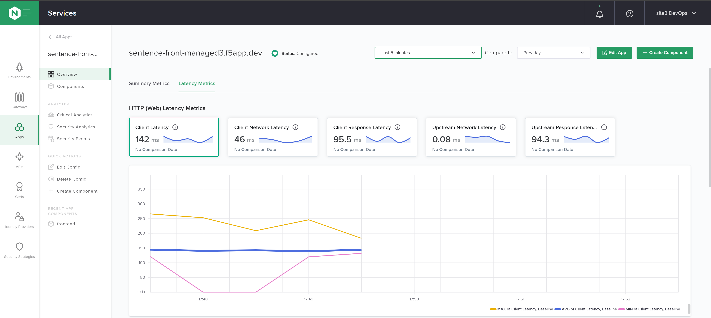

- Go to ``Components`` **>** ``frontend``
- Update filter to ``Last 5 minutes``
- Switch tab to ``Latency metrics``, click on compare to ``Prev week`` and see graphs

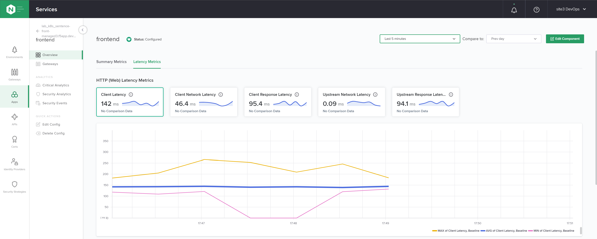

False Positive Management
*********************************************

Exercise 6: Simple starting point
============================================
If SecOps doesn't have time to specify a standard WAF policy,
a good way is to

    1. use the pre-defined ``balanced_default`` WAF policy in Monitoring mode,
    2. disable matched Signatures to prevent False Positives during QA tests and then in Production,
    3. enable policy in Blocking mode after few weeks in Production
    4. disable matched Signatures in case of complain from legitimate user

- In NGINX Controller, login as DevOps owner of your site

    - email:  devops{{ site_ID }}@f5cloudbuilder.dev
    - password: NGINXC0ntroller!

- Go to ``Services`` **>** ``Apps`` **>** ``sentence-front-managed{{ site_ID }}.f5app.dev`` **>** ``Components`` **>** ``frontend``
- Click on ``Edit component`` **>** ``Security``
- Choose Security Strategy proposed by default: ``balanced_default`` then ``Submit``

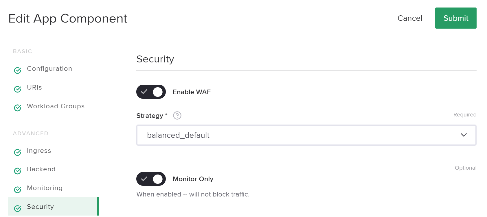

- Choose Strategy proposed by default: ``balanced_default`` then ``Submit``
- On your web browser, do an attack:

.. code-block:: bash

    https://sentence-front-managed{{ site_ID }}.f5app.dev?a=

- In Controller, show related Security event

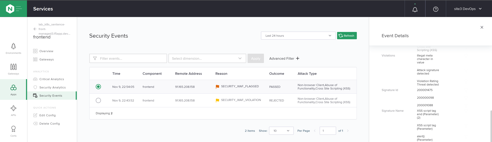

- Disable related signatures, set Security Strategy to blocking mode then *Submit*

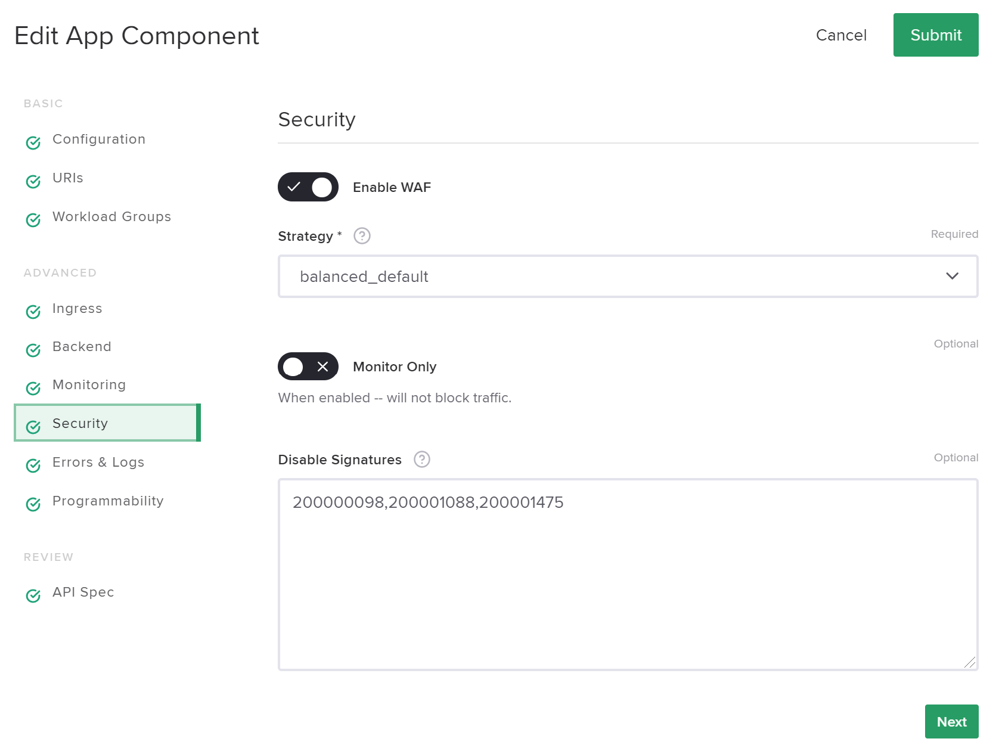

- On your web browser, do an attack:

.. code-block:: bash

    https://sentence-front-managed{{ site_ID }}.f5app.dev/?a='1=1;cat /etc/password'

- Note the *support ID* on the blocking page
- In Controller, show related Security event by filtering on *support ID*

.. image:: ./_pictures/Controller_service_component_security_event_filter.png
   :align: center
   :width: 700
   :alt: Show Security event

- Append related signatures to disabled list of signatures then *Submit*

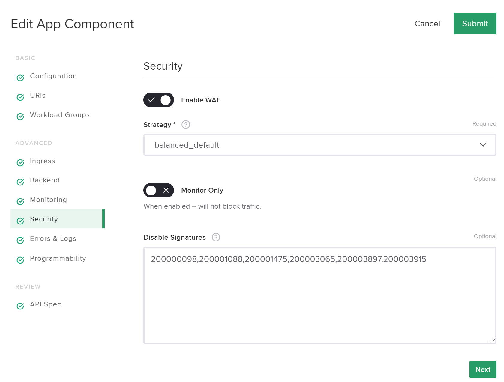

- On your web browser, repeat the attack and see that is not blocked anymore

.. code-block:: bash

    https://sentence-front-managed{{ site_ID }}.f5app.dev/?a='1=1;cat /etc/password'