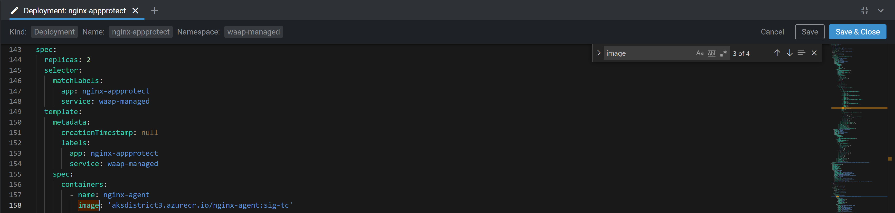

Exercises
#################################################################

By the end of the lab you will be able to:
- **Life Cycle Management**
    - Scale Out / Scale In
    - Upgrade NGINX App Protect version
    - Update the signatures and threats on NGINX App Protect

- **False Positive Management**
    - Deploy an application
    - Start with a basic WAF policy and be reactive to handle False Positive
    - Create your standard policy and publish it in catalog
    - Update your standard policy and all attached applications

- **Visibility**
    - Detect which Components have not a policy attached to it

.. contents:: Contents
    :local:
    :depth: 2

Life Cycle Management
*********************************************

Exercise 1: Scale Out
============================================
- In Lens, edit Deployment of NGINX App Protect instances:  ``Workloads`` **>** ``Deployments`` **>** ``NameSpace: waap-managed`` **>** ``nginx-appprotect``

.. image:: ./_pictures/Lens_Deployment_show.png
   :align: center
   :width: 900
   :alt: Show instances

- Scroll to see the environment variable used to startup PODs

.. code-block:: yaml
    :emphasize-lines: 3

          env:
            - name: ENV_CONTROLLER_INSTANCE_GROUP
              value: lab_k8s_{{site_ID}}
            - name: ENV_CONTROLLER_LOCATION
              value: site{{site_ID}}_waap_managed
            - name: ENV_CONTROLLER_API_URL
              value: '10.0.0.12:443'

- Note the value of Controller's Instance-Group to be registered
- In NGINX Controller, login as SuperNetOps
    - email:  supernetops@f5cloudbuilder.dev
    - password: NGINXC0ntroller!
- User Role of a SuperNetOps allow a user to view all instance-groups
- Check if you see POD names of your Kubernetes cluster {{site_ID}}

.. image:: ./_pictures/Controller_instances_show.png
   :align: center
   :width: 900
   :alt: Show instances in instance-group

- Click on an instance name

.. image:: ./_pictures/Controller_instance_show.png
   :align: center
   :width: 900
   :alt: Show instance

- Scroll down to see Services running in this Instance

.. image:: ./_pictures/Controller_instance_show.png
   :align: center
   :width: 900
   :alt: Show instance > Services

- In Lens, scale out Deployment of NGINX App Protect to 3 replicas (instances)

.. image:: ./_pictures/Lens_Deployment_Scale_3.png
   :align: center
   :width: 400
   :alt: Scale Out

- In Controller, see the instance registered in instance-group ``lab_k8s_{{site_ID}}``

Exercise 2: Upgrade Software and Signatures
============================================

- View Software version
    - Run on Jumphost ``sudo yum --showduplicates list app-protect``
    - source: https://docs.nginx.com/nginx-app-protect/admin-guide/install/#centos-74-installation

- View default signature package
    - Open a BASH on Lens >> POD NAP: ``cat /var/log/app_protect/compile_error_msg.json``

.. code-block:: json
    :emphasize-lines: 2,3,4

    {
        "user_signatures_packages": [],
        "threat_campaigns_package": {},
        "attack_signatures_package":
        {
            "revision_datetime": "2019-07-16T12:21:31Z"
        },
        "completed_successfully": true
    }

    - See: **No** ThreatCampaign signature package, signature package of **2019-07-16**

- View Signature versions
    - Run on Jumphost ``sudo yum --showduplicates list app-protect-attack-signatures``
    - Update to latest version or a specific version: https://docs.nginx.com/nginx-app-protect/admin-guide/install/#centos--rhel-74--amazon-linux-2

- View Signature versions
    - Run on Jumphost ``sudo yum --showduplicates list app-protect-threat-campaigns``
    - Update to latest version or a specific version: https://docs.nginx.com/nginx-app-protect/admin-guide/install/#centos--rhel-74--amazon-linux-2-

- Clone and update your own DockerFile: https://github.com/nginxinc/docker-nginx-controller/blob/master/centos/nap/Dockerfile

- *ToDo* Alexis *ToDo*
    - do a DockerFile with latest signatures ``aksdistrict3.azurecr.io/nginx-agent:latest``
    - build an image available in ACR

- In Lens, edit Deployment of NAP instances and look for image key.

- Change value of *image* by ``aksdistrict3.azurecr.io/nginx-agent:latest`` then ``Save & Close``

- View rolling upgrade of PODs by clicking on nginx-appprotect deployement

- View signature package
    - Open a BASH on Lens >> POD NAP: ``cat /var/log/app_protect/compile_error_msg.json``

.. code-block:: json
    :emphasize-lines: 1

    ToDo

Life Cycle Management
*********************************************