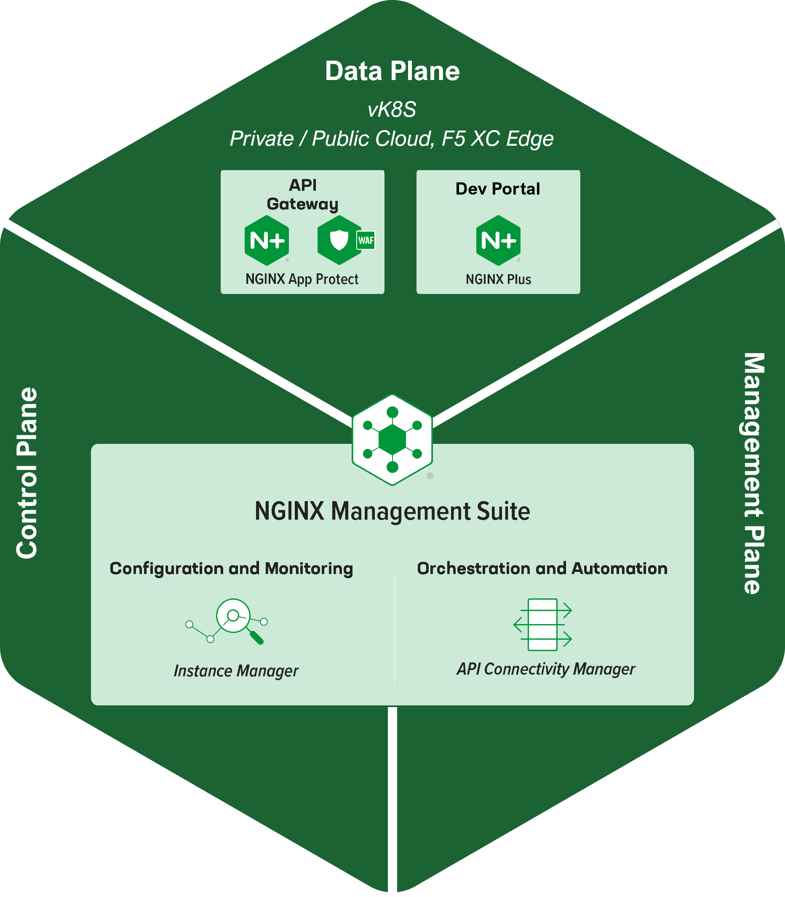
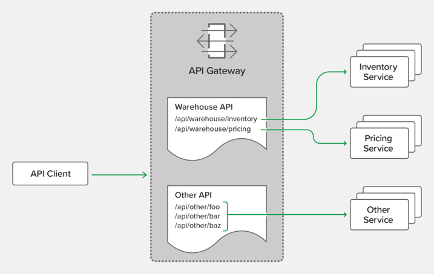
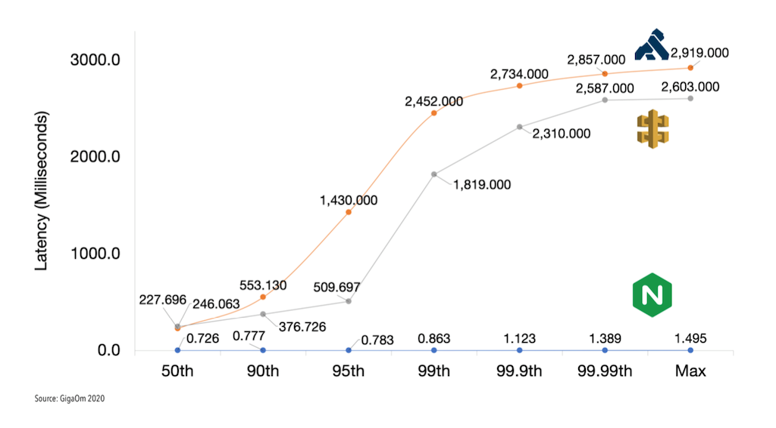
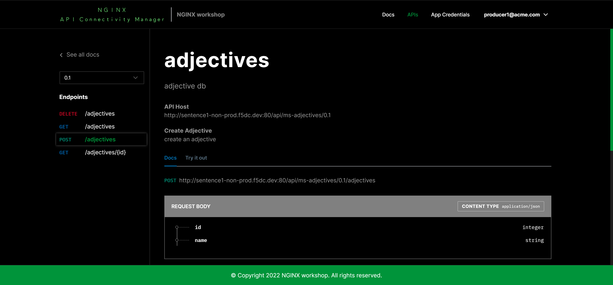
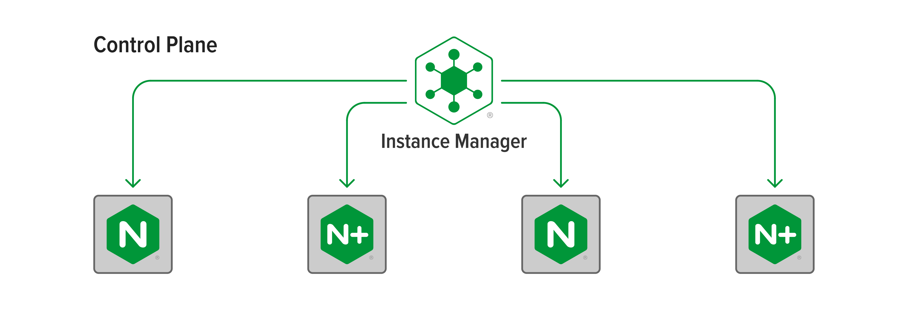
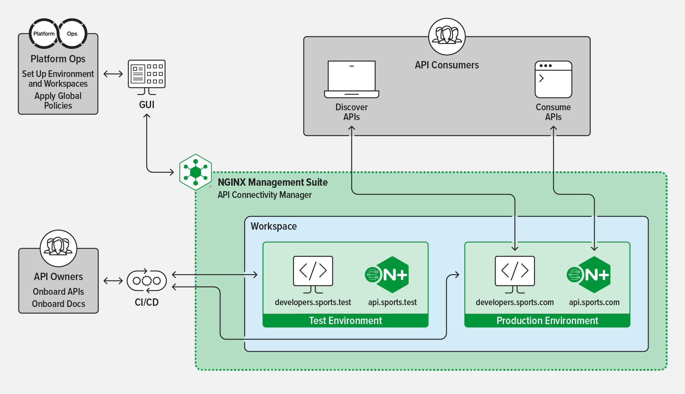
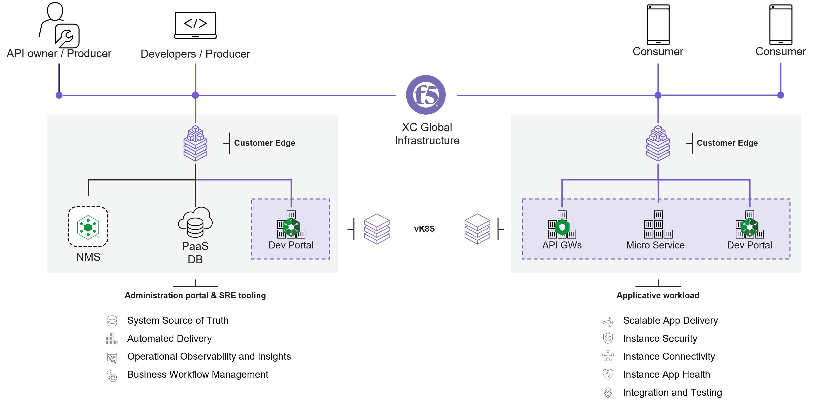

In Progress - Architecture
#################################################################

.. contents:: Contents
    :local:
    :depth: 1

Components of API Management
***************************************************************
The F5 API Management solution includes 3 components:

1) Data-Plane | API Gateways (GW)
=============================================
An API GW is a NGINX Plus instance that delivers microservices with reliability, speed and security across multiple environments (baremetal, VM, K8S container).

Key API Gateways Tasks:
    - **Authenticate API calls** (AuthN): Control authentication with Basic Auth, OAuth 2.0/OIDC, JSON Web Tokens (JWT)
    - **Control access to resources** (AuthZ): Use JSON Web Tokens (JWT), API keys
    - **Route and manage API traffic**: Apply rate limiting, quotas, TLS and more to control and route traffic through the gateway
    - **Gain visibility into API traffic**: Create logs for monitoring and visibility into API traffic

------------------------------------------------------------------------------------------------------------------------

*Why NGINX Plus?*

Regarding Gigaom report `here <https://www.nginx.com/blog/benchmarking-api-management-solutions-nginx-kong-amazon-real-time-apis/>`_, N+ deliver APIs with lower latency and higher through-put than competitors

2) Data-Plane | Developer Portal
=============================================
A Developer Portal is a NGINX Plus instance that delivers API Documentation and Self Service management of API access (API Keys).
A Developer Portal enables internal and external Producers to rapidly discover, onboard and use APIs in their projects with consistent documentation and versioning.

3) Control-Plane & Management-Plane | Central Manager
========================================================
A Central Manager provides uniform and consistent oversight for platform environments, API specifications and configurations from a single pane of glass.
Central Manager is the product `NGINX Management Suite <https://www.nginx.com/blog/connect-scale-secure-apps-apis-with-f5-nginx-management-suite/>`_ that includes 2 modules:

    1. **Control-Plane | Instance Manager**: represents the core functionality of NGINX Management Suite. Operating within the control plane, Instance Manager simplifies configuration and monitoring of your NGINX fleet.

------------------------------------------------------------------------------------------------------------------------

    2. **Management-Plane | API Connectivity Manager**: simplifies governance of API in your organization, delivers API across your NGINX fleet and enforce consistent API Security.

Infrastructure
***************************************************************
For this Lab, components are deployed in Microsoft Azure and across different regions.

XC Global Infrastructure
========================================================
F5 Distributed Cloud (XC) Global Infrastructure is a `Multi-Cloud Networking Software <https://blogs.gartner.com/andrew-lerner/2022/04/21/multicloud-networking-software-mcns/>`_
that creates a virtual Backbone between ``sites``:
    - **Regional Edges (RE)** or `F5 POPs <https://www.f5cloudstatus.com/>`_ that interconnect Internet Service Providers, Cloud Service Providers and Customer Private Links
    - **Customer Edges (CE)** that are hosted in customer landing zones (On Premise, Private or Public Cloud) and are interconnected to REs via secured VPN tunnels

XC App Stack
========================================================
Each ``site`` (RE or CE) is a Kubernetes clusters of 1 or 3+ nodes.
A ``virtual site`` is a logical group of ``site`` with same labels set.
F5 Distributed Cloud (XC) AppStack is a Virtual Kubernetes (vK8S) cluster deployed across a ``virtual site``.

Short demo video that shows sites, a virtual site and vK8S:

.. raw:: html

    

1) Central Manager
========================================================

For this Lab, API GWs and Developer Portals are deployed on virtual Kubernetes,
a `F5 Distributed Cloud App Stack <https://www.f5.com/pdf/data-sheets/f5-distributed-cloud-app-stack-ds.pdf>`_ service.

