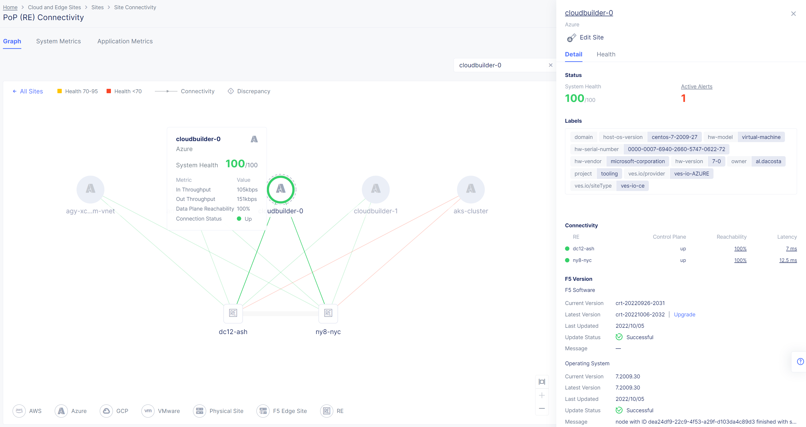
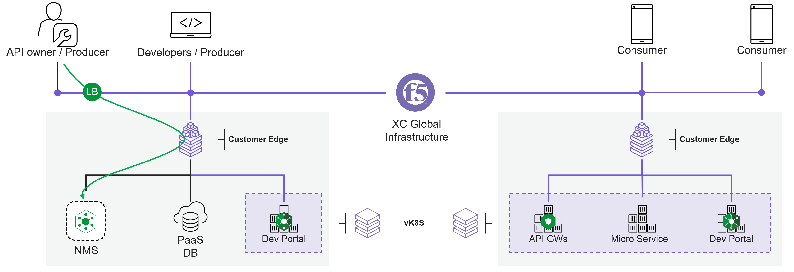
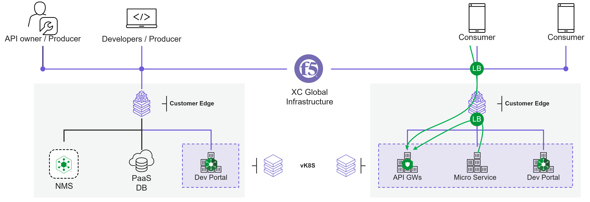
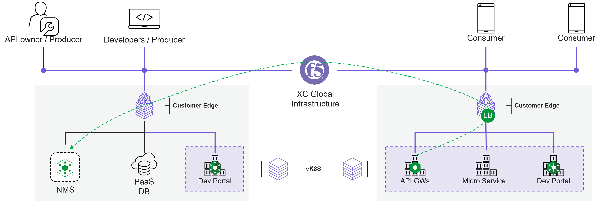
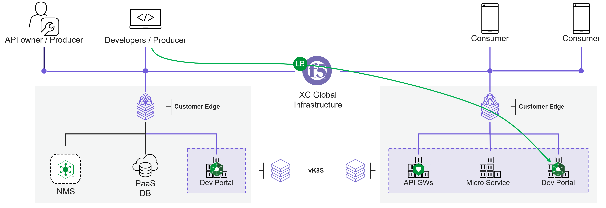
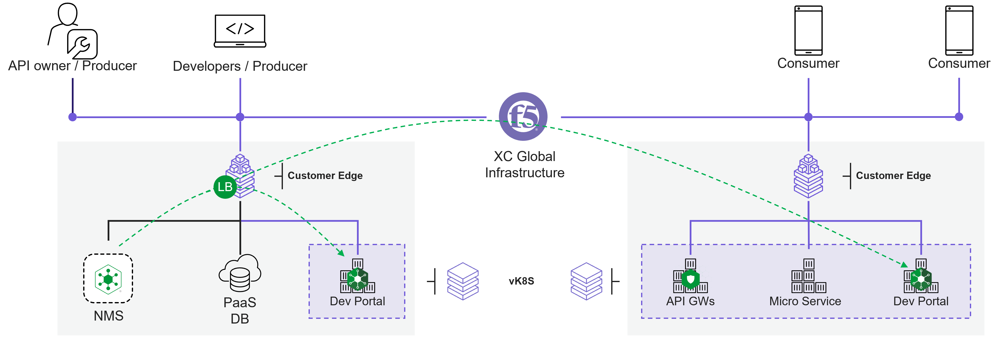
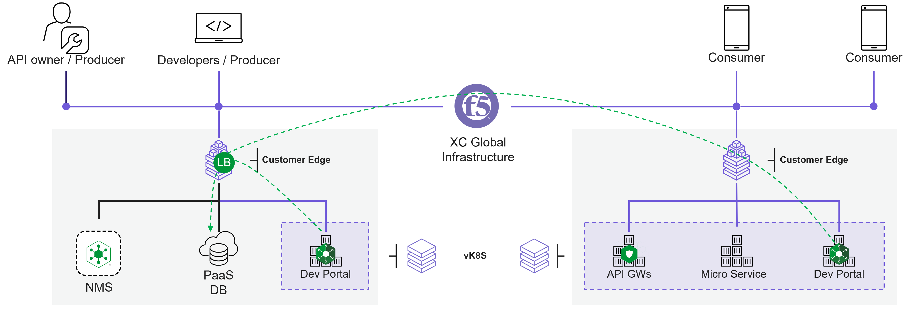
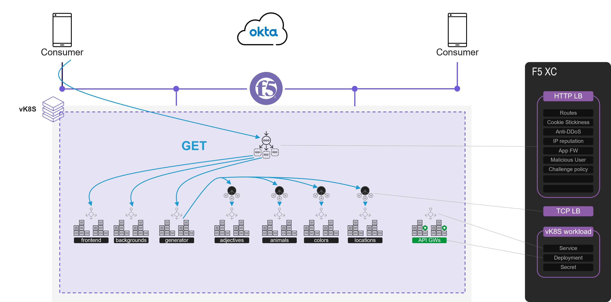
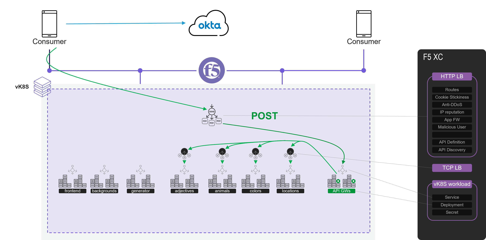
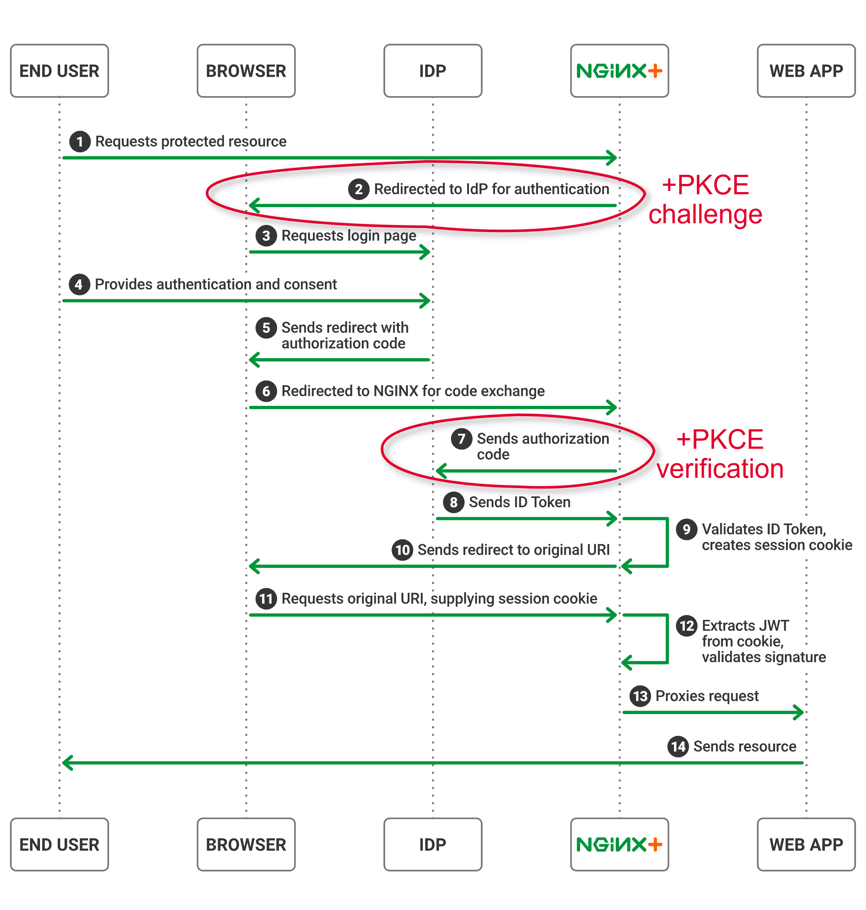

Architecture
#################################################################

.. contents:: Contents
    :local:
    :depth: 2

Components of API Connectivity Manager
***************************************************************
The F5 API Connectivity Manager (ACM) is a solution to manage NGINX API Gateways (API GW).
It includes 3 components:

.. image:: ./_pictures/functional_view_3_pillars.png
   :align: center
   :width: 400
   :alt: Architecture 3 pillars

1) Data-Plane | API Gateways (GW)
=============================================
An API GW is a NGINX Plus instance that delivers microservices with reliability, speed and security across multiple environments (baremetal, VM, K8S container).

.. image:: ./_pictures/API_GW.png
   :align: center
   :width: 500
   :alt: API Gateway

Key API Gateways Tasks:
    - **Authenticate API calls** (AuthN): Control authentication with Basic Auth, OAuth 2.0/OIDC, JSON Web Tokens (JWT)
    - **Control access to resources** (AuthZ): Use JSON Web Tokens (JWT), API keys
    - **Route and manage API traffic**: Apply rate limiting, quotas, TLS and more to control and route traffic through the gateway
    - **Gain visibility into API traffic**: Create logs for monitoring and visibility into API traffic

------------------------------------------------------------------------------------------------------------------------

*Why NGINX Plus?*

Regarding Gigaom report `here <https://www.nginx.com/blog/benchmarking-api-management-solutions-nginx-kong-amazon-real-time-apis/>`_, N+ deliver APIs with lower latency and higher through-put than competitors

.. image:: ./_pictures/nginx_api_gw_gigaom.png
   :align: center
   :width: 600
   :alt: Gigaom

2) Data-Plane | Developer Portal
=============================================
A Developer Portal is a NGINX Plus instance that delivers API Documentation and Self Service management of API access (API Keys).
A Developer Portal enables internal and external Producers to rapidly discover, onboard and use APIs in their projects with consistent documentation and versioning.

.. image:: ./_pictures/devportal.png
   :align: center
   :width: 700
   :alt: NIM

3) Control-Plane & Management-Plane | Central Manager
========================================================
A Central Manager provides uniform and consistent oversight for platform environments, API specifications and configurations from a single pane of glass.
Central Manager is the product `NGINX Management Suite <https://www.nginx.com/blog/connect-scale-secure-apps-apis-with-f5-nginx-management-suite/>`_ that includes 2 modules:

    1. **Control-Plane | Instance Manager**: represents the core functionality of NGINX Management Suite. Operating within the control plane, Instance Manager simplifies configuration and monitoring of your NGINX fleet.

.. image:: ./_pictures/NSM-Instance-Mgr_topology.png
   :align: center
   :width: 600
   :alt: NIM

------------------------------------------------------------------------------------------------------------------------

    2. **Management-Plane | API Connectivity Manager**: simplifies governance of API in your organization, delivers API across your NGINX fleet and enforce consistent API Security.

.. image:: ./_pictures/NSM-API-Connectivity-Mgr_topology.png
   :align: center
   :width: 600
   :alt: NCM

Infrastructure & flows
***************************************************************
For this Lab, components are deployed on Microsoft Azure and across different regions.

.. image:: ./_pictures/Architecture_global_view.png
   :align: center
   :width: 800
   :alt: NCM

XC Global Infrastructure
========================================================
F5 Distributed Cloud (XC) Global Infrastructure is a `Multi-Cloud Networking Software <https://blogs.gartner.com/andrew-lerner/2022/04/21/multicloud-networking-software-mcns/>`_
that creates a virtual Backbone between ``sites``:
    - **Regional Edges (RE)** or `F5 POPs <https://www.f5cloudstatus.com/>`_ that interconnect Internet Service Providers, Cloud Service Providers and Customer Private Links
    - **Customer Edges (CE)** that are hosted in customer landing zones (On Premise, Private or Public Cloud) and are interconnected to REs via secured VPN tunnels

XC App Stack
========================================================
Each ``site`` (RE or CE) is a Kubernetes clusters of 1 or 3+ nodes.
A ``virtual site`` is a logical group of ``sites`` with same label(s) set.
F5 Distributed Cloud (XC) AppStack is a Virtual Kubernetes (vK8S) cluster deployed across a ``virtual site``.

Short demo video that shows sites, a virtual site and vK8S:

.. raw:: html

    

Central Manager
========================================================
NGINX Management Suite (NMS) is hosted on a VM and accessible from API owners on Internet.
NMS UI/API is published and secured by F5 XC.

API GWs
========================================================
API gateway instances are hosted on Containers and deployed on vK8S, in closest regions where consumers are present.
A consumer can be a endpoint/edge on Internet or another micro-service present in vK8S.
Application Services are published and secured by F5 XC.

NMS communicates with managed API gateways through a GRPC session initiated by a ``nginx-agent`` installed on API gateways.
Communications are forwarded through F5 XC virtual backbone.

Developer Portal
========================================================
Developer Portal instances are hosted on Containers and deployed on vK8S, in closest regions where developers are present.
Developer Portals are published and secured by F5 XC.

NMS communicates with managed Developer Portals through:
    - ``nginx-agent`` sessions, as seen for API GWs,
    - and a ``nginx-devportal`` service: NMS initiates REST API calls to a ``nginx-devportal`` service that is published and secured by F5 XC.

Persistent data of Developer Portals, from all regions, are stored in a PaaS DB (Azure Database for PostgreSQL) available in only one region.
Communications are forwarded through F5 XC virtual backbone.

Sentence app
***************************************************************
For this lab, `Sentence application  <https://gitlab.com/sentence-app>`_ is deployed.

Components
========================================================
Sentence is based on multiple decoupled services:

    - **frontend**: Web UI that generates an HTML page and delivers a Single Page Application (JavaScript).
    - **background**: a micro-service that returns (GET) a *background* image
    - **generator**: a micro-service that generates a *Sentence* by aggregating an *adjective*, an *animal*, a *color* and a *location*
    - **adjectives**: a micro-service that returns (GET) an *adjective*
    - **animals**: a micro-service that returns (GET) an *animal*
    - **colors**: a micro-service that returns (GET) an *color*
    - **locations**: a micro-service that returns (GET) an *location*

End user authentication | oAuth OIDC + PKCE
========================================================
End user must be authenticated to CREATE a new *adjective*, *animal*, *color* or *location*.
Authentication is handled by API GW that leverages Okta as an Identity Provider.

`oAuth/OIDC <https://developer.okta.com/docs/concepts/oauth-openid/>`_ flow is described in picture below and `here <https://github.com/nginxinc/nginx-openid-connect>`_.

PKCE is used to make Sentence apps more secure, see explanations `here  <https://developer.okta.com/blog/2019/08/22/okta-authjs-pkce#use-pkce-to-make-your-apps-more-secure>`_.

Application authentication | API Key
========================================================
Client, for example a mobile app, must be authenticated to CREATE a new *color*.
Authentication is handled by API GW and authentication is based on API key provided by the application.

