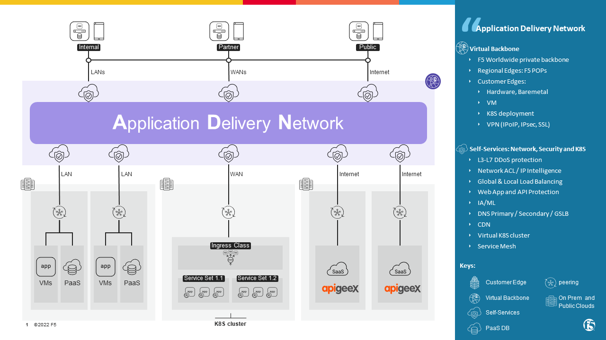
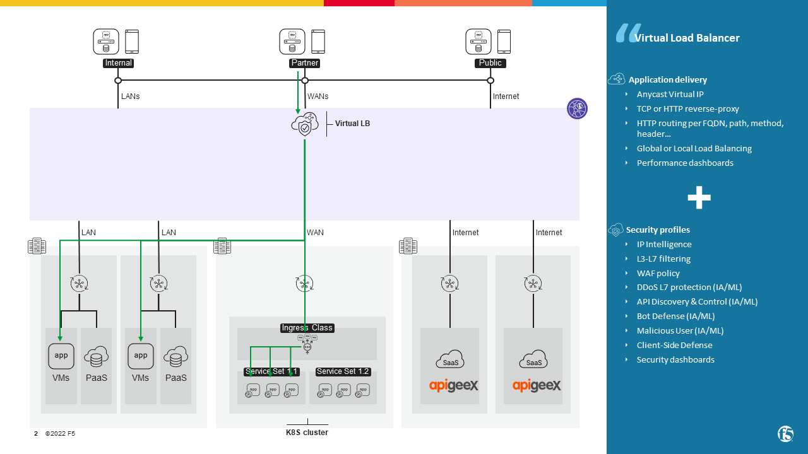
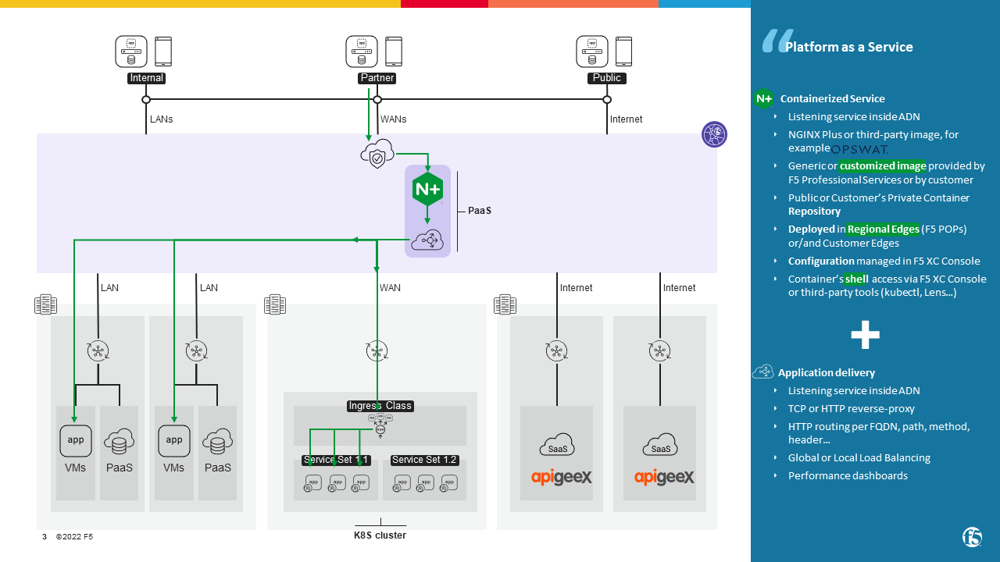

lab 7 | XC PaaS
##############################################################

`F5 Distributed Cloud (XC) <https://www.f5.com/cloud>`_ is a SaaS-based platform
that enables Network and Security services in data path to your application.
If customer desires to add also custom Security services in the data path,
customer will deploy **Platform as a Services** (PaaS), a container based solution.

This folder shares some typical customer use cases of PaaS:

.. toctree::
   :maxdepth: 1
   :glob:

   module*/module*

First, a quick introduction to F5 XC:

.. contents:: Contents
    :local:
    :depth: 1

Application Delivery Network (ADN)
***************************************************************

F5 XC Application Delivery Network (ADN) is a Virtual Backbone that interconnects clients and services to be consumed by them.
Edges of F5 XC ADN are:
    - F5 **Regional Edges** (RE): F5's Points of Presence, based hardware managed by F5
    - or/and **Customer Edges** (CE): Customer's Points of Presence (or ``site``), based hardware managed by customer or by a Cloud Service Provider

Interconnections between Edges, as described `here <https://docs.cloud.f5.com/docs/ves-concepts/system-overview>`_ , are:
    - `F5 private backbone <https://docs.cloud.f5.com/docs/services/mesh/secure-backbone>`_: REs are interconnected using a multi-terabit, dedicated and redundant private backbone for maximum performance. These PoPs are densely peered and connected with multiple Tier1 transit providers to deliver high-quality internet access for applications and consumers. REs are directly connected to multiple cloud providers from these locations to provide a reliable and predictable experience across cloud providers.
    - `Tunneling <https://docs.cloud.f5.com/docs/how-to/advanced-networking/tunneling>`_: REs-CEs and CEs-CEs are interconnected using tunnels IP over IP, IPsec or TLS depending on the trust of the underlay network.

Edges have the same software that provides Network, Security and K8S services managed in F5 XC Console.

Virtual Load Balancer (LB)
***************************************************************

A Virtual ``Load Balancer`` - like a ``Virtual Server`` in F5 BIG-IP - is an object
that is listening on a Virtual IP + Protocol + Port + FQDN and somewhere (Internet, interface of a CE or a K8S namespace).
Once traffic is matched, Network and Security services are applied on the TCP session or the HTTP transaction.
Then the traffic is Load Balanced to a pool of origin servers.

Platform as a Service (PaaS)
***************************************************************

If customer wants to apply custom traffic management  - like an ``iRule`` in F5 BIG-IP that could do "everything else" -
or add a specific security protection that is not proposed by F5 XC,
it's possible with *Platform as a Service* feature.

Because ADN is one giant Kubernetes cluster, named ``Virtual Kubernetes``,
F5 XC is designed to execute containers in a pool of edges, named ``Virtual Site``.
These containers can be :
    - part of an application (API micro-service, web front-end, middle-end, ...). For example `NGINX Unit <https://unit.nginx.org/>`_ running a Flask restfull servers
    - security components. For example `NGINX API GW managed by NGINX API Connectivity Manager <https://www.nginx.com/products/nginx-management-suite/api-connectivity-manager/>`_

For PaaS deployment on F5 XC REs, the restrictions `here <https://docs.cloud.f5.com/docs/how-to/app-management/vk8s-deployment#restrictions>`_ apply.

