Architecture
#################################################################

.. contents:: Contents
    :local:
    :depth: 1

Components
***************************************************************
Solution architecture is based on 3 components:

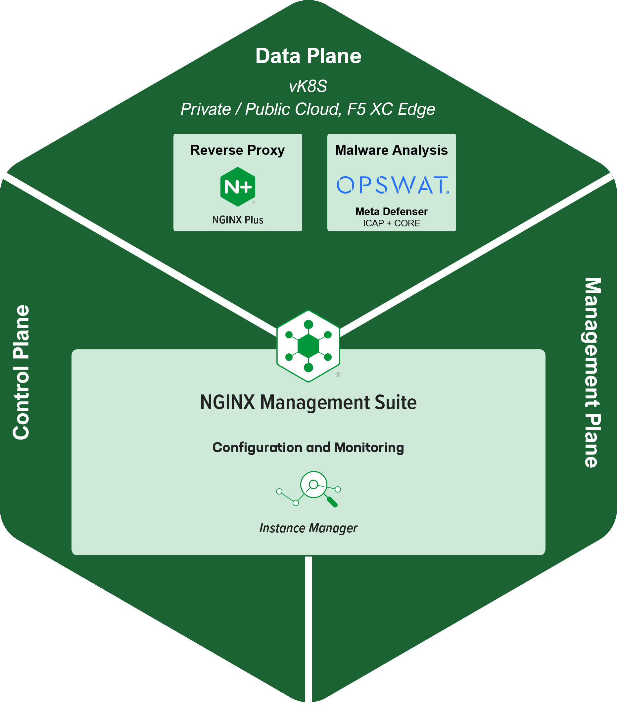

1) Data-Plane | Reverse Proxy
=============================================
NGINX+ is installed with OPSWAT dynamic module.
NGINX+ instance forwards all HTTP request and response to MetaDefender ICAP Server for malware analysis.

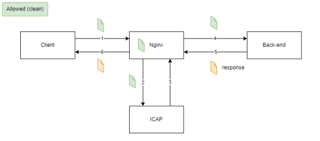

MetaDefender ICAP server can sanitized the file, the flow is unchanged.

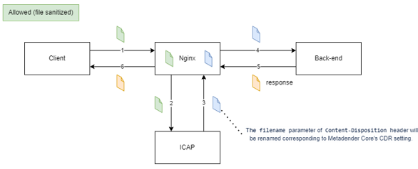

MetaDefender ICAP server can sanitized the file, the flow is unchanged.

If a malware is present, a blocked page is answered back to client.

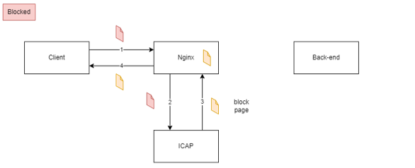

NGINX configuration is generic, therefore it does not need to be touched:

.. code-block:: bash

    http {
        upstream internal-gw {
            server internal-gw:80;
        }
        server {
            listen       80  default_server;

            location / {
                ometascan_pass http://md-icapsrv-rest-icap;
                ometascan_methods POST PUT;
                ometascan_read_timeout 1d;
                proxy_set_header Host $host;
                proxy_pass http://internal-gw;
            }
        }
    }

2) Data-Plane | MetaDefender ICAP server
=============================================
MetaDefender ICAP Server provides HTTP interface, a NGINX connector, on top of MetaDefender Core.

3) Data-Plane | MetaDefender CORE
=============================================
MetaDefender Core prevents malicious file uploads on web applications that bypass sandboxes and other detection-based security solutions.
It also helps protect confidential data, minimize data breaches, and prevent privacy violations with Proactive DLP.

MetaDefender Core requires a remote postgre DataBase.

For this Lab, this database is hosted on Microsoft Azure PaaS DB.

3) Control-Plane & Management-Plane | Central Manager
========================================================
A Central Manager provides provides consistent configuration and oversight for NGINX+ instances hosted anywhere.
Central Manager is the product `NGINX Management Suite <https://www.nginx.com/blog/connect-scale-secure-apps-apis-with-f5-nginx-management-suite/>`_ that includes only this module for handling this use case:

    **Instance Manager**: represents the core functionality of NGINX Management Suite. Operating within the control plane, Instance Manager manages configuration and monitoring of your NGINX fleet.

.. image:: ./_pictures/NSM-Instance-Mgr_topology.png
   :align: center
   :width: 600
   :alt: NIM

Infrastructure & flows
***************************************************************
Components of the solution, described above, are deployed as containers and are hosted in a distributed Kubernetes cluster managed by F5 Distributed Cloud (XC),
named *Virtual Kubernetes* (vK8S).
Nodes of vK8S are grouped by *Customer Edge* (CE).
Two types of functional site are deployed for this solution:

    **1. Administration & SRE tooling**: CE located in Administration zone or Out of Band zone
    **2. Application workload**: CE located in applicative landing zone(s)

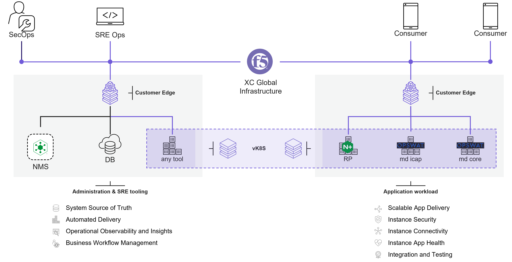

For this lab, one CE of each type described below are deployed on Microsoft Azure and in 2 different regions.

XC Global Infrastructure
========================================================
F5 Distributed Cloud (XC) Global Infrastructure is a `Multi-Cloud Networking Software <https://blogs.gartner.com/andrew-lerner/2022/04/21/multicloud-networking-software-mcns/>`_
that creates a virtual Backbone between ``sites``:
    - **Regional Edges (RE)** or `F5 POPs <https://www.f5cloudstatus.com/>`_ that interconnect Internet Service Providers, Cloud Service Providers and Customer Private Links
    - **Customer Edges (CE)** that are hosted in customer landing zones (On Premise, Private or Public Cloud) and are interconnected to REs via secured VPN tunnels

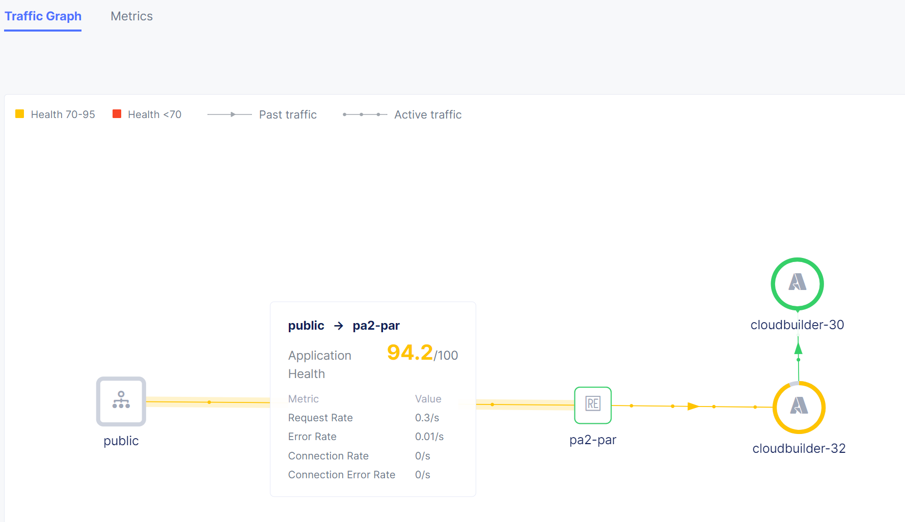

For this lab, CEs are named ``cloudbuilder-x``.

XC App Stack
========================================================
Each ``site`` (RE or CE) is a local Kubernetes clusters of 1 or 3+ nodes.
A ``virtual site`` is a logical group of ``sites`` with same label(s) set.
F5 Distributed Cloud (XC) AppStack is a Virtual Kubernetes (vK8S) cluster deployed across a ``virtual site``.
Each Node of a site is seen as a node of vK8S cluster.

For this lab, dataplane components are all deployed on one CE ``cloudbuilder-x`` and have only one replica on node ``master-0``.
For vK8S point of view, dataplane components are deployed on Node ``cloudbuilder-x-master-0``

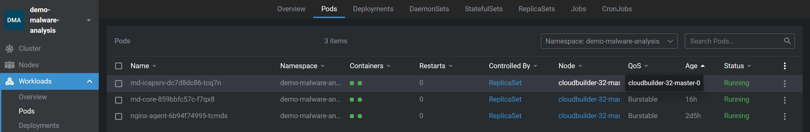

Service Mesh feature of F5 XC AppStack monitor traffic between components of the solution.
See demo video:

.. raw:: html

    

Central Manager
========================================================
NGINX Management Suite (NMS) is hosted on a VM and accessible from SecOps and Customer support team (SRE Ops).
NMS UI/API is published and secured by F5 XC.

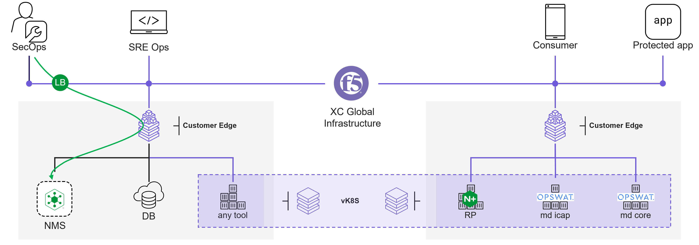

Configuration of all NGINX+ instance is managed by NIM module hosted on NMS server.
When a NGINX+ instance starts, it retrieves its configuration from NMS.
Metrics of NGINX+ instances are collected centrally in NIM.

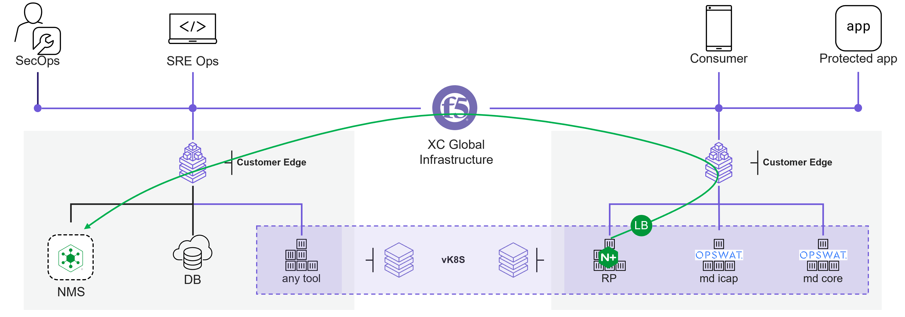

See demo video:

.. raw:: html

    

Malware analysis
========================================================
On F5 XC, a HTTP LB manages content routing for a protected domain:

    - HTTP PATH and methods (POST + PUT) are forwarded to NGINX + pool
    - by default, all others transactions are directly forwarded to backend pool that are application's origin servers

The picture below shows a transaction with NO file uploaded

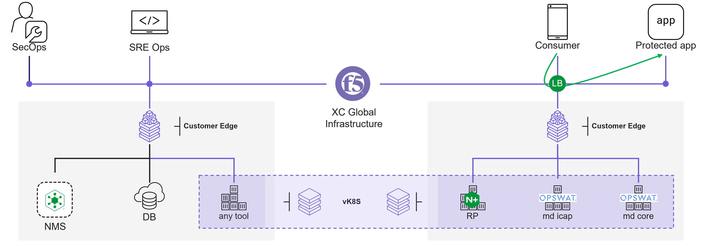

The picture below shows a transaction with a file uploaded

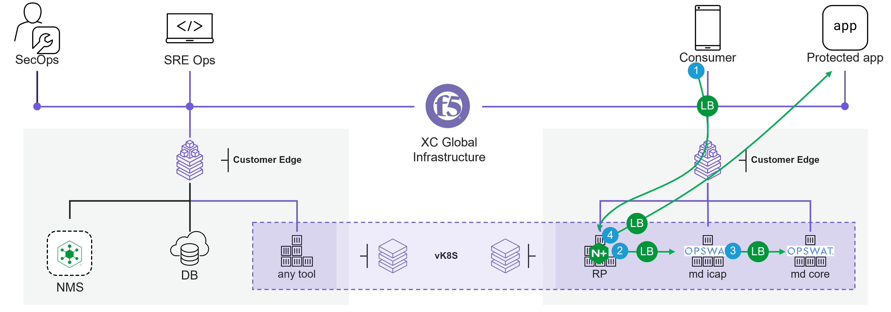

When a file is uploaded, steps are:

    1. Request is forwarded to NGINX+ pool
    2. Request is forwarded to MetaDefender ICAP server pool
    3. Payload of the request is extracted and passed to MetaDefender CORE for analysis. Verdict is sent back to MD ICAP. Request is sent back to NGINX.
    4. Request is forwarded to a internal HTTP LB that does content routing based on host header and forwards traffic to the remote application.

If a malware is present in the uploaded file, there is no step 4 because NGINX generates a response that notifies client of the blocking request.

See demo video:

.. raw:: html

    
