Secure Access
#################################################################

JSON Web Tokens (JWTs, pronounced “jots”) are a compact and highly portable means of exchanging identity information.
The JWT specification has been an important underpinning of OpenID Connect,
providing a Single Sign‑On (SSO) token for the OAuth 2.0 ecosystem.
JWTs can also be used as authentication credentials in their own right
and are a better way to control access to web‑based APIs than traditional API keys.

Powered by the most popular Reverse-Proxy, NGINX,
F5 Distributed Cloud (XC) *Secure Access* improves your security posture:
    - **Reduce the attack surface**: Require **access control** for Web and API based Application
    - **Grant least privileges**: Define an allowed **Scope** per App or micro-service
    - **Prevent malicious activity**: Track identified user activities, detect **behavioral** anomalies and auto-mitigate.

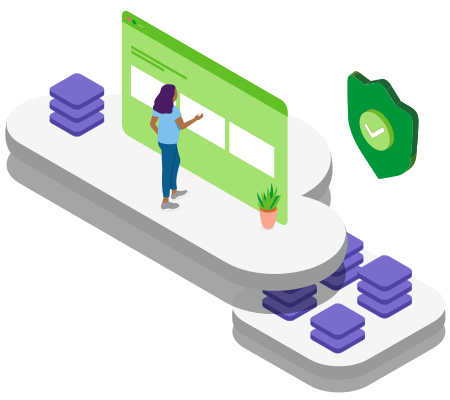

.. contents:: Contents
    :local:
    :depth: 2

What is an OAuth 2.0 Grant Type?
***************************************************************
In OAuth 2.0, the term “grant type” refers to the way an application gets an access token.
OAuth 2.0 defines several grant types, including the **authorization code** flow.
Each grant type is optimized for a particular use case,
whether that’s a web app, a native app, a device without the ability to launch a web browser,
or server-to-server applications.

OAuth is all about enabling users or clients to grant limited access to applications.

---------------------------------------------------------------

oAuth/OIDC authentication, for user access
***************************************************************
*Secure Access* implementation assumes the following environment:
    - The Identity Provider (IdP) supports OpenID Connect 1.0
    - The *authorization code* flow is in use
    - F5 XC is used as a *relying party*
    - The IdP knows F5 XC as a trusted client using *PKCE*

Authorization Code Flow
================================================================
The Authorization Code grant type is used by web and mobile apps.
It differs from most of the other grant types by first requiring the app launch a browser to begin the flow.
The application first needs to decide which permissions it is requesting, the ``scope``,
then send the user to a browser to get their permission.

At a high level, the flow has the following steps:
    - The application opens a browser to send the user to the OAuth server
    - The user sees the authorization prompt and approves the app’s request
    - The user is redirected back to the application with an authorization code in the query string
    - The application exchanges the authorization code for an access token

All these steps above are managed by F5 XC *secure access*, exactly by the NGINX gateway, as a **relying party**,
that free up the application about implementing the authentication mechanism.

Relying party
================================================================
With F5 XC *Secure Access*,
both the client and the NGINX gateway communicate directly with the IdP at different stages during the initial authentication event.

.. image:: ./_pictures/high_level_flow.svg
   :align: center
   :width: 400
   :alt: Flow high level

NGINX Plus is configured to perform OpenID Connect authentication:
    - **1.** Upon a first visit to a protected resource,
    - **2.** NGINX Plus initiates the OpenID Connect authorization code flow and redirects the client to the OpenID Connect provider (IdP).
    - **3-5.** The IdP verifies the identity of the end-user.
    - **6.** When the client returns to NGINX Plus with an authorization code,
    - **7-8.** NGINX Plus exchanges that code for a set of tokens by communicating directly with the IdP.
    - **9.** The ID Token received from the IdP is validated. NGINX Plus then stores the ID token in the key-value store, issues a session cookie to the client using a random string, (which becomes the key to obtain the ID token from the key-value store)
    - **10.** and redirects the client to the original URI requested prior to authentication.
    - **11.** Subsequent requests to protected resources are authenticated by exchanging the session cookie for the ID Token in the key-value store.
    - **12.** JWT validation is performed on **each request**, as normal, so that the ID Token validity period is enforced.

.. image:: ./_pictures/flow.svg
   :align: center
   :width: 700
   :alt: Flow

For a more detailled diagram on OpenID Connect and NGINX,
please visit the repository `here <https://github.com/nginxinc/nginx-openid-connect>`_.

----------------------------------------------------------------

oAuth JWT validation, for API key access
***************************************************************

JWTs can also be used as authentication credentials in their own right
and are a better way to control access to web‑based APIs than traditional API keys.
NGINX *Secure Access* gateway can validate JWTs directly.

.. image:: ./_pictures/authenticating-API-clients-JWT-NGINX-Plus_jwt.png
   :align: center
   :width: 700
   :alt: NGINX Plus validates the JWT before passing the request to the API endpoints

It is common to apply different access controls and policies to different API clients.
With traditional API keys, this requires a lookup to match the API key with a set of attributes.
Performing this lookup on each and every request has an understandable impact on the overall latency of the system.
With JWT, these attributes are embedded, negating the need for a separate lookup.

Using JWT as the API key provides a high‑performance alternative to traditional API keys,
combining best‑practice authentication technology with a standards‑based schema for exchanging identity attributes.

Validating JWT signature
================================================================
NGINX *Secure Access* gateway is validating the JWT signature.
The signature is verified (for JWS) or payload is decrypted (for JWE)
with the JSON Web Key Sets (JWKS) URIs of the allowed IdPs.

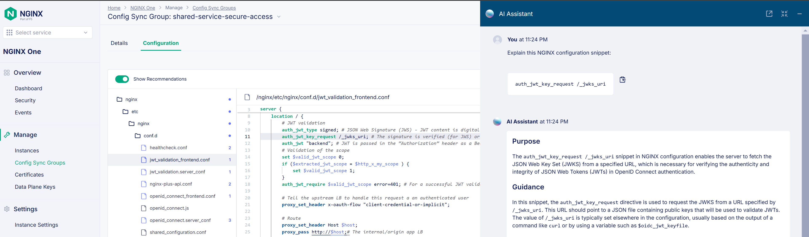

Validating the Claimed Scope
================================================================
NGINX *Secure Access* gateway provides support for JWT authentication
and sophisticated configuration solutions based on the information contained within the JWT itself.
The App SQUAD defines fine grained ``scope`` as required in the Public LB routing policy, for example:
    - per App: Public LB default HTTP route,
    - per Service: Public LB specific HTTP route that matches a Host
    - per micro-service: Public specific HTTP route that matches a PATH
    - per HTTP method ``GET``, ``POST``, ``UPDATE``, ``DELETE`` to filter ``Create``, ``Read``, ``Update``, ``Delete`` (CRUD) rights

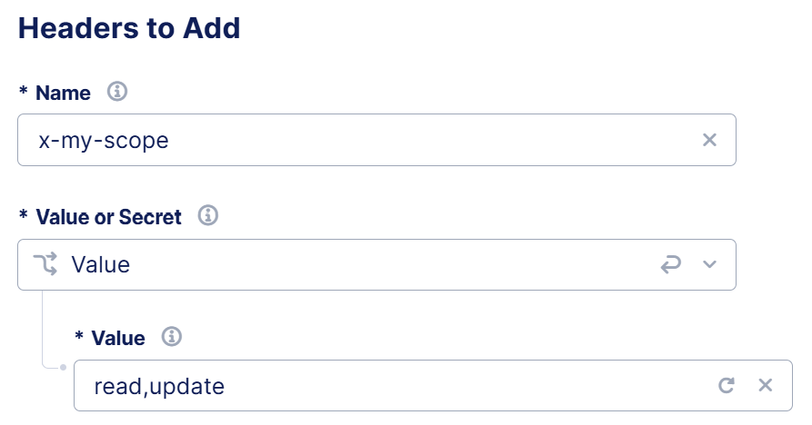

Then the NGINX gateway will compare the validated JWT against the expected ``scope`` defined in the customer header,
``x-my-scope`` here.

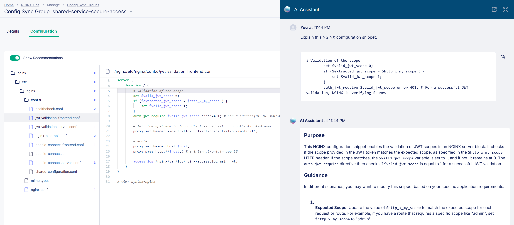

Leveraging JWT Claims as User Identifier
================================================================
One of the primary advantages of JWTs as authentication credentials is that they convey “claims”,
which represent entities associated with the JWT and its payload
(its issuer, the user to whom it was issued, and the intended recipient, for example).
After validating the JWT, NGINX gateway and XC LB has access to all of the fields present in the header and the payload.

For example, *Secure Access* is leveraging JWT Claims to Identify a User,
and track their activities with `XC Malicious User <https://docs.cloud.f5.com/docs/how-to/advanced-security/malicious-users>`_,
and Rate Limiting per Identified User.

In this example below,
we’re also using claim-based variables to provide API rate limiting per API client,
instead of per IP address.
This is particularly useful when multiple API clients are embedded in a single portal
and cannot be differentiated by IP address.

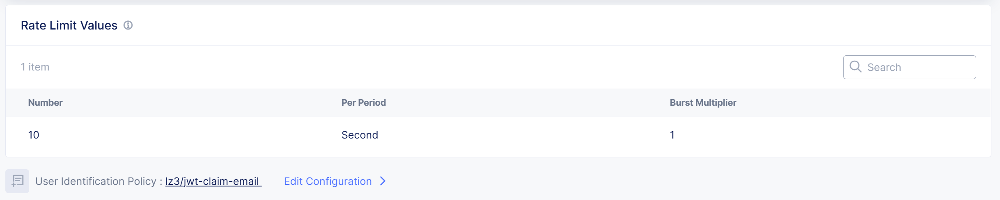

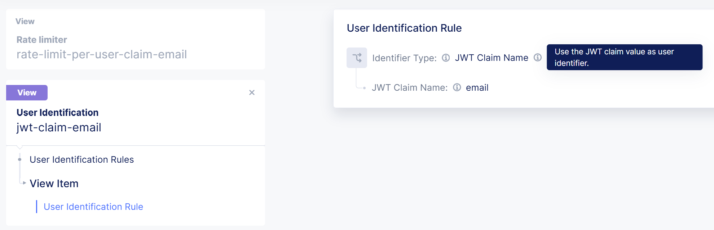

----------------------------------------------------

Behavioral based prevention, for Malicious User access and activities
************************************************************************
Combined with `F5 XC Malicious User <https://docs.cloud.f5.com/docs/how-to/advanced-security/malicious-users>`_ feature,
SecOps teams can enforce strong access policies from login to logout,
including step-up challenges for suspect behaviors.

----------------------------------------------------

*demo video:*

.. raw:: html

    

Detection
================================================================
*Malicious User* is part of the `F5 XC User Behavior Analysis <https://docs.cloud.f5.com/docs/how-to/app-security/user-behavior-analysis>`_ that detects suspect behavior based on watching several dimensions:

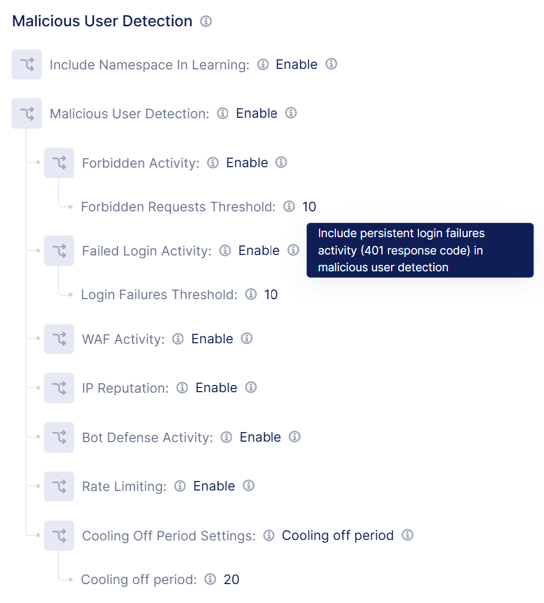

Mitigation
================================================================
If a client tries to access resources with insufficient privileges,
NGINX gateway will return a 401 response code.
After several attempts (10 by default),
a security event will be raised and a step-up challenge will be send.
The system tags the users into threat levels High, Medium, and Low.

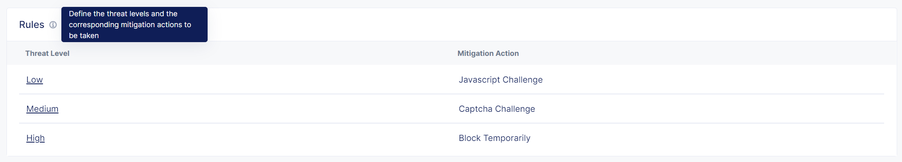

If the client that manages to resolve challenges and tries to access resources with insufficient privileges,
then this client will be blocked.
The system automatically lower the score when there is no malicious behavior detected for this Identified User for a certain period of time.
This is known as the ``Cooling Off Period``.
This period indicates how long it takes to lower from High threat level to Low.
The system executes a score decay mechanism over a period of time for this to happen.

User Identifier
================================================================
The User is identified by a Claim of its JWT, ``email`` for example.
If not present, the ``Bearer Token`` is used, else a *Secure Access* cookie.
The User Identifier is customizable by the App SQUAD and per Application (LB).

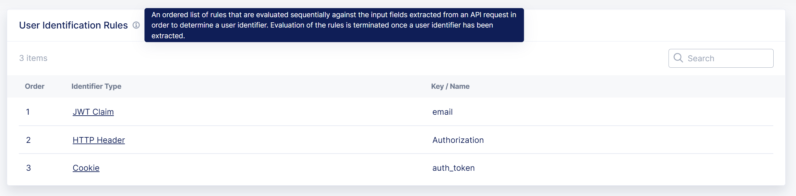

----------------------------------------------------------------

Design overview
***************************************************************
Shared Services
================================================================
*Secure Access* is deployed as a **Shared Service** that can be consumed by any Application namespace.

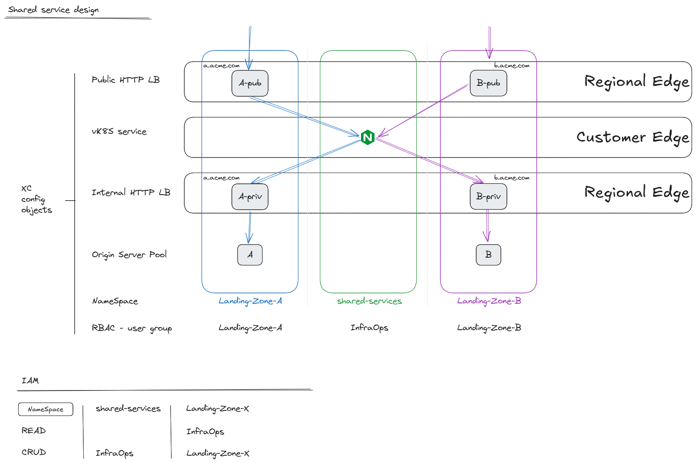

From a app Namespace, *Landing-Zone-A* for example,
the Applicative Squad is free to consume the *Secure Access* shared services :
- oAuth/OIDC authentication
- or/and JWT validation

These services can be consumed:
    - per application (XC LB)
    - per service (DNS domain)
    - per micro-service or API Group (HTTP PATH).
For example the private part ``/my-account`` of a web site can require to authenticate user access.

**How to consume a Shared service?**

In the Public HTTP LB (in blue in the diagram),
a HTTP Route is configured to forward the traffic to a service of the *Secure Access* gateway.
Once authenticated, the *Secure Access* gateway forwards the request back to the Application namespace,
i.e. to the internal HTTP LB (in pink in the diagram).

### ToDo change the Keys to update Public LB

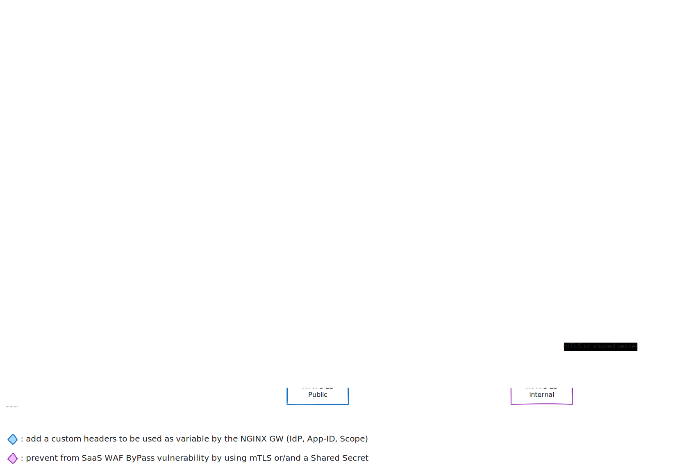

----------------------------------------------------------------

Secure Access GateWay
================================================================
The *oAuth/OIDC authentication* and the *JWT validation* are featured by a NGINX gateway.

F5 XC, as a Multi-Cloud Networking Software (MCNS),
allows to insert any container based service in the data-path,
named **Container as a Service** (CaaS). For example, an NGINX gateway.

The whole configuration of the *Secure Access GateWay* is stored in `NGINX One console <https://docs.nginx.com/nginx-one>`_.
At the container startup, `NGINX Agent <https://docs.nginx.com/nginx-agent/overview/>`_
is retrieving the *Secure Access GateWay* configuration from NGINX One console.

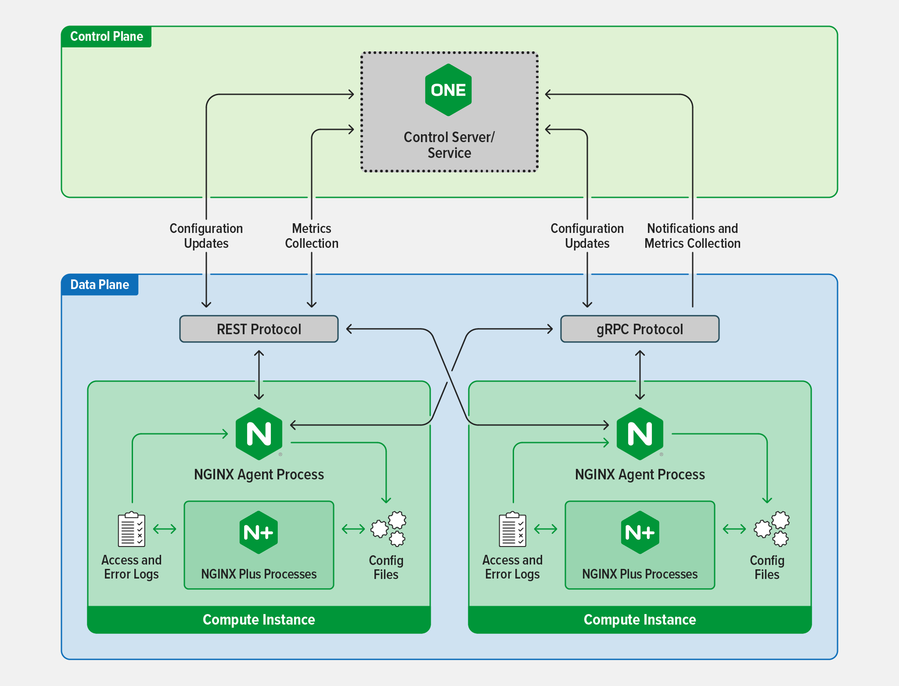

Therefore, the *Secure Access GateWay* is a **Platform as a Service** (PaaS),
based on supported NGINX+ containers and managed by NGINX One console,
that makes easy to manage NGINX instances across locations (Regional Edge, Customer Edge or other platform factor).
The console lets you monitor and control your NGINX fleet from one place:
    - read or/and update the configuration
    - track performance metrics
    - identify security vulnerabilities

----------------------------------------------------------------

Dynamic configuration
================================================================
Some parts of the NGINX configuration is dynamic to allow the Application to specify:
    - the selected Identity Provider in the allow list of the company
    - the Application ID to use, for OIDC
    - the granted Scope to clients

These specifications (IdP, App-ID, Scope) are set as custom HTTP headers in the Public HTTP LB,
exactly per HTTP Route, managed by the applicative Squad.

**HTTP Route:**

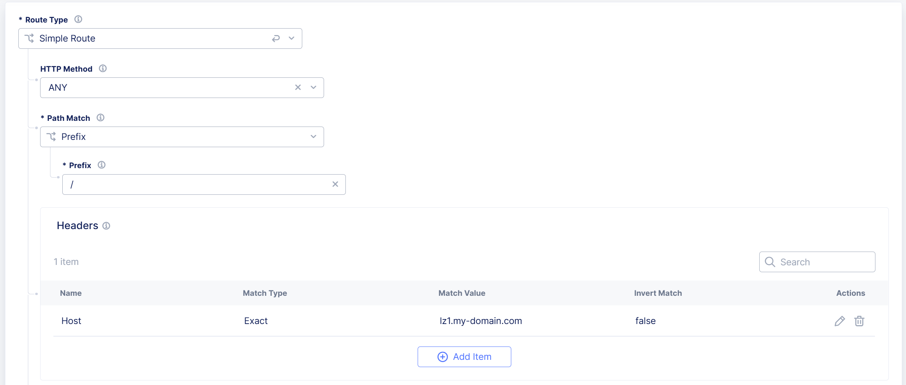

**Custom Headers**

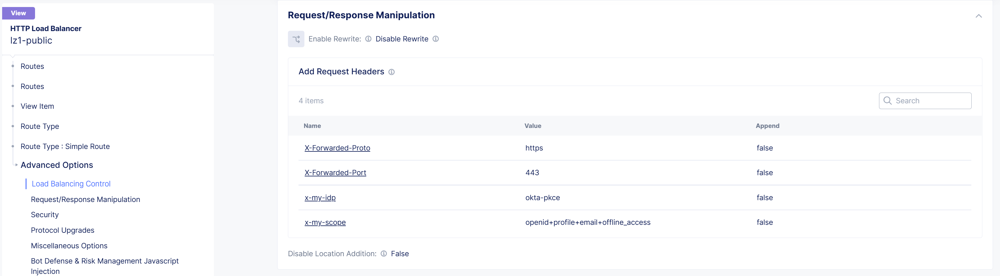

**Variable in NGINX configuration**

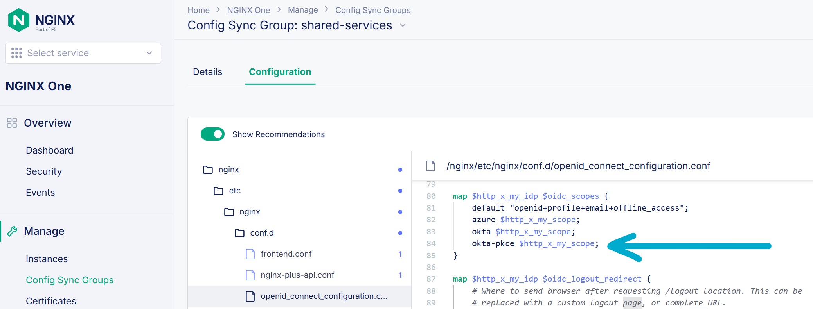

----------------------------------------------------------------

Demo video
================================================================

.. raw:: html

    

