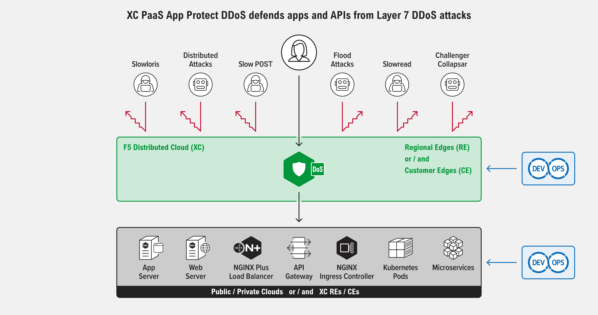
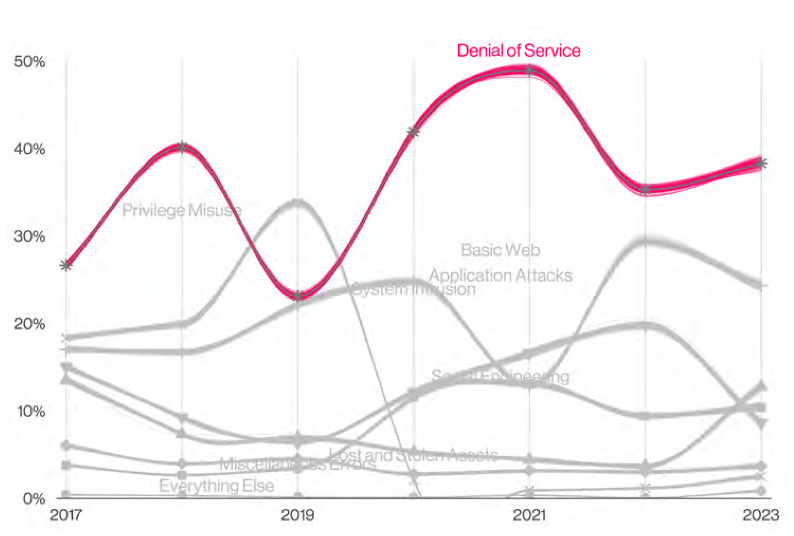
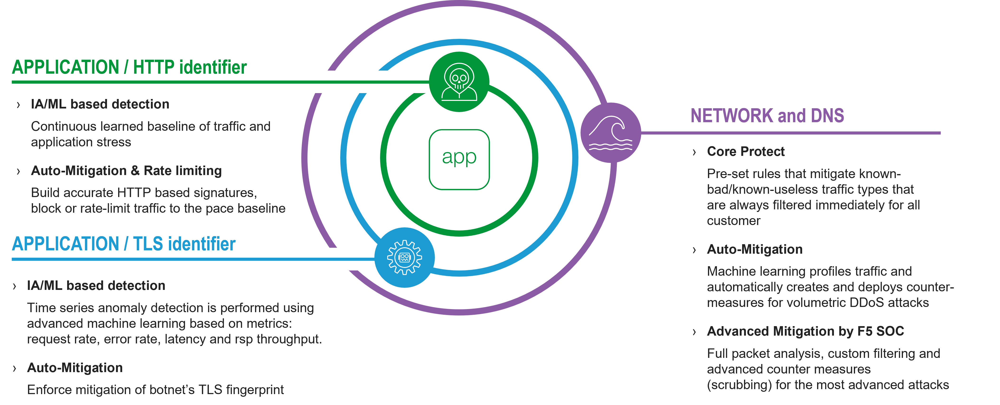
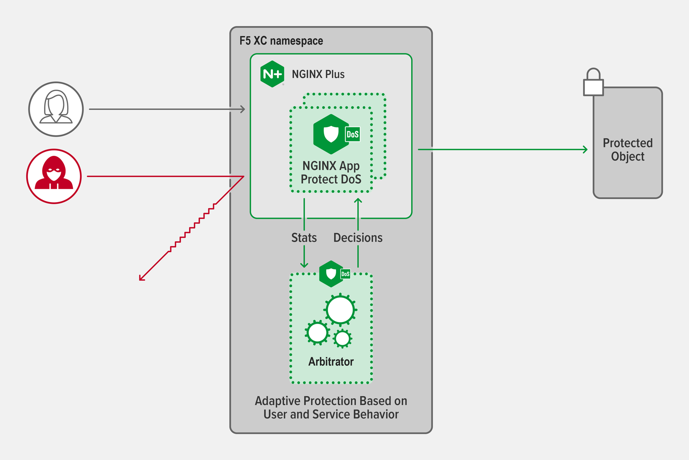
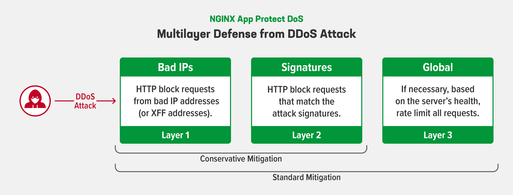
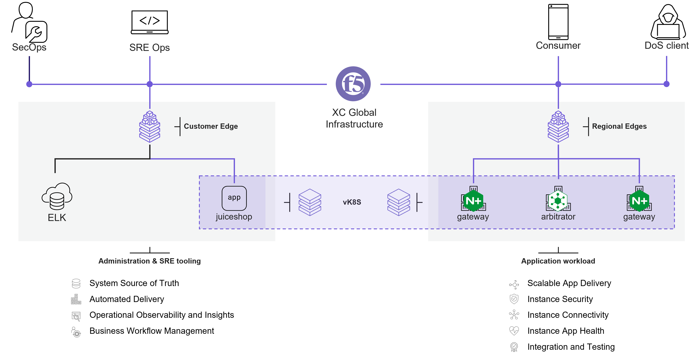
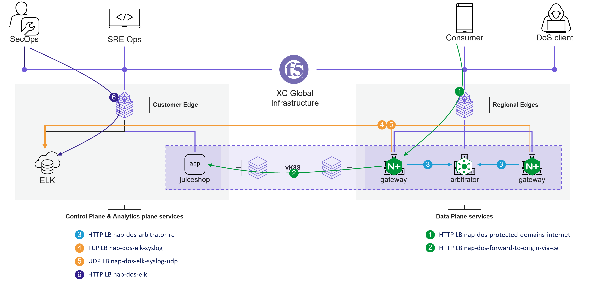

App Protect DDoS
#################################################################

*App Protect DDoS*,
a F5 Distributed Cloud (XC) Platform as a Service (PaaS),
defends, adapts, and mitigates against Layer 7 denial-of-service attacks on your apps and APIs.

.. contents:: Contents
    :local:
    :depth: 1

Modern Denial of Service Attacks
*********************************************************************************************************

Modern Denial of Service Attacks become Complex to detect and mitigate without impacting legitimate users.
Denial of Service attacks continue to be ubiquitous and have remained in the top spot of incidents for several years now.
Source: `DBIR 2023 <https://www.verizon.com/business/fr-fr/resources/reports/dbir/>`_

This `blog <https://www.nginx.com/blog/defending-applications-complex-modern-attacks/>`_ describes
volumetric denial-of-service (DoS) and distributed DoS (DDoS) attacks at the network and transport levels (Layers 3 and 4),
which exhaust servers’ available bandwidth by flooding them with TCP/UDP connection requests.
Now attackers have added a new tool to their arsenal – DoS and DDoS attacks that use HTTP requests
or API calls to exhaust resources at the application level (Layer 7).

Layer 7 attacks are more complex to design than network attacks,
and many tools that can handle Layer 3/4 attacks are ineffective at protecting modern application architectures.
Layer 7 DDoS attacks are more difficult to detect because bots and automation allow attackers to disguise themselves as legitimate traffic,
especially when they’re using sophisticated security penetration tools.
When a hacker can assemble a botnet – thousands of compromised machines under the hacker’s control – it’s easy to initiate attacks on a huge scale.
With bad bot traffic stealthily hiding among legitimate customer traffic, Layer 7 attacks create a new challenge.

Overview of the XC Multi-Layered DDoS protection
***************************************************************

----------------------------------------------------------------

F5 Distributed Cloud (XC) offers a multi-Layered DDoS protection:
    - **1. Volumetric network DDoS protection**: leveraging IP anycast, `highly BGP peered to metro networks <https://bgp.he.net/report/peers>`_ and F5 XC private global network, XC "Transit DDoS" mitigates volumetric DDoS attacks up to 20 Tbps.
    - **2. TLS based DDoS protection**: when you publish an application on XC, using an HTTP LB object, a native L7 DDoS protection detects attacks leveraging Machine Learning and automatically mitigates attacks identified by the botnet's TLS fingerprint.
    - **2. HTTP headers based DDoS protection**: *App Protect DDoS* analyzes client behavior and application health to model normal traffic patterns, uses unique algorithms to create a dynamic statistical model that provides the most accurate protections, and deploys dynamic signatures to automatically mitigate attacks.

L7 DDoS protection, a Modern Solution for a Modern Problem
***************************************************************
What are the key components that protect against Layer 7 attackers?

On a basic level,
you need a tool that recognizes when your site is under attack
– something that’s able to distinguish between “good guys” (legitimate traffic) and “bad guys” (malicious traffic).

PaaS *App Protect DDoS* is a **fire and forget** solution,
that can be **deployed everywhere** on the globe
and blocks traffic **closest to attackers**
and **only requests that cause harm**.

Seamless integration
=============================================
Components of the *App Protect DDoS* solution are:
    1. **Data-plane / gateways** workload: gateways learn traffic, enforce security rules and notify the arbitrator of ongoing attacks
    2. **Control-plane / the arbitrator** workload: the arbitrator is aware of all ongoing attacks and synchronise gateways to enforce security rules of all ongoing attacks
    3. **Analytics plane / log collector / SIEM**: customer is free to forward metrics and security event from gateways to his own log collector or SIEM solution. `Here <https://github.com/f5devcentral/nap-dos-elk-dashboards>`_ a simple ELK dashboard used for the demo.

----------------------------------------------
*demo video:*

.. raw:: html

    

Distributed gateways, Central Monitoring
=============================================

F5 XC offers native *Service Mesh* dashboards to monitor this distributed solution across all Edges :

    **1. Data-plane**: health of the data-plane service per location and key metrics of users traffic

.. raw:: html

    

----------------------------------------------

    **2. Control-plane**: health of the control-plane services per location and key metrics of operational traffic

.. raw:: html

    

Lowest False Positive
=============================================
As described in this `blog <https://www.nginx.com/blog/how-nginx-app-protect-denial-of-service-adapts-to-evolving-attack-landscape/>`_,
we acknowledge that some users are uncomfortable relying on adaptive learning because of the potential for large numbers of false positives,
but we have found it’s the most effective way to mitigate Layer 7 DoS attacks.
App Protect DDoS reduces false positives by combining multiple approaches described below, such as: checking service health checks, analyzing user behavior and measuring the effectiveness of mitigation tactics.
Together the three approaches provide comprehensive visibility and protection without requiring you to manually alter configuration in response to attacks.

    1. **Checking Service Health**: Mitigation and rate limit traffic occurs only when the backend server are stressed
    2. **Conservative mitigation**: App Protect DDoS gateways track more than 320 metrics related to user and app behavior, resulting in a multifactor statistical model that provides continuously the most accurate signature.
    3. **Standard mitigation**: If a signature is not yet generated by the ML system, App Protect DDoS rate limit all requests to the protected object to the learned base line

As shown in the diagram above, you can configure either a conservative or standard mitigation strategy.
With both strategies,
the first layer of defense is to block requests from the malicious actors who were identified by IP address and X-Forwarded-For header in the previous step.
The next layer of defense blocks requests that match the signatures generated in the previous step.
The App Protect DDoS *gateway* notifies the App Protect DDoS *arbitrator*, then he synchronized all other *gateways* to enforce the signatures.
Finally, if an App Protect DDoS gateway find the first two layers of defense are insufficient, it applies global rate limiting for a short period.

*demo video*:

.. raw:: html

    

--------------------------------------------

**No-touch policy configuration**
Because this protection is managed automatically by the IA/ML engine, it results to configure one time the `protection policy <https://docs.nginx.com/nginx-app-protect-dos/directives-and-policy/learn-about-directives-and-policy/#policy-directive-app_protect_dos_policy_file>`_.
Example of a protection policy:

.. code-block:: json

    {
        "mitigation_mode": "standard",
        "signatures": "on",
        "bad_actors": "on",
        "automation_tools_detection": "on",
        "tls_fingerprint" : "on"
    }

The following items explain more in details each point discussed above.

----------------------------------------------

**1. CHECKING SERVICE HEALTH**
Many Layer 7 DoS mitigation tools pay attention only to client traffic patterns.
For superior attack detection, App Protect DDoS gateways actively check service health in addition.
A App Protect DDoS gateway mimics human behavior by measuring latency for every single transaction and calculates the level of stress for a service.
It tracks multiple server performance metrics such as response time and proportion of dropped requests.
Worsening values for these metrics indicate that an application is “under stress”, possibly because of an attack.

There’s another benefit to tracking server metrics: once an App Protect DDoS gateway determines that an attack is in progress,
the pattern of responses to health checks helps identify when the attack started.

----------------------------------------------

**2. CONSERVATIVE MITIGATION**

*Detecting an Anomaly*
    When an App Protect DDoS gateway determines that an attack is underway – based on deviations from the site statistical model and changes to server response – it stops updating the site statistical model and instead analyzes how current metric values differ from the established baselines. Differences likely point to a global anomaly.

*Identifying Malicious Actors and Request Patterns*

The App Protect DDoS gateway then kicks off two procedures that run in parallel:
    1. Analyzing the behavior of individual users to detect who created or contributed to the anomaly. The App Protect gateway initially treats all users as suspects and analyzes their behavior. It’s unlikely that every user is an attacker, but measuring the behavior of all of them enables the App Protect gateway to create a statistical picture that reveals who did and did not contribute to the attack. Detected **bad actors** are identified using their IP address or the X-Forwarded-For header in their requests.
    2. Generating a list of rules that describe attack traffic without blocking legitimate users – real‑time signatures for zero‑day attack protection. Signatures generated during previous attacks can be reused. The generated signatures identify HTTP attributes associated with the attack, as in this example below. The **signature** contains 11 attributes that cover all aspects: method, path, headers and payload. Such a level of granularity and reaction time is not feasible neither for volumetric vectors nor a SOC operator armed with a regex engine.

.. code-block:: bash

    http.request.method eq GET and http.user_agent contains Chrome and
    http.uri_parameters eq 6 and http.accept_header_exists eq false and
    http.headers_count eq 7

----------------------------------------------

**3. STANDARD MITIGATION and CHALLENGES**

When a App Protect DDoS gateway applies global rate limiting,
there is a chance that requests from legitimate users get blocked – a false positive.
Gateways can reduce false positives based on the fact that a typical DoS attack is created using scripts run by a botnet controller (malware on infected computers),
not directly by humans.
Unlike web browsers, many of these simple scripts cannot properly handle an HTTP redirect, and even fewer can process JavaScript.
These differences in capability between scripts and browsers help App Protect DDoS tell which of them is generating the suspicious traffic.

So instead of rate limiting requests from all clients,
an App Protect DDoS gateway first sends an HTTP redirection and then a snippet of JavaScript to be processed.
Scripted bots cannot successfully respond, but a browser can enabling the App Protect DDoS gateway to block traffic from scripts while allowing browser traffic through.

Sizing and boundless scaling
=============================================
Because App Protect DDoS is deployed on the modern infrastructure of F5 Distributed Cloud,
`Application Deivery Network <https://f5-k8s-ctfd.docs.emea.f5se.com/en/latest/class8/class8.html#application-delivery-network-adn>`_ (ADN),
and its unique technology ``virtual Kubernetes`` (vK8S), it mitigates attacks that are highly distributed.

App Protect DDoS *gateways* are containers deployed in F5 XC Edges:
    - **Regional Edges**, fully managed by F5
    - or/and **Customer Edges** hosted in Customer's Private / Public Clouds. Underlying infrastructure could be F5 hardware, baremetal or VM.

Each *gateway* container, sized with 2 CPU / 2 GB RAM, can handle up to 30K concurrent connections.

Therefore, the light footprint of a gateway and the availability of edge locations
allow customer to create one distributed defense layer with adaptive resources, to scale when the threat appears,
and deployed closest to the source of the threat.

*demo video* ``TO DO``

.. raw:: html

    

Demo lab
*********************************************************************************************************

Architecture
=============================================

Services
=============================================

gateway / NGINX App Protect DoS
=============================================

Image : `here <https://github.com/nergalex/docker-nap-dos>`_

.. code-block:: nginx

    load_module /usr/lib/nginx/modules/ngx_http_app_protect_dos_module.so;

    worker_processes  auto;
    error_log /nginx/var/log/nginx/error.log debug;
    pid /nginx-tmp/nginx.pid;

    events {
        worker_connections 4096;
    }

    http {
        scgi_temp_path /nginx-cache/scgi_temp;
        uwsgi_temp_path /nginx-cache/uwsgi_temp;
        fastcgi_temp_path /nginx-cache/fastcgi_temp;
        proxy_temp_path /nginx-cache/proxy_temp;
        client_body_temp_path /nginx-cache/client_temp;
        default_type  application/octet-stream;

        client_max_body_size 1000M;
        log_format  main  '$remote_addr - $remote_user [$time_local] "$request" '
                          '$status $body_bytes_sent "$http_referer" '
                          '"$http_user_agent" "$http_x_forwarded_for"';
        access_log  /nginx/var/log/nginx/access.log  main;
        resolver 100.127.192.10; # F5 XC vK8S DNS resolver. Used for DNS lookup of $host;
        proxy_set_header Host $host;

        # NAP-DOS
        log_format log_dos ', vs_name_al=$app_protect_dos_vs_name, ip=$http_x_forwarded_for, tls_fp=$app_protect_dos_tls_fp, outcome=$app_protect_dos_outcome, reason=$app_protect_dos_outcome_reason, ip_tls=$http_x_forwarded_for:$app_protect_dos_tls_fp, ';
        app_protect_dos_security_log_enable on;
        app_protect_dos_security_log "/nginx/etc/nginx/log-profiles/generic-log.json" syslog:server=nap-dos-elk-syslog:5261;
        app_protect_dos_arb_fqdn nap-dos-arbitrator-re;
        app_protect_dos_readiness on uri:/readiness port:8090;
        app_protect_dos_liveness on uri:/liveness port:8090;

        # Trust XFF
        set_real_ip_from  100.0.0.0/8;
        real_ip_header    X-Forwarded-For;
        real_ip_recursive on;

        server {
            server_name juiceshop.f5cloudbuilder.dev;
            listen 8080;

            set $loggable '1';
            access_log syslog:server=nap-dos-elk-syslog-udp:5561 log_dos; # if=$loggable;

            location / {
                app_protect_dos_enable on;
                app_protect_dos_policy_file "/nginx/etc/nginx/policies/generic-policy.json";
                app_protect_dos_name "vs-juiceshop-f5cloudbuilder-dev";
                app_protect_dos_monitor uri=http://juiceshop.f5cloudbuilder.dev:8080/;
                proxy_pass http://$host;
            }
        }
        server {
            listen 8090;
            location /api {
                app_protect_dos_api;
            }
            location = /dashboard-dos.html {
                root   /nginx/usr/share/nginx/html;
            }
        }
    }
