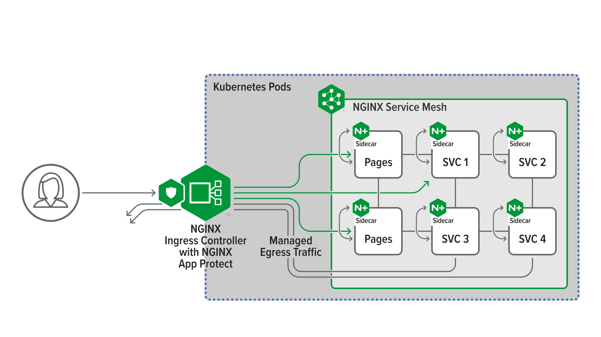

future lab | Service Mesh
##############################################################

This lab describes how to control and to observe internal traffic into a k8s cluster and outside with `NGINX Service Mesh <https://www.nginx.com/blog/introducing-nginx-service-mesh/>`_ .

.. toctree::
   :maxdepth: 1
   :glob:

   module*/module*

